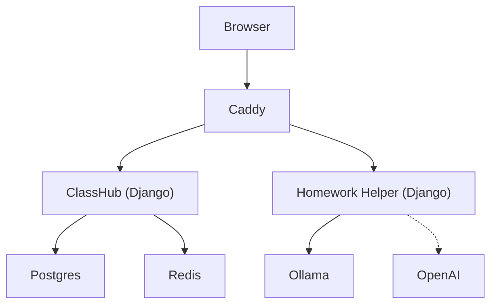

# Self-Hosted ClassHub — Full Evaluation & Autopsy

## Executive Summary

ClassHub is an unusually well-considered self-hosted micro-LMS built with Django, targeting small-school and classroom-first deployments. It ships two services (a core LMS and an AI tutor), wraps them in a production-ready Docker Compose stack, and backs them with layered security, extensive testing, and 33+ docs. The project punches well above typical "weekend side project" weight — but it also carries structural debt from rapid solo iteration that will slow down its next phase of growth.

**Overall grade: B+ / A−**
Strong privacy posture, excellent operational tooling, thoughtful architectural decisions. Main concerns are code organization (bloated view files), incomplete modularity, and a few extensibility bottlenecks.

---

## 1. Architecture & Design

### What's here

| Component | Role | Lines of Python |
|---|---|---|
| ClassHub (`hub` app) | Student join, classroom, teacher portal, content rendering | ~11,400 |
| Homework Helper (`tutor` app) | AI-assisted tutoring under `/helper/*` | ~2,100 |
| Common library | Shared `request_safety`, `helper_scope` | ~230 |
| Scripts | Ops tooling (smoke, backup, retention, evaluation) | ~2,400 |
| **Total** | | **~16,100** |

### Strengths

- **Service isolation is real.** Helper outages don't take down the LMS. The two Django services share a Postgres database but use separate Redis DBs and separate Dockerfiles & Gunicorn processes. Cross-service communication is via an authenticated internal events endpoint — not raw shared database writes.
- **Trust boundaries are explicit.** The ARCHITECTURE.md includes Mermaid diagrams for trust zones, data flow, and module dependencies — and the code actually matches.
- **Token-gated helper access.** Student helper scope is signed server-side (`issue_scope_token`), preventing client-side scope widening. This is a genuinely thoughtful security boundary.
- **Content-as-code.** Lessons are Markdown + YAML front-matter under `content/courses/`, rendered at runtime. Changes deploy with the container image. This is a good pattern for small-team, version-controlled curriculum.

### Concerns

- **Shared database.** Both services hit the same Postgres instance. While convenient for Day-1, this couples deployment and migration schedules tightly. The `_table_exists()`/`_student_session_exists()` pattern in the helper works around this but is fragile.
- **No task queue / async pipeline.** Large uploads, video processing, and AI calls all happen synchronously inside Gunicorn workers. The 1200s Gunicorn timeout is a band-aid for slow classroom Wi-Fi, not a solution.

---

## 2. Code Quality

### Models (425 lines) — **Strong**

- Clean, well-documented domain model: `Class`, `Module`, `Material`, `Submission`, `StudentIdentity`, `StudentEvent`, `LessonRelease`, `LessonVideo`, `LessonAsset`, `LessonAssetFolder`, `AuditEvent`.
- Good use of database constraints (`UniqueConstraint`, composite indexes).
- Append-only event models (`StudentEvent`, `AuditEvent`) have `save`/`delete` guards to prevent mutation.
- Smart upload path isolation (`_submission_upload_to` segregates by class+material).

### Views — **Mixed** ⚠️

This is the biggest code-quality concern:

| File | Lines | Concern |
|---|---|---|
| `hub/views/teacher.py` | 2,817 | **Massive.** Single file with 65 outlined functions. |
| `hub/views/_legacy.py` | 2,659 | **Full copy of pre-refactor views** still in the codebase. |
| `hub/views/student.py` | 807 | Reasonable size, well-organized. |
| `tutor/views.py` | 986 | Everything in one file: helpers, circuit-breaker, retry, chat. |

**Key issues:**

1. **`_legacy.py` is 98KB of dead weight.** It duplicates nearly every function now in `student.py`, `teacher.py`, `content.py`, `media.py`, and `internal.py`. It's imported via `__init__.py` but the refactored modules also export the same names. This creates confusion about which codepath is canonical.

2. **`teacher.py` needs decomposition.** It contains 2FA onboarding, email sending, QR code generation, video management, module CRUD, roster management, daily digests, lesson release handling, audit logging, and closeout workflows. Each of these is a natural sub-module.

3. **`tutor/views.py` mixes concerns.** Circuit-breaker logic, retry/backoff, reference citation building, prompt engineering, Piper hardware triage, and the actual HTTP endpoint all live in one 986-line file. The circuit-breaker and retry logic should be a service layer; the prompt/citation logic should be separate.

### Middleware (268 lines) — **Excellent**

Four focused, well-tested middlewares:
- `SecurityHeadersMiddleware` — CSP, Permissions-Policy, Referrer-Policy, X-Frame-Options
- `TeacherOTPRequiredMiddleware` — 2FA enforcement for `/teach/*`
- `AuthRateLimitMiddleware` — fixed-window throttling on auth endpoints
- `SiteModeMiddleware` — graceful degradation (read-only, join-only, maintenance)

Each middleware is single-responsibility and well-commented. This is some of the best code in the repo.

### Services Layer (11 modules) — **Good**

| Module | Lines | Purpose |
|---|---|---|
| `markdown_content.py` | ~300 | Course YAML + Markdown parsing with mtime caching |
| `authoring_templates.py` | ~200 | Generate `.md`/`.docx` course templates |
| `content_links.py` | ~170 | URL parsing and asset URL rewriting |
| `release_state.py` | ~130 | Lesson availability logic (dates, locks, overrides) |
| `upload_scan.py` | ~100 | Optional ClamAV integration |
| `upload_validation.py` | ~70 | Magic-byte and `.sb3` content checks |
| `upload_policy.py` | ~50 | Extension parsing |
| `audit.py` | ~60 | `AuditEvent` creation helper |
| `ip_privacy.py` | ~30 | IP truncation for privacy |
| `filenames.py` | ~10 | Safe filename sanitization |

Good separation of concerns. These could be exemplary if the views actually delegated more logic into them.

### Settings (332 lines) — **Thorough**

- 60+ env knobs, all with sensible defaults.
- Explicit weak-secret-key rejection in production.
- CSP defaults are strong (report-only + enforced in parallel).
- IP privacy mode is configurable (truncate/full/none).
- Upload scanning is optional but wired.

### Test Coverage — **Good to Very Good**

| Test File | Lines | Coverage Area |
|---|---|---|
| `hub/tests.py` | 1,982 | 149 test cases covering student join, teacher portal, submissions, events, portfolio export, roster management, 2FA, etc. |
| `hub/tests_services.py` | ~500 | Service-layer unit tests |
| `hub/tests_security_headers.py` | ~150 | Explicit security header validation |
| `tutor/tests.py` | ~900 | Helper chat auth, scope validation, circuit breaker, backend retry, citation logic |

CI runs branch coverage, which is better than most projects. Tests are well-structured with descriptive names.

> [!TIP]
> Tests use `_force_login_staff_verified()` to simulate OTP-verified sessions — a sign the tests were designed alongside the security model, not bolted on.

### Static Analysis & Linting

- **Ruff** configured in `pyproject.toml` with `E,F,I,B,UP` rules.
- **Bandit** SAST scanning in CI, with a custom runner (`scripts/run_bandit.sh`).
- **pip-audit** dependency vulnerability scanning in CI.
- **Gitleaks** secret scanning in CI.
- **CodeQL** analysis in separate workflow.

This is a _very_ thorough CI security pipeline for a project this size.

---

## 3. Extensibility

### What Extends Well

| Extension | Difficulty | Notes |
|---|---|---|
| Add a new course | Easy | Create `content/courses/<slug>/course.yaml` + lesson `.md` files |
| Add lesson content features | Easy | Front-matter keys drive behavior (videos, submissions, release dates, helper topics) |
| Change LLM backend | Easy | Swap `HELPER_LLM_BACKEND` from `ollama` to `openai` or `mock` |
| Add security headers | Easy | Env knobs for CSP, Permissions-Policy, etc. |
| Add a new site mode | Moderate | Extend `SiteModeMiddleware` |
| Add new student data controls | Moderate | Follow existing `/student/my-data` pattern |

### What Doesn't Extend Well

| Extension | Difficulty | Why |
|---|---|---|
| Add a new user role (e.g. parent, TA) | Hard | Auth model is binary: `is_staff` or session-based student. No role model. |
| Multi-school / multi-tenant | Hard | No organization model. `Class` is the top-level entity. Teacher-class relationships aren't explicitly modeled. |
| Add a new service (e.g. gradebook) | Medium-Hard | Services share a database but have no shared schema contract. |
| Plugin system for content types | Not possible | Material types are hardcoded (`link`, `text`, `upload`). No plugin architecture. |
| REST API for external integrations | Hard | No API layer exists. Every endpoint is a Django view returning HTML or ad-hoc JSON. |
| Alternative front-end | Hard | Logic is tightly coupled to Django templates. No API boundary. |

### Architecture Debt

1. **No serializer/API layer.** Views do validation, business logic, and response formatting in one function. This makes it hard to build an API, mobile app, or SPA front-end without rewriting.

2. **No explicit teacher ↔ class relationship.** Any `is_staff` user can manage any class. There's no ownership or permission model beyond "staff vs student."

3. **Content model is file-based.** This is great for version control but terrible for runtime editing. Teachers can't create lessons through the UI — they need repo access or CLI tooling.

4. **No webhook / event system beyond AuditEvent.** There's no way for external services to subscribe to ClassHub events (student joined, submission uploaded, etc.).

---

## 4. User Value

### For Students

| Feature | Value | Notes |
|---|---|---|
| Join by code | ★★★★★ | Zero-friction onboarding. No email, no password. |
| Privacy controls (`/student/my-data`) | ★★★★★ | Export portfolio, delete submissions, end session. Rare in edu-tech. |
| Return code for cross-device rejoin | ★★★★ | Clever but fragile — students lose codes easily. |
| Helper AI widget | ★★★★ | Lesson-scoped, citation-grounded AI help. Scope signing is smart. |
| Portfolio export | ★★★★ | Offline ZIP with `index.html` — works without internet. |
| Submission upload | ★★★ | Works but basic. No progress indicator, no preview. |

### For Teachers

| Feature | Value | Notes |
|---|---|---|
| Teacher portal (`/teach`) | ★★★★ | Dashboard with daily digest, closeout workflow, roster management. |
| Lesson release controls | ★★★★ | Per-class/per-lesson availability, scheduling, helper topic overrides. |
| Student roster management | ★★★★ | Rename, merge duplicates, delete student data, reset roster. |
| Printable join cards | ★★★ | Nice touch for physical classrooms. |
| Course authoring | ★★ | Requires repo access. Teachers need Markdown + YAML literacy or CLI tooling. |

### For Operators

| Feature | Value | Notes |
|---|---|---|
| Deploy tooling | ★★★★★ | `system_doctor.sh`, `golden_path_smoke.sh`, `validate_env_secrets.sh`, `deploy_with_smoke.sh`. |
| Retention management | ★★★★ | Automated pruning scripts with CSV export before deletion. |
| Security posture | ★★★★★ | 2FA, CSP, rate-limiting, upload scanning, audit logs, secret validation. |
| Documentation | ★★★★★ | 33+ docs with role-based paths, troubleshooting, decision records. |
| Backup scripts | ★★★ | Postgres + uploads + MinIO backups exist but aren't integrated into a single restore workflow. |

### Deliberate Non-Goals (Good Choices)

The project explicitly avoids:
- No gradebook / grade syncing
- No surveillance analytics
- No ad-tech integrations
- No Google/Facebook SSO (students don't have accounts)
- No third-party font/CDN network calls

These non-goals are well-documented and show real design discipline.

---

## 5. Security Posture

### Strengths

- **Strong defaults.** `DJANGO_DEBUG=0` required in production, weak secrets rejected, 2FA enforced, CSP deployed.
- **Defense in depth.** Optional Caddy IP allowlists + basic-auth on top of Django auth + OTP.
- **Rate limiting everywhere.** Join, auth, helper chat — all throttled.
- **Upload security.** Permission-checked downloads (not public `/media`), content validation, optional malware scanning, safe filenames.
- **Privacy by design.** IP truncation, metadata-only event logging, explicit retention controls, student self-service deletion.

### Weaknesses

- **`script-src 'unsafe-inline'`** in enforced CSP. Understandable for Django templates with inline JS, but a significant browser security gap.
- **No CSRF token rotation on session transitions.** Student joins mutate session state without re-validating CSRF provenance.
- **`signing.dumps` for device hint cookies** uses Django's `SECRET_KEY` as HMAC key. If the secret is compromised, all device hint cookies are forgeable. Consider a separate signing key.
- **Bare `except Exception` in several places.** Some catch blocks are too broad and could mask real errors.

---

## 6. Documentation Quality

This is one of the project's greatest strengths.

| Document | Lines | Purpose |
|---|---|---|
| `DECISIONS.md` | 690 | 40+ active architectural decision records with rationale |
| `SECURITY.md` | 249 | Practical posture + Day-1 checklist |
| `ARCHITECTURE.md` | 216 | 5 Mermaid diagrams + trust boundary map |
| `RUNBOOK.md` | ~400 | Ops procedures with command blocks |
| `TROUBLESHOOTING.md` | ~300 | Symptom-first triage guides |
| `PRIVACY-ADDENDUM.md` | ~180 | Field-level retention and lifecycle |
| `PILOT_PLAYBOOK.md` | ~100 | Week-1 success criteria |

> [!IMPORTANT]
> The `DECISIONS.md` file alone is remarkable — 40+ decisions with "Current decision" + "Why this remains active" format. This level of architectural documentation is rare even in well-funded teams.

---

## 7. Recommendations

### High Priority (Code Health)

1. **Delete `_legacy.py`** (2,659 dead lines). Verify no imports reference it, remove it, reclaim readability.
2. **Decompose `teacher.py`** (2,817 lines → 5-7 files). Natural splits: `teacher_auth.py`, `teacher_roster.py`, `teacher_content.py`, `teacher_2fa.py`, `teacher_closeout.py`, `teacher_videos.py`.
3. **Extract helper service layer.** Move circuit-breaker, retry, and prompt logic out of `tutor/views.py` into `tutor/services/`.

### Medium Priority (Extensibility)

4. **Add a role model.** At minimum: `TeacherClassMembership(teacher, classroom, role)` so teachers see only their own classes.
5. **Consider adding a thin REST API** for key operations (join, submit, class status) to enable future front-end flexibility.
6. **Add async task processing** (Celery or Django-Q) for uploads, video processing, and AI calls. The 1200s Gunicorn timeout is covering for missing async infrastructure.

### Low Priority (Polish)

7. **Pin Ollama and MinIO images** in `docker-compose.yml` (currently `latest`).
8. **Add a `CHANGELOG.md` workflow** — the current changelog is only 427 bytes.
9. **Consider `nonces` for CSP** to eliminate `'unsafe-inline'` from `script-src`.

---

## 8. Final Assessment

| Dimension | Rating | Notes |
|---|---|---|
| **Code quality** | B | Good foundations, but view bloat and legacy dead code drag it down |
| **Architecture** | A− | Service split, trust boundaries, and deployment model are well-thought-out |
| **Security** | A | One of the strongest security postures I've seen in a small self-hosted project |
| **Testing** | A− | 100K+ test LOC with branch coverage. Missing integration/E2E tests but unit coverage is solid |
| **Documentation** | A+ | Best-in-class for a project this size. Decision records are exceptional |
| **Extensibility** | C+ | Good within its design envelope, but hard to extend beyond it |
| **User value** | B+ | Strong for its target audience (small classrooms). Limited authoring tools for teachers |
| **Ops experience** | A | Smoke tests, doctor scripts, retention tooling, validation scripts — production-ready |
| **Overall** | **B+/A−** | A thoughtful, security-conscious classroom tool that needs modular refactoring to scale |

This is a project that takes its users' privacy and operational reliability seriously — which is refreshing in ed-tech. The main growth path is decomposing the monolithic views and adding the missing multi-tenancy / API layers that would let it scale from "one classroom" to "one school."
