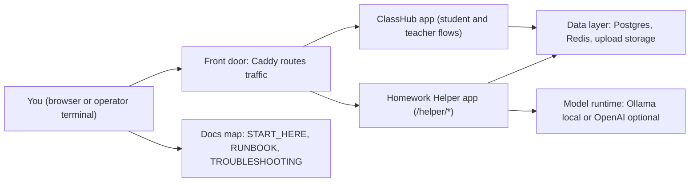

# ClassHub

ClassHub is open learning infrastructure built for privacy-forward educational programs.

It intentionally limits data collection while enabling structured cohort delivery, outcome capture, and certificate issuance — designed to survive staff turnover and vendor drift.

## What It Is

- Cohort-based learning container
- Organization-scoped access boundaries
- Invite-only enrollment with seat controls
- Outcome tracking and export
- Certificate eligibility and issuance

## What It Is Not

- Not a marketing website
- Not a payment processor
- Not a CRM
- Not a behavioral analytics system
- Not a surveillance-based LMS

## Design Principles

- Data minimization
- Role-based access control
- Append-only audit events
- Exportable artifacts
- Operational resilience

[](https://github.com/bseverns/ClassHub/actions/workflows/test-suite.yml)
[](https://github.com/bseverns/ClassHub/actions/workflows/security.yml)
[](https://github.com/bseverns/ClassHub/actions/workflows/docs.yml)
[](LICENSE)

Class Hub is a classroom-first, self-hosted micro-LMS with a separate Homework Helper service.

- Public overview: `docs/PUBLIC_OVERVIEW.md`
- Start here (canonical docs landing page): `docs/START_HERE.md`
- Evaluating for your org? Start with [Public Overview](docs/PUBLIC_OVERVIEW.md) and [Try It Local](docs/TRY_IT_LOCAL.md).

## You Are Here (System Map)



## Try it locally in 10 minutes

See: `docs/TRY_IT_LOCAL.md`

Quick path:

```bash
cp compose/.env.example.local compose/.env
cd compose && docker compose up -d --build
cd ..
bash scripts/load_demo_coursepack.sh
```

Then open:
- Student join: `http://localhost/`
- Teacher login: `http://localhost/admin/login/`

## Pilot in a box

- Time to deploy: local in minutes; domain pilot usually one focused setup session.
- Week 1 success: students join, submit work, and teachers run review/closeout without manual triage.
- Deliberate non-goals: no gradebook, no surveillance analytics, no ad-tech integrations.
- Data posture: student controls are explicit (`/student/my-data` export/delete/end-session).
- Reliability check: smoke validates health + join + helper + teacher paths.
- Measure without surveillance: onboarding time, submissions per session, teacher minutes saved.
- Playbook: [docs/PILOT_PLAYBOOK.md](docs/PILOT_PLAYBOOK.md).

## Security + deployment links

- Security posture: `docs/SECURITY.md`
- Day-1 deploy checklist: `docs/DAY1_DEPLOY_CHECKLIST.md`
- Release packaging policy: `docs/RELEASING.md` (use `scripts/make_release_zip.sh` only)

## Contributing + press

- Contributing guide: `CONTRIBUTING.md`
- Changelog: `CHANGELOG.md`
- Press kit: [press/README.md](press/README.md)
- Screenshot shot list: `press/screenshots/SHOTLIST.md`
- Screenshot placeholders: `press/screenshots/PLACEHOLDERS.md`

A lightweight, self-hosted LMS focused on reliable classroom operations.

Mission:
- reliable (boring infra)
- inspectable (logs, checks, audit trails)
- privacy-forward (minimal student identity model)
- fast to ship (MVP-first architecture)

## Architecture at a glance

- `Class Hub` (Django): student join/session flow, class views, `/teach`, `/admin`.
- `Homework Helper` (Django): separate AI tutor service under `/helper/*`.
- `Caddy`: reverse proxy and TLS termination.
- `Postgres`: primary data store.
- `Redis`: cache/rate-limit/queue state.
- `MinIO`: optional backup/ops component (uploads are served from Django-managed filesystem storage by default).

Detailed architecture: `docs/ARCHITECTURE.md`

Service notebooks:
- `services/classhub/README.md`
- `services/homework_helper/README.md`

## Quickstart (local)

1. Configure environment:

```bash
# local/day-1
cp compose/.env.example.local compose/.env

# domain/TLS
cp compose/.env.example.domain compose/.env
```

2. Set routing template in `compose/.env`:

```env
CADDYFILE_TEMPLATE=Caddyfile.local
```

3. Build and run:

```bash
cd compose
docker compose up -d --build
```

4. Create initial admin:

```bash
docker compose exec classhub_web python manage.py createsuperuser
```

5. Verify health:

- `http://localhost/healthz`
- `http://localhost/helper/healthz`

6. Run full stack self-check:

```bash
bash scripts/system_doctor.sh
```

## Docs entrypoint

Start with `docs/DOCS_MAP.md` for the documentation contract and map.
Then use `docs/START_HERE.md` for role-specific paths:
- Operator
- Teacher/staff
- Developer

For guided hands-on learning tracks, use `docs/LEARNING_PATHS.md`.
For incident triage by symptom, use `docs/TROUBLESHOOTING.md`.
For documentation pedagogy and maintainership standards, use `docs/TEACHING_PLAYBOOK.md`.

Before opening a PR, run through `docs/MERGE_READINESS.md`.
