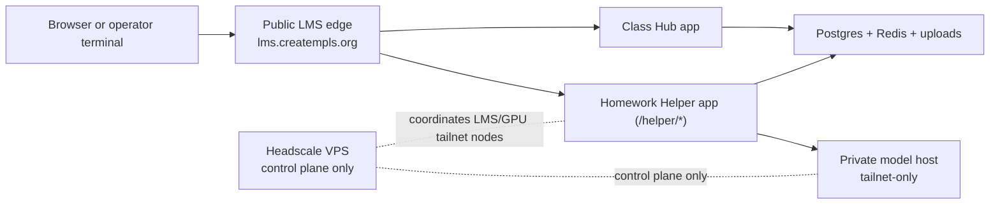

# Class Hub
[](https://github.com/bseverns/ClassHub/actions/workflows/test-suite.yml)
[](https://github.com/bseverns/ClassHub/actions/workflows/security.yml)
[](https://github.com/bseverns/ClassHub/actions/workflows/docs.yml)
[](LICENSE)

Class Hub is classroom-first, self-hosted learning infrastructure built for reliable operations, inspectable behavior, and privacy-forward defaults.

## Front-door map

Use these four docs as the canonical entrypoints, each with one job:

- `README.md` (this file): repository front door and quick operator/developer start.
- [`docs/START_HERE.md`](docs/START_HERE.md): role-based docs router.
- [`docs/PUBLIC_OVERVIEW.md`](docs/PUBLIC_OVERVIEW.md): external evaluator/funder overview.
- [`docs/CURRENT_STATE.md`](docs/CURRENT_STATE.md): what is live on `main` right now.

## What it is

- Cohort-based learning container.
- Organization-scoped access boundaries.
- Invite-only enrollment with seat controls.
- Outcome tracking and export.
- Certificate eligibility and issuance.

## What it is not

- Not a marketing website.
- Not a payment processor.
- Not a CRM.
- Not a behavioral analytics system.
- Not a surveillance-based LMS.

## Architecture at a glance

- `Class Hub` (Django): student join/session flows, class views, `/teach`, `/admin`.
- `Homework Helper` (Django): separate tutor service under `/helper/*`.
- `Caddy`: reverse proxy and TLS termination.
- `Postgres`: primary data store.
- `Redis`: cache/rate-limit/queue state.
- `MinIO`: optional backup/ops component.

Detailed architecture: [`docs/ARCHITECTURE.md`](docs/ARCHITECTURE.md)


```mermaid
flowchart LR
  You["Browser or operator terminal"]
  Edge["Public LMS edge<br/>lms.creatempls.org"]
  Hub["Class Hub app"]
  Helper["Homework Helper app (/helper/*)"]
  Data["Postgres + Redis + uploads"]
  Model["Private model host<br/>tailnet-only"]
  Control["Headscale VPS<br/>control plane only"]

  You --> Edge
  Edge --> Hub
  Edge --> Helper
  Hub --> Data
  Helper --> Data
  Helper --> Model
  Control -. coordinates LMS/GPU tailnet nodes .- Helper
  Control -. control plane only .- Model
```

## Quickstart (local)

```bash
bash scripts/quickstart_stack.sh --yes --mode local --with-admin \
  --admin-username admin --admin-email admin@example.org --admin-password 'CHANGE_ME'
```

Then open:

- Student join: `http://localhost/`
- Teacher login: `http://localhost/teach/login` (or `http://localhost/admin/login/` for admin console access)

The quickstart and deploy scripts now default to a bundled CPU-local helper smoke path via Ollama. That local path is intentionally small and bounded so operators can validate the LMS stack on modest hardware without turning the LMS host into the serious production inference node. If you later move the helper to a private remote model host, the serious production path is a public LMS plus a private tailnet-only model endpoint that only Homework Helper can reach. For createMPLS-style deployments, the recommended control plane for that private path is a self-hosted Headscale server on a tiny Ubuntu VPS. A Gemma-family model on the remote private host is now the recommended open-model example, while the ClassHub runtime remains provider-neutral (`LLM_BACKEND`, `LLM_BASE_URL`, `LLM_API_KEY`).

## Production posture (important)

- Domain/TLS deployments should start from `compose/.env.example.domain`.
- Production default is strict org boundary: `REQUIRE_ORG_MEMBERSHIP_FOR_STAFF=1`.
- Local/dev and migration scenarios may temporarily use `REQUIRE_ORG_MEMBERSHIP_FOR_STAFF=0`.
- Serious private-LLM production path: keep `lms.creatempls.org` public, keep the model host private, and route only Homework Helper server-to-server traffic over the tailnet.
- For createMPLS-style deployments, Headscale on a tiny Ubuntu VPS is the recommended tailnet control plane; the ClassHub runtime itself stays control-plane-agnostic and uses `LLM_BASE_URL` + `LLM_API_KEY`.

## Next docs

- Local demo and first run: [`docs/TRY_IT_LOCAL.md`](docs/TRY_IT_LOCAL.md)
- Security baseline: [`docs/SECURITY.md`](docs/SECURITY.md)
- Day-1 deployment checklist: [`docs/DAY1_DEPLOY_CHECKLIST.md`](docs/DAY1_DEPLOY_CHECKLIST.md)
- Runbook and operations: [`docs/RUNBOOK.md`](docs/RUNBOOK.md)
- Private LLM topology: [`docs/PRIVATE_LLM_BACKEND.md`](docs/PRIVATE_LLM_BACKEND.md)
- Headscale operator guide: [`docs/HEADSCALE_CONTROL_PLANE.md`](docs/HEADSCALE_CONTROL_PLANE.md)
- Remote compute lease control: [`docs/REMOTE_HELPER_COMPUTE_CONTROL.md`](docs/REMOTE_HELPER_COMPUTE_CONTROL.md)
- Feature flags and maturity: [`docs/FEATURE_MATURITY.md`](docs/FEATURE_MATURITY.md)

## Repository links

- Contributing: [`CONTRIBUTING.md`](CONTRIBUTING.md)
- Changelog: [`CHANGELOG.md`](CHANGELOG.md)
- Service docs: [`services/classhub/README.md`](services/classhub/README.md), [`services/homework_helper/README.md`](services/homework_helper/README.md)
- Press kit: [`press/README.md`](press/README.md)
