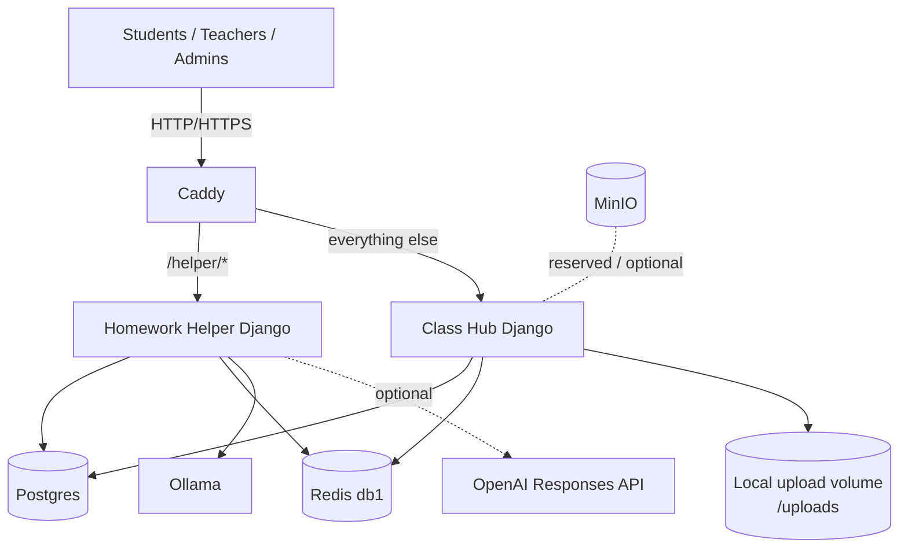
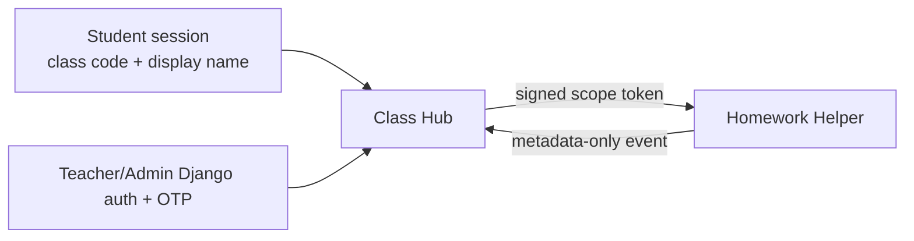
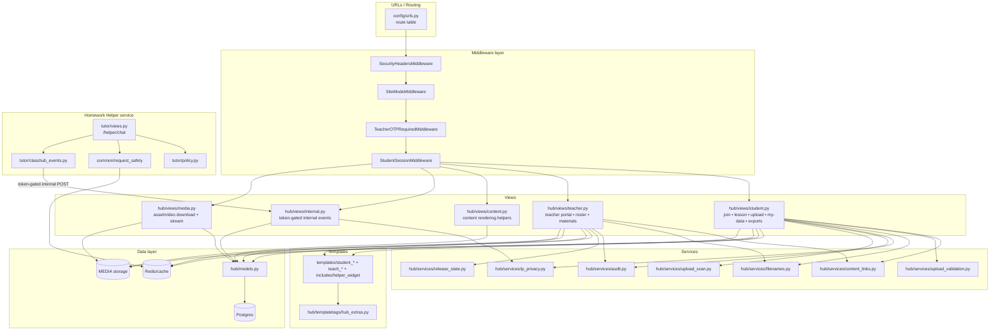

# Architecture

This system is a small self-hosted LMS stack with a split web surface:

- `Class Hub` (main LMS)
- `Homework Helper` (AI tutor under `/helper/*`)

## Runtime topology (current)



## Trust boundaries (Map A)

```mermaid
flowchart TB
  subgraph Z0["Internet / Browsers"]
    S[Student Browser]
    T[Teacher Browser]
    A[Admin / Operator Browser]
  end

  subgraph Z1["Edge / Reverse Proxy (Caddy)"]
    C[Caddy<br/>TLS • routing • body limits<br/>security headers (optional)]
  end

  subgraph Z2["Application Network (Docker / host LAN)"]
    CH[ClassHub (Django)<br/>classhub_web<br/>student + teacher UI]
    HH[Homework Helper (Django)<br/>helper_web<br/>hint engine + policies]
    R[(Redis / cache)<br/>rate limits • sessions • throttles]
    PG[(Postgres)<br/>core data store]
    FS[(File storage / MEDIA)<br/>submissions • exports]
  end

  subgraph Z3["Optional External Services"]
    YT[YouTube-nocookie embeds]
    REM[Remote LLM provider<br/>(only if enabled)]
  end

  S -->|HTTPS| C
  T -->|HTTPS| C
  A -->|HTTPS| C

  C -->|/ + /teach + media/download routes| CH
  C -->|/helper/*| HH

  CH <-->|cache calls| R
  CH <-->|SQL| PG
  CH <-->|read/write| FS

  HH <-->|cache calls| R
  HH -->|best-effort internal event POST (token-gated)| CH

  CH -.->|embeds| YT
  HH -. optional .->|prompt/response| REM
```

## What routes where

- Caddy handles edge traffic.
- `/helper/*` goes to Homework Helper.
- All other paths go to Class Hub.

This means helper outages are less likely to take down core LMS pages.



## Data boundaries

### Class Hub

- Owns classroom, student, module/material, submission, and teacher portal flows.
- Uses Postgres + Redis.
- Stores uploads on local mounted storage (`/uploads`), not public media routes.

### Homework Helper

- Owns helper chat policy, prompt shaping, and model backends.
- Uses Postgres + Redis for auth/session/rate-limit integration.
- Uses Ollama by default; OpenAI is optional by environment config.

## Why two Django services

1. Availability isolation: core classroom flows can remain usable when AI degrades.
2. Security boundaries: helper policy/rate-limit logic is isolated from core LMS pages.
3. Operational flexibility: helper can evolve independently (model/backend changes).

## Deployment model

- Production images bake service code and curriculum content from repo.
- Gunicorn serves Django in containers.
- Local dev uses compose override + bind mounts for fast iteration.

See:

- `docs/DEVELOPMENT.md` for local workflow
- `docs/RUNBOOK.md` for operations
- `compose/docker-compose.yml` for source-of-truth wiring

## ClassHub module graph (Map C)


