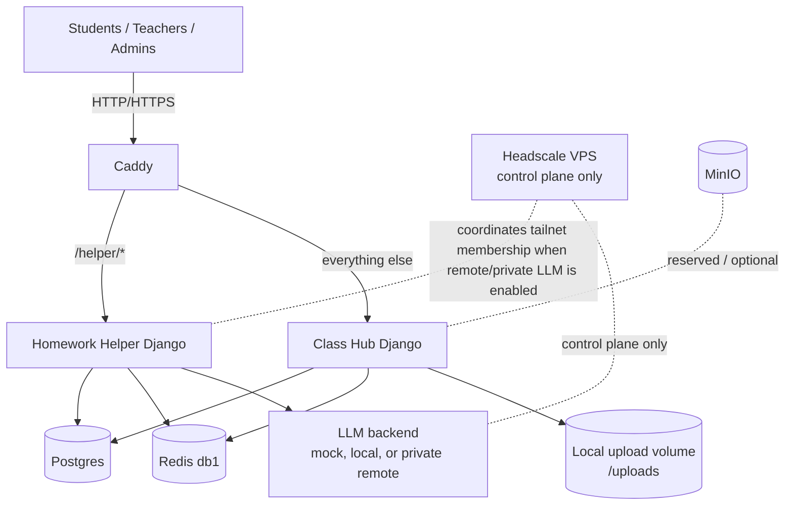
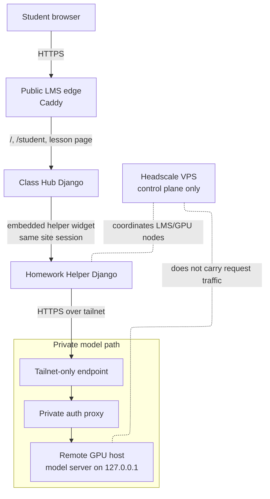
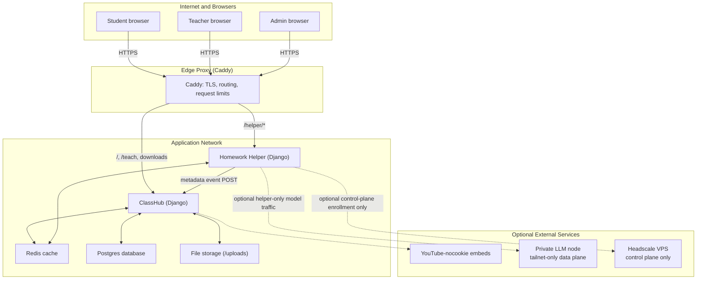
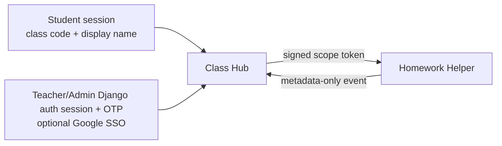
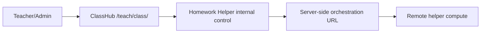
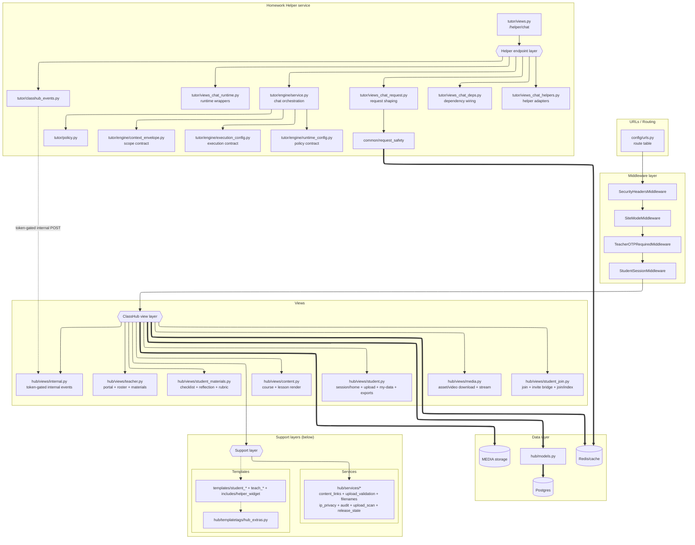

# Architecture

This system is a small self-hosted LMS stack with a split web surface:

- `Class Hub` (main LMS)
- `Homework Helper` (AI tutor under `/helper/*`)

## Runtime topology (current)

```mermaid
flowchart TD
  U[Students / Teachers / Admins] -->|HTTP/HTTPS| C[Caddy]
  C -->|/helper/*| H[Homework Helper Django]
  C -->|everything else| W[Class Hub Django]

  W --> P[(Postgres)]
  H --> P
  W --> R[(Redis db0)]
  H --> R[(Redis db1)]

  W --> F[(Local upload volume<br/>/uploads)]
  H --> L[LLM backend<br/>mock, local, or private remote]
  HS[Headscale VPS<br/>control plane only]

  HS -. coordinates tailnet membership when remote/private LLM is enabled .- H
  HS -. control plane only .- L

  M[(MinIO)] -. reserved / optional .- W
```

## End-to-end learner/helper path

In the current remote-GPU deployment, the browser only talks to the public LMS edge. The model host stays private and tailnet-only. Homework Helper is the only component that talks to that private endpoint.

```mermaid
%%{init: {"flowchart": {"nodeSpacing": 18, "rankSpacing": 20, "defaultRenderer": "elk"}}}%%
flowchart TB
  S[Student browser] -->|HTTPS| E[Public LMS edge<br/>Caddy]
  E -->|/, /student, lesson page| CH[Class Hub Django]
  CH -->|embedded helper widget<br/>same site session| HH[Homework Helper Django]

  subgraph PRIVATE["Private model path"]
    direction TB
    TS[Tailnet-only endpoint]
    AP[Private auth proxy]
    GPU[Remote GPU host<br/>model server on 127.0.0.1]
    TS --> AP --> GPU
  end

  HS[Headscale VPS<br/>control plane only]

  HH -->|HTTPS over tailnet| TS
  HS -. coordinates LMS/GPU nodes .- HH
  HS -. does not carry request traffic .- GPU
```

Key points:

- Browsers never connect to the GPU host directly.
- Homework Helper is the only component that talks to the model host.
- The helper request still appears inside the LMS page, but the model hop happens server-to-server from Homework Helper.
- Responses return along the same path; the reverse hop is omitted from the diagram to keep it readable in-flow.
- Class Hub remains the policy and session boundary for the learner-visible experience.
- The tailnet exists only for LLM traffic and related operator troubleshooting, not for normal browser traffic and not for general site routing.
- For createMPLS-style production deployments, the recommended control plane for that private path is a self-hosted Headscale server on a tiny Ubuntu VPS.
- If the remote model host is down, Class Hub pages still load; only helper responses degrade.

## Trust boundaries (Map A)

```mermaid
flowchart TB
  subgraph Z0["Internet and Browsers"]
    S["Student browser"]
    T["Teacher browser"]
    A["Admin browser"]
  end

  subgraph Z1["Edge Proxy (Caddy)"]
    C["Caddy: TLS, routing, request limits"]
  end

  subgraph Z2["Application Network"]
    CH["ClassHub (Django)"]
    HH["Homework Helper (Django)"]
    R["Redis cache"]
    PG["Postgres database"]
    FS["File storage (/uploads)"]
  end

  subgraph Z3["Optional External Services"]
    YT["YouTube-nocookie embeds"]
    REM["Private LLM node<br/>tailnet-only data plane"]
    HS["Headscale VPS<br/>control plane only"]
  end

  S -->|HTTPS| C
  T -->|HTTPS| C
  A -->|HTTPS| C

  C -->|/, /teach, downloads| CH
  C -->|/helper/*| HH

  CH <--> R
  CH <--> PG
  CH <--> FS

  HH <--> R
  HH -->|metadata event POST| CH

  CH -.-> YT
  HH -. optional helper-only model traffic .-> REM
  HH -. optional control-plane enrollment only .-> HS
```

## What routes where

- Caddy handles edge traffic.
- `/helper/*` goes to Homework Helper.
- All other paths go to Class Hub.

This means helper outages are less likely to take down core LMS pages.

```mermaid
flowchart LR
  S[Student session<br/>class code + display name] --> W[Class Hub]
  T[Teacher/Admin Django auth session + OTP<br/>optional Google SSO] --> W
  W -->|signed scope token| H[Homework Helper]
  H -->|metadata-only event| W
```

For the remote private-model continuation of that flow, see [PRIVATE_LLM_BACKEND.md](PRIVATE_LLM_BACKEND.md).

## Data boundaries

### Class Hub

- Owns classroom, student, module/material, submission, and teacher portal flows.
- Uses Postgres + Redis.
- Stores uploads on local mounted storage (`/uploads`), not public media routes.

### Homework Helper

- Owns helper chat policy, prompt shaping, and model backends.
- Uses Postgres + Redis for auth/session/rate-limit integration.
- Uses a small local Ollama path by default for bounded smoke/day-1 validation; serious remote Gemma-family or other private backends are supported through the helper provider layer.
- Private remote deployment stays control-plane-agnostic at runtime: the app uses `LLM_BASE_URL` and `LLM_API_KEY`, while operators may use Tailscale or Headscale to coordinate the private host-to-host path.
- Owns the bounded remote-compute lease control for expensive private helper backends; the teacher/admin surface can request activation, but provider credentials and orchestration APIs remain server-side.
- Runtime behavior is resolved through explicit contracts:
  - scope/context envelope (`engine/context_envelope.py`)
  - policy bundle (`engine/runtime_config.py`)
  - execution config (`engine/execution_config.py`)
  - provider abstraction (`tutor/llm/*`)

## Why two Django services

1. Availability isolation: core classroom flows can remain usable when AI degrades.
2. Security boundaries: helper policy/rate-limit logic is isolated from core LMS pages.
3. Operational flexibility: helper can evolve independently (model/backend changes).

## Deployment model

- Production images bake service code and curriculum content from repo.
- Gunicorn serves Django in containers.
- Local dev uses compose override + bind mounts for fast iteration.
- Day-1 deploy/test defaults to a bundled CPU-local Ollama service with a small local smoke profile when the helper backend points at `http://ollama:11434`.
- Private remote inference remains optional; remote helper validation is advisory by default so the core LMS stack can still deploy and smoke-test independently.
- For createMPLS-style production use, the recommended serious path is a public LMS plus a private tailnet-only model endpoint coordinated by Headscale on a tiny Ubuntu VPS, with a Gemma-family model as the recommended open-model example on the private GPU host.

## Staff activation path for remote compute

```mermaid
flowchart LR
  Staff["Teacher/Admin"]
  LMS["ClassHub /teach/class/<id>"]
  Helper["Homework Helper internal control"]
  Ops["Server-side orchestration URL"]
  Remote["Remote helper compute"]

  Staff --> LMS
  LMS --> Helper
  Helper --> Ops
  Ops --> Remote
```

This path is staff-only and server-side after the initial teacher/admin action. It is not a student/browser feature.

See:

- [DEVELOPMENT.md](DEVELOPMENT.md) for local workflow
- [RUNBOOK.md](RUNBOOK.md) for operations
- [EVIDENCE_REMOTE_COMPUTE.md](EVIDENCE_REMOTE_COMPUTE.md) for the measured lease/fallback evidence layer
- `compose/docker-compose.yml` for source-of-truth wiring

## ClassHub module graph (Map C)

```mermaid
%%{init: {"themeVariables": {"fontSize": "11px"}, "flowchart": {"nodeSpacing": 24, "rankSpacing": 22, "defaultRenderer": "elk"}}}%%
flowchart TB
  subgraph URL["URLs / Routing"]
    U[config/urls.py<br/>route table]
  end

  subgraph MW["Middleware layer"]
    M1[SecurityHeadersMiddleware]
    M2[SiteModeMiddleware]
    M3[TeacherOTPRequiredMiddleware]
    M4[StudentSessionMiddleware]
  end

  subgraph V["Views"]
    direction TB
    V1[hub/views/student_join.py<br/>join + invite bridge + join/index]
    V2[hub/views/student.py<br/>session/home + upload + my-data + exports]
    V3[hub/views/student_materials.py<br/>checklist + reflection + rubric]
    V4[hub/views/content.py<br/>course + lesson render]
    V5[hub/views/teacher.py<br/>portal + roster + materials]
    V6[hub/views/internal.py<br/>token-gated internal events]
    V7[hub/views/media.py<br/>asset/video download + stream]
    VALL{{ClassHub view layer}}
  end

  subgraph D["Data layer"]
    MD[hub/models.py]
    DB[(Postgres)]
    RC[(Redis/cache)]
    FS[(MEDIA storage)]
  end

  subgraph H["Homework Helper service"]
    direction TB
    H1[tutor/views.py<br/>/helper/chat]
    H2[tutor/views_chat_request.py<br/>request shaping]
    H3[tutor/views_chat_deps.py<br/>dependency wiring]
    H4[tutor/views_chat_runtime.py<br/>runtime wrappers]
    H5[tutor/views_chat_helpers.py<br/>helper adapters]
    H6[tutor/engine/service.py<br/>chat orchestration]
    H7[tutor/engine/context_envelope.py<br/>scope contract]
    H8[tutor/engine/runtime_config.py<br/>policy contract]
    H9[tutor/engine/execution_config.py<br/>execution contract]
    H10[tutor/policy.py]
    H11[tutor/classhub_events.py]
    H12[common/request_safety]
    HALL{{Helper endpoint layer}}
  end

  subgraph B["Support layers (below)"]
    direction TB
    BSUP{{Support layer}}

    subgraph S["Services"]
      SALL[hub/services/*<br/>content_links + upload_validation + filenames<br/>ip_privacy + audit + upload_scan + release_state]
    end

    subgraph T["Templates"]
      TP[templates/student_* + teach_* + includes/helper_widget]
      TT[hub/templatetags/hub_extras.py]
    end
  end

  U --> M1 --> M2 --> M3 --> M4 --> VALL

  VALL --> V1
  VALL --> V2
  VALL --> V3
  VALL --> V4
  VALL --> V5
  VALL --> V6
  VALL --> V7

  VALL --> BSUP
  BSUP --> SALL
  BSUP -.-> TP

  VALL ==> MD
  MD ==> DB
  VALL ==> RC
  VALL ==> FS

  TP -.-> TT

  H1 --> HALL
  HALL --> H2
  HALL --> H3
  HALL --> H4
  HALL --> H5
  HALL --> H6
  H6 --> H7
  H6 --> H8
  H6 --> H9
  H6 --> H10
  HALL --> H11
  H2 --> H12
  H11 -. token-gated internal POST .-> V6
  H12 ==> RC
```

Reading note: arrows indicate directional dependencies/flow between modules.
Where a connection has special meaning, it is labeled directly on the edge
(for example, `token-gated internal POST`).
