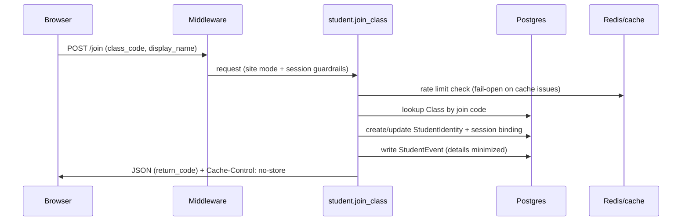

# Class-code auth (student)

## MVP behavior

- Students do not have email/password.
- A student joins a class by entering:
  - Class code
  - Display name
- On first join, we create a `StudentIdentity`, issue a short `return_code`, and store
  the student id in the session cookie.
- Rejoin from the same browser/device can reclaim identity automatically when class code
  + display name match a valid signed device hint cookie.
- Rejoin from a different browser/device requires class code + display name + `return_code`.

## Recovery

If cookies are cleared, the student can rejoin using the same class code and their
return code.

## Security notes

- Class codes should be rotatable.
- Joining can be locked per class.
- `/join` should be rate-limited to discourage brute force.

## Join flow (Map D1)

