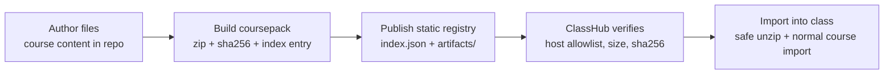

# Coursepack Registry Publishing Guide

This guide turns the static coursepack registry slice into an operator workflow.

Use this when you want to:
- build a reviewed coursepack artifact,
- publish it in a static directory tree,
- import it into ClassHub from a registry index instead of from a local repo checkout.

## Publishing path in one view



Read it left to right: the registry is a static distribution layer, not a new authoring system or hosted control plane.

## Recommended static layout

Keep the registry as plain files:

```text
registry/
  index.json
  artifacts/
    swarm_aesthetics_20260608T210000Z.zip
    swarm_aesthetics_20260608T210000Z.zip.sha256
    scratch_intro_games_code_grade9_6_session_20260608T211500Z.zip
    scratch_intro_games_code_grade9_6_session_20260608T211500Z.zip.sha256
```

Why this layout:
- `index.json` stays small and readable.
- artifact paths remain relative to the index.
- the same tree works from a local folder, a Git repository, or static object storage.

## Build and publish one coursepack

From the repo root:

```bash
python3 scripts/coursepack_sdk.py build \
  --course-slug swarm_aesthetics \
  --version 20260608T210000Z \
  --source-url "https://github.com/example/classhub-curriculum/tree/main/swarm_aesthetics" \
  --output registry/artifacts/swarm_aesthetics_20260608T210000Z.zip \
  --registry-index registry/index.json
```

This writes:
- `registry/artifacts/swarm_aesthetics_20260608T210000Z.zip`
- `registry/artifacts/swarm_aesthetics_20260608T210000Z.zip.sha256`
- an updated `registry/index.json`

## Validate before publishing

```bash
python3 scripts/coursepack_sdk.py registry-validate --index registry/index.json
python3 scripts/coursepack_sdk.py registry-list --index registry/index.json
```

## Host the registry

Any static file host is sufficient. The contract is just:
- `index.json` must be reachable,
- artifact `.zip` files must be reachable,
- checksum sidecars must stay adjacent to those artifacts.

If you want ClassHub to fetch a remote registry directly:
- host it on `https`,
- add the registry host to `CLASSHUB_COURSEPACK_REGISTRY_ALLOWED_HOSTS`,
- keep artifact and checksum URLs on the same origin as the index.

Examples:
- local filesystem path:
  - `file:///srv/classhub-coursepacks/index.json`
- relative local path from the process working directory:
  - `registry/index.json`
- Git-backed static site or raw file hosting:
  - `https://example.org/classhub-coursepacks/index.json`
- object storage bucket with static read access:
  - `https://storage.example.org/classhub-coursepacks/index.json`

## Import from the registry into ClassHub

If the ClassHub server can reach the registry index, operators can import directly:

```bash
cd /srv/lms/app/compose
docker compose exec classhub_web python manage.py import_coursepack_registry \
  --index https://example.org/classhub-coursepacks/index.json \
  --course-slug swarm_aesthetics \
  --registry-version 20260608T210000Z \
  --class-name "Swarm Aesthetics Cohort" \
  --create-class
```

Local-file variant:

```bash
cd /srv/lms/app/compose
docker compose exec classhub_web python manage.py import_coursepack_registry \
  --index file:///srv/classhub-coursepacks/index.json \
  --course-slug swarm_aesthetics \
  --class-name "Swarm Aesthetics Cohort" \
  --create-class
```

Notes:
- If `--registry-version` is omitted, the command imports the most recently generated registry entry for that slug.
- The command verifies SHA-256 and byte size before importing.
- The command reuses the existing safe ZIP extraction/import path after verification.
- Remote indexes are rejected unless their host is listed in `CLASSHUB_COURSEPACK_REGISTRY_ALLOWED_HOSTS`.
- Absolute local indexes must use `file://...`; plain local paths are treated as relative to the ClassHub process working directory.
- Use `--overwrite-content` if the extracted course already exists under `CONTENT_ROOT/courses/<slug>`.
- Use `--replace` if the class already has module/material layout that should be rebuilt from the imported coursepack.

## Browser-based import paths

Shell access is no longer required for the import step.

Current UI paths:
- Teacher Portal (`/teach`)
  - superuser-only card: `Import Registry Coursepack`
  - accepts registry index, course slug, optional registry version, and target class fields
- Django admin (`/admin/hub/class/import-coursepack/`)
  - supports either upload-based import or registry-based import from the same page

Both UI paths:
- verify SHA-256 and byte size before import,
- reuse the same safe ZIP extraction/import flow as the command path,
- write audit events with registry provenance metadata.
- are now visible in the Teacher Portal content/import audit feed when advanced tools are enabled.

## Audit provenance

Registry-backed imports now record explicit provenance in audit history:
- management command: `coursepack.registry.import`
- teacher portal: `coursepack.registry.import`
- admin GUI: `admin.coursepack_registry.import`

Audit metadata includes:
- registry index location
- registry version
- source URL
- release channel
- artifact URL
- resolved artifact/checksum locations
- verified SHA-256 and byte size

## Minimal operator checklist

1. Build the artifact with `coursepack_sdk.py build ... --registry-index ...`.
2. Run `registry-validate`.
3. Publish `index.json`, `.zip`, and `.sha256` files together.
4. Import with `manage.py import_coursepack_registry`.
5. Verify the class route and module count in `/teach` or `/admin`.

## Boundaries

- This is a static distribution workflow, not a hosted registry service.
- Trust is checksum-based in this first slice; signed artifact policy is still future work.
- Remote fetch is intentionally bounded to explicit `https` host allowlists; arbitrary remote URLs are not accepted.
- The registry does not change the source-of-truth authoring model: course content is still authored file-first and packaged intentionally.
