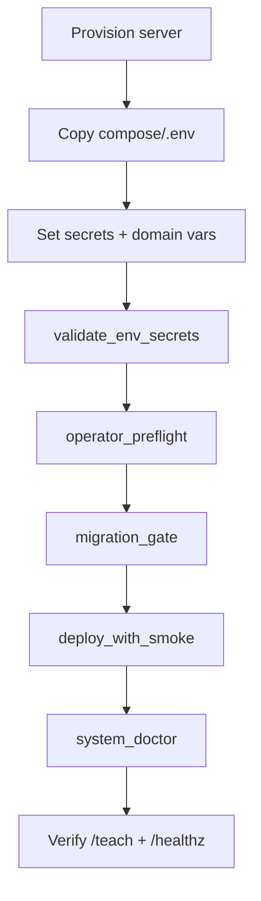

# Day 1 deploy checklist (Ubuntu)

See `scripts/bootstrap_day1.sh` for an automated starter.
Operator skill-floor reference: [MINIMUM_VIABLE_OPERATOR.md](MINIMUM_VIABLE_OPERATOR.md).



## Essentials
- Create non-root deploy user
- Enable firewall (SSH/80/443 only)
- Install Docker + Compose
- Set Docker log limits
- Create `/srv/lms/app` directory spine (or set `PROJECT_ROOT` and keep docs/systemd paths consistent)
- Put backups off-server
- Plan container UID/GID mapping for bind-mounted writes (`APP_UID`/`APP_GID`)

## Run
- Copy the mode-appropriate env example:
  - local/day-1: `compose/.env.example.local` → `compose/.env`
  - domain/TLS: `compose/.env.example.domain` → `compose/.env`
- Set a strong `DJANGO_SECRET_KEY` (do not keep placeholder/default values)
- Set a separate strong `DEVICE_HINT_SIGNING_KEY` (do not reuse `DJANGO_SECRET_KEY`)
- Set a separate strong `HELPER_SCOPE_SIGNING_KEY` (do not reuse `DJANGO_SECRET_KEY` in production)
- Set non-root container ids to match your deploy user (recommended):
  - `APP_UID=$(id -u <deploy-user>)`
  - `APP_GID=$(id -g <deploy-user>)`
- Pick staff/org boundary mode:
  - `REQUIRE_ORG_MEMBERSHIP_FOR_STAFF=1` (production default; hard org boundary)
  - `REQUIRE_ORG_MEMBERSHIP_FOR_STAFF=0` (local/dev or time-boxed migration fallback only)
  - Validate lock posture before first deploy:
    - `python3 scripts/check_runtime_policy_lock.py --profile baseline --env-file compose/.env`
  - Record the selected org-boundary posture in [ORG_BOUNDARY_POLICY_AUDIT.md](ORG_BOUNDARY_POLICY_AUDIT.md) as the first audit row for this deployment.
- Keep admin 2FA enforcement enabled: `DJANGO_ADMIN_2FA_REQUIRED=1`
- For domain/TLS mode, set:
  - `DJANGO_SECURE_SSL_REDIRECT=1`
  - `CADDY_HSTS_MAX_AGE=31536000` (after initial validation)
  - `REQUEST_SAFETY_TRUST_PROXY_HEADERS=1`
- Confirm proxy body limits for your workload:
  - `CADDY_CLASSHUB_MAX_BODY` (uploads; default `220MB`)
  - `CADDY_HELPER_MAX_BODY` (helper API; default `1MB`)
  - `CLASSHUB_UPLOAD_MAX_MB` (default `200`)
- Configure LLM backend (default is Ollama; ensure it is running)
  - Treat the local LMS-hosted model path as a bounded smoke/day-1 validation lane, not as the serious long-term inference node.
  - If using the remote vGPU path, keep the browser on the public LMS site and let Homework Helper reach the model host privately over a tailnet:
    - public LMS example: `DOMAIN=lms.creatempls.org`
    - private model endpoint example: `LLM_BASE_URL=https://thundercompute-vgpu.tail.creatempls.org`
    - control plane for createMPLS-style production: Jetson_B running Headscale at `hs.creatempls.org`
    - canonical repo bundle for Jetson_B now lives in `ops/headscale/` (`install.sh`, Compose stack, backup, restore, systemd timer)
    - set `LLM_BACKEND=openai_compatible` unless the Thundercompute endpoint exposes an Ollama-compatible API
    - set `LLM_API_KEY=<shared proxy bearer token>`
    - set `HELPER_REMOTE_MODE_ACKNOWLEDGED=1`
    - For remote vGPU smoke stability, set `LLM_NUM_CTX=4096` as a starting point if the selected backend honors it
    - Keep the tailnet limited to helper-to-model traffic and related operator/admin troubleshooting only
  - Legacy note: `OLLAMA_BASE_URL` still works as a fallback, but `LLM_*` names are the preferred contract for new deploys.
  - If you keep both canonical and legacy helper keys in `compose/.env`, keep them identical:
    - `LLM_BACKEND=ollama` and `HELPER_LLM_BACKEND=ollama`
    - `LLM_BASE_URL=...` and `OLLAMA_BASE_URL=...`
    - `LLM_MODEL=...` and `OLLAMA_MODEL=...`
  - Optional staff-only remote compute lease control:
    - keep `CLASSHUB_REMOTE_HELPER_COMPUTE_ENABLED=0` and `CLASSHUB_REMOTE_HELPER_COMPUTE_ACKNOWLEDGED=0` unless you are intentionally turning on the bounded class-session control
    - if enabled, configure `REMOTE_LLM_*` plus `HELPER_REMOTE_COMPUTE_ACTIVATE_URL` / `HELPER_REMOTE_COMPUTE_DEACTIVATE_URL` and, ideally, `HELPER_REMOTE_COMPUTE_HEALTHCHECK_URL`
    - the teacher/admin control stays on `/teach/class/<id>`; students never activate remote compute directly
- Configure smoke-check credentials in `compose/.env` (for strict mode):
  - `SMOKE_BASE_URL`
  - `SMOKE_CLASS_CODE`
  - `SMOKE_TEACHER_USERNAME`
  - `SMOKE_TEACHER_PASSWORD`
- Optional: use fixture-backed golden smoke mode to avoid managing static smoke credentials:
  - `DEPLOY_SMOKE_MODE=golden bash scripts/deploy_with_smoke.sh`
- Run content preflight checks (blocks bad lesson video/copy sync):
  - `bash scripts/content_preflight.sh piper_scratch_12_session`
- Validate deploy secrets and routing env:
  - `bash scripts/validate_env_secrets.sh`
- Run operator preflight (catches routing/host/internal-URL mismatches before deploy):
  - `python3 scripts/operator_preflight.py --env-file compose/.env`
- Run migration gate:
  - `bash scripts/migration_gate.sh`
- Run deterministic production deploy + smoke:
  - `bash scripts/deploy_with_smoke.sh`
  - Remote vGPU recommended smoke invocation:
    - `SMOKE_TIMEOUT_SECONDS=45 SMOKE_HELPER_MESSAGE='Give one short Scratch hint about moving a sprite.' make smoke-full`
- Run one-command end-to-end diagnostic:
  - `bash scripts/system_doctor.sh`
  - Remote vGPU operator reference:
    - [PRIVATE_LLM_BACKEND.md](PRIVATE_LLM_BACKEND.md)
    - [HEADSCALE_CONTROL_PLANE.md](HEADSCALE_CONTROL_PLANE.md)
- Manual production compose fallback (if needed):
  - `docker compose -f docker-compose.yml up -d --build`
- Create first superuser
- Create at least one staff teacher account (`is_staff=True`, non-superuser preferred for daily use), e.g.:
  - `docker compose exec classhub_web python manage.py create_teacher --username teacher1 --email teacher1@example.org --password CHANGE_ME`
- Verify health endpoints
- Verify teacher routes:
  - `/teach`
  - `/teach/lessons`

## Routing mode switch (local vs domain)
Use `.env` as the single selector (no ad-hoc file renames):

- Local/day-1 mode:
  - `CADDYFILE_TEMPLATE=Caddyfile.local`
  - `DOMAIN` can stay placeholder
- Domain/TLS mode:
  - `CADDYFILE_TEMPLATE=Caddyfile.domain`
  - set real `DOMAIN=...`
  - point DNS A/AAAA record to server
- Domain/TLS + separate asset host:
  - `CADDYFILE_TEMPLATE=Caddyfile.domain.assets`
  - set `DOMAIN=...` and `ASSET_DOMAIN=...`
  - set `CLASSHUB_ASSET_BASE_URL=https://$ASSET_DOMAIN`
  - if using sibling subdomains, set:
    - `DJANGO_SESSION_COOKIE_DOMAIN=.yourdomain.tld`
    - `DJANGO_CSRF_COOKIE_DOMAIN=.yourdomain.tld`
- Optional static organization site on the same Caddy edge:
  - keep `CADDYFILE_TEMPLATE` in a domain/TLS mode
  - set `CADDY_EXTRA_CONFIG_TEMPLATE=Caddyfile.extra.static-site`
  - set `CADDY_STATIC_SITE_ROOT_HOST` to a dedicated host directory containing `index.html`
  - set `CADDY_STATIC_SITE_DOMAINS` to one or more comma-separated public hostnames, with a space after each comma as required by Caddy
  - do not reuse `DOMAIN` or `ASSET_DOMAIN`; the operator preflight rejects hostname collisions

Example:

```dotenv
CADDY_EXTRA_CONFIG_TEMPLATE=Caddyfile.extra.static-site
CADDY_STATIC_SITE_ROOT_HOST=/srv/example_orgsite
CADDY_STATIC_SITE_DOMAINS=example.org, www.example.org
```

The directory is mounted read-only at `/srv/caddy-static-site`. The shipped fragment blocks repository metadata and supports both `.html` files and extensionless routes. Keep the default `Caddyfile.extra.empty` when no additional site is needed.

Validate every shipped domain combination with `bash scripts/check_caddy_configs.sh` on a host with Docker available.

Then deploy/reload:

```bash
cd compose
docker compose -f docker-compose.yml up -d --build
```

If you need a manual fallback (older docs/scripts), use explicit copy commands:

```bash
cp compose/Caddyfile.local compose/Caddyfile
cp compose/Caddyfile.domain compose/Caddyfile
```

PowerShell equivalents:

```powershell
Copy-Item compose/Caddyfile.local compose/Caddyfile -Force
Copy-Item compose/Caddyfile.domain compose/Caddyfile -Force
```

## Verification commands (run in both modes)

Local mode expectations (`CADDYFILE_TEMPLATE=Caddyfile.local`):

```bash
cd compose
docker compose ps
curl -i http://localhost/healthz
curl -i http://localhost/upstream-healthz
curl -i http://localhost/helper/healthz
curl -I http://localhost/
```

Expected behavior: health endpoints return `200` on `http://localhost`; no TLS required.

Domain mode expectations (`CADDYFILE_TEMPLATE=Caddyfile.domain`):

```bash
cd compose
docker compose ps
curl -i https://$DOMAIN/healthz
curl -i https://$DOMAIN/upstream-healthz
curl -i https://$DOMAIN/helper/healthz
curl -I http://$DOMAIN/
curl -I https://$DOMAIN/
```

Expected behavior: HTTPS endpoints return `200`; HTTP redirects to HTTPS (`301`/`308`).
If `CADDY_EXPOSE_UPSTREAM_HEALTHZ=0`, `/upstream-healthz` should return `404`.

Asset-domain mode expectations (`CADDYFILE_TEMPLATE=Caddyfile.domain.assets`):

```bash
cd compose
docker compose ps
curl -i https://$DOMAIN/healthz
curl -i https://$DOMAIN/upstream-healthz
curl -i https://$ASSET_DOMAIN/healthz
curl -i https://$ASSET_DOMAIN/upstream-healthz
curl -I https://$ASSET_DOMAIN/lesson-video/1/stream
```

Expected behavior: both hosts answer health checks; asset host serves only `/lesson-asset/*` and `/lesson-video/*`.
If `CADDY_EXPOSE_UPSTREAM_HEALTHZ=0`, both `/upstream-healthz` checks should return `404`.

When the optional static site is enabled, also verify:

```bash
curl -I https://example.org/
curl -I https://example.org/about
curl -I https://example.org/.git/config
```

Expected behavior: public pages return `200`; repository metadata returns `404`.

Service exposure defaults:
- Postgres/Redis are internal-only on Docker networking.
- Ollama (`11434`) and MinIO console (`9001`) bind to `127.0.0.1` on host.
