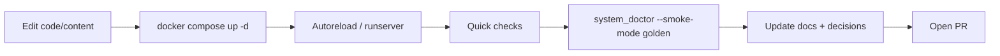

# Development

This repo is optimized for **fast local iteration** with Docker Compose.
By default, Docker Compose will load `compose/docker-compose.override.yml`
if it exists, which enables hot reload for Django code and templates.

Docs are first-class in this repo. If you change behavior, update docs in the
same branch. Start with:



- [index.md](index.md) (documentation contract)
- [START_HERE.md](START_HERE.md) (navigation map)
- [TEACHING_PLAYBOOK.md](TEACHING_PLAYBOOK.md) (teaching-quality writing standards)
- [MERGE_READINESS.md](MERGE_READINESS.md) (merge gate expectations)

## Extension map (where to change what)

Use this map to pick the right seam before you start coding.

### What to do now
1. Pick the lane below that matches your change.
2. Edit only the primary files first, then run the lane tests.
3. Update the linked docs page in the same branch.

### Verification signal
You can point to one lane, one focused test command, and one docs update for your PR.

| Change type | Primary edit locations | Tests to run first | Docs to update |
|---|---|---|---|
| Student join/session behavior | `services/classhub/hub/views/student.py`, `services/classhub/hub/middleware.py`, `services/classhub/hub/models.py` | `python manage.py test hub.tests.JoinClassTests hub.tests_services.StudentSessionMiddlewareTests hub.tests.StudentDataControlsTests` | `docs/CLASS_CODE_AUTH.md`, `docs/PRIVACY-ADDENDUM.md`, `docs/DECISIONS.md` |
| Teacher flows, OTP, roster, teaching UI | `services/classhub/hub/views/teacher.py`, `services/classhub/config/middleware.py`, `services/classhub/hub/forms.py` | `python manage.py test hub.tests.TeacherPortalTests hub.tests.Teacher2FASetupTests` | `docs/TEACHER_PORTAL.md`, `docs/SECURITY.md`, `docs/DECISIONS.md` |
| Upload validation, scanning, and downloads | `services/classhub/hub/services/upload_policy.py`, `services/classhub/hub/services/upload_validation.py`, `services/classhub/hub/services/upload_scan.py`, `services/classhub/hub/views/media.py` | `python manage.py test hub.tests_services.UploadValidationServiceTests hub.tests_services.UploadScanServiceTests hub.tests.SubmissionDownloadHardeningTests` | `docs/SECURITY.md`, `docs/PRIVACY-ADDENDUM.md`, `docs/RUNBOOK.md` |
| Markdown/content rendering and embed behavior | `services/classhub/hub/services/markdown_content.py`, `services/classhub/hub/services/content_links.py`, `services/classhub/hub/views/content.py`, templates under `services/classhub/templates/` | `python manage.py test hub.tests_services.MarkdownContentServiceTests hub.tests_services.ContentLinksServiceTests` | `docs/COURSE_AUTHORING.md`, `docs/DEVELOPMENT.md`, `docs/DECISIONS.md` |
| Helper policy, response behavior, backend routing | `services/homework_helper/tutor/policy.py`, `services/homework_helper/tutor/views.py`, `services/homework_helper/tutor/fixtures/policy_prompts.md` | `python manage.py test tutor.tests.HelperChatAuthTests` | `docs/HELPER_POLICY.md`, `docs/OPENAI_HELPER.md`, `docs/DECISIONS.md` |
| Shared rate limiting / request safety / IP behavior | `services/common/request_safety/__init__.py`, `services/common/helper_scope.py`, integration points in classhub/helper views | `python manage.py test hub.tests_services.RequestSafetyRateLimitResilienceTests tutor.tests.HelperChatAuthTests` | `docs/REQUEST_SAFETY.md`, `docs/SECURITY_BASELINE.md`, `docs/DECISIONS.md` |
| New model fields or retention behavior | `services/classhub/hub/models.py`, migrations in `services/classhub/hub/migrations/`, retention commands in `services/classhub/hub/management/commands/` | `python manage.py test hub.tests.StudentEventRetentionCommandTests hub.tests.SubmissionRetentionCommandTests hub.tests.StudentDataControlsTests` | `docs/PRIVACY-ADDENDUM.md`, `docs/RUNBOOK.md`, `docs/DISASTER_RECOVERY.md` |
| Security headers / cache policy / browser hardening | `services/classhub/config/settings.py`, `services/classhub/config/middleware.py`, `services/homework_helper/config/settings.py`, `services/homework_helper/config/middleware.py`, `services/classhub/hub/http/headers.py` | `python manage.py test hub.tests_security_headers.SecurityHeaderDriftTests hub.tests.ClassHubSecurityHeaderTests tutor.tests.HelperSecurityHeaderTests` | `docs/SECURITY.md`, `docs/SECURITY_BASELINE.md`, `docs/DECISIONS.md` |
| Internal helper event ingest contract | `services/classhub/hub/views/internal.py`, `services/homework_helper/tutor/views.py` (`helper-chat` forwarder) | `python manage.py test hub.tests.InternalHelperEventEndpointTests tutor.tests.ClassHubEventForwardingTests` | `docs/OPENAI_HELPER.md`, `docs/HELPER_EVALS.md`, `docs/DECISIONS.md` |

Notes:
- Avoid adding new behavior to `services/classhub/hub/views/_legacy.py`; keep new work in `student.py`, `teacher.py`, `content.py`, `media.py`, or `internal.py`.
- If you change data models, include migrations in the same PR and run `bash scripts/migration_gate.sh` before push.
- After lane tests pass, run `bash scripts/system_doctor.sh --smoke-mode golden` before opening a PR.

## Hot reload (local dev)

The override file:

- bind-mounts the source into the containers
- runs Django's dev server (`runserver`)
- sets `DJANGO_DEBUG=1`

Start the stack:

```bash
cd compose
docker compose up -d
```

Then edit files under:

- `services/common/` (shared request safety helpers)
- `services/classhub/` (Class Hub Django app)
- `services/homework_helper/` (Homework Helper Django app)
- `services/classhub/content/` (markdown course packs)

Django's autoreloader will pick up Python + template changes, and the
lesson pages read markdown files from disk on each request.

## Local LLM (Ollama)

By default, the helper uses Ollama. Make sure the model server is running:

```bash
cd compose
docker compose exec ollama ollama pull llama3.2:1b
```

If you run Ollama outside of Compose, set `OLLAMA_BASE_URL` in `compose/.env`
so the container can reach it.

## Lesson front matter hygiene

Lesson front matter values containing colons must be quoted (e.g., `title: "Save privately: Download..."`).
Run `scripts/quote_lesson_frontmatter.py` after editing any lesson file to auto-quote those values.

`hub.views` now validates front matter before parsing, so you get a clear `500` and the offending
line if you forget to quote something.

## Content-only updates

If you only want curriculum hot reload (not Python code), you can mount
just the content directory instead of the full app:

```yaml
services:
  classhub_web:
    volumes:
      - ../services/classhub/content:/app/content
      - ../data/classhub_uploads:/uploads
```

## Rebuild course pack in DB

When lesson markdown or `course.yaml` changes, re-import the course pack
to refresh Modules + Materials for a class:

```bash
CLASS_CODE=BZ2CYTTE scripts/rebuild_coursepack.sh
```

You can also pass flags directly:

```bash
scripts/rebuild_coursepack.sh --course-slug piper_scratch_12_session --class-code BZ2CYTTE
```

To create a brand-new class from the course title:

```bash
scripts/rebuild_coursepack.sh --course-slug piper_scratch_12_session --create-class
```

## When rebuilds are required

You **still** need an image rebuild when you change:

- `requirements.txt` (Python dependencies)
- Dockerfiles or OS-level packages
- production-only assets that rely on `collectstatic`

For production-style builds:

```bash
cd compose
docker compose up -d --build
```

The production container entrypoint already runs:

## Repo hygiene check

Quick guardrail before pushing:

```bash
bash scripts/repo_hygiene_check.sh
```

This fails if blocked runtime/local artifacts are tracked (for example `.venv/`, `__pycache__/`, `.env`, `*.sqlite3`, `media/`, `staticfiles/`).

## Lint and editor baseline

Run Ruff from repo root:

```bash
ruff check services scripts
```

Match CI blocking gate:

```bash
ruff check services scripts --select E9,F63,F7,F82
```

Match CI advisory coverage sweep:

```bash
ruff check services scripts --select E,F,I,B,UP --statistics
```

Run Bandit with the same config/scope as CI:

```bash
pip install bandit==1.8.3
bash scripts/run_bandit.sh
```

Optional modes:
- `bash scripts/run_bandit.sh report /tmp/bandit-report.json`
- `bash scripts/run_bandit.sh gate`

Repo formatting defaults are defined in:
- `pyproject.toml` (Ruff baseline)
- `.editorconfig` (line endings/indent/newline defaults)

- `python manage.py migrate`
- `python manage.py collectstatic --noinput`
- Gunicorn server

## Debug vs production behavior

With `DJANGO_DEBUG=1`:

- Django serves static assets directly (no `collectstatic` required)
- stack traces are shown in the browser
- **do not** use this in production

In production, remove the override file or set `DJANGO_DEBUG=0`
and rebuild the image.

For production deploys, prefer:

```bash
bash scripts/deploy_with_smoke.sh
```

That path intentionally uses only `compose/docker-compose.yml` and adds smoke checks.
If you are using a dedicated asset host, set `CADDYFILE_TEMPLATE=Caddyfile.domain.assets`
and configure `ASSET_DOMAIN` + `CLASSHUB_ASSET_BASE_URL` in `compose/.env`.

For one-command local confidence before pushing:

```bash
bash scripts/system_doctor.sh --smoke-mode golden
```
