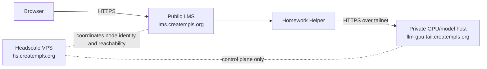

# Headscale Control Plane

## Summary
This is the operator field guide for the recommended control plane behind the createMPLS private LLM path.

For this deployment class:

- `lms.creatempls.org` stays public
- the model host stays private
- only Homework Helper talks to the model host
- the private path is host-to-host over a tailnet
- the recommended tailnet control plane is a self-hosted Headscale server on a tiny Ubuntu VPS

Headscale is coordinating the private path. It is not serving the model and it is not serving the public LMS.

## Purpose

Use the Headscale VPS for one job only:

- coordinate private tailnet membership for the LMS host and the GPU/model host

Do not treat it as:

- a public reverse proxy
- a transit box for browser traffic
- a general office VPN
- a full-site overlay for `lms.creatempls.org`

## Why it is separate

Keep the Headscale control plane separate from the LMS for boring operations:

- the public LMS should keep working even if you replace the tailnet control plane
- the model host should remain replaceable compute, not the networking source of truth
- control-plane maintenance should not share fate with the public classroom site

## Recommended host

Minimal default for this deployment class:

- tiny Ubuntu VPS
- 1 vCPU
- 1 GB RAM
- small persistent disk
- stable public IP or stable DNS front door

This node is coordination-only. It does not need GPU, large storage, or public web app capacity.

Recommended hostname/subdomain:

- `hs.creatempls.org`

Keep it distinct from:

- public LMS: `lms.creatempls.org`
- private model endpoint: for example `llm-gpu.tail.creatempls.org`

## Ubuntu-first assumptions

Assume:

- Ubuntu LTS on the Headscale VPS
- Ubuntu or another Linux distribution on the LMS host
- Ubuntu or another Linux distribution on the GPU/model host

This repo documents the topology and operator expectations. It does not currently automate Headscale installation for you.

## What joins the tailnet

Default nodes:

- LMS application host running ClassHub + Homework Helper
- GPU/model host running the private model server and optional auth proxy

Optional, narrow-use nodes:

- one trusted admin workstation for operator troubleshooting

## What should not join by default

- student browsers
- teacher browsers
- classroom devices
- public edge/CDN nodes serving `lms.creatempls.org`
- unrelated office, school, or home-network devices

If you add more nodes, document the reason first. The default mental model is two servers, plus maybe one operator laptop.

## What traffic uses the tailnet

Allowed/default:

- Homework Helper on the LMS host to the model endpoint on the GPU host
- operator/admin troubleshooting between the LMS host and GPU host
- narrow admin checks against tailnet state when debugging the helper path

## What traffic must never use the tailnet

- public browser traffic to `lms.creatempls.org`
- normal student or teacher page loads
- public asset delivery
- general site routing for ClassHub
- unrelated office or school traffic

The tailnet is only for LLM traffic and related operator troubleshooting.
Remote helper compute activation leases do not change that boundary; they only control when the helper prefers the private remote backend.

## Data plane vs control plane



Important:

- request traffic does not transit through the Headscale VPS
- Headscale coordinates the private path; it does not proxy model traffic, serve the model, or serve the public LMS

## LMS-side relation to helper config

ClassHub runtime stays vendor-neutral at this layer. The LMS side only needs:

- `LLM_BASE_URL`
- `LLM_API_KEY`
- `LLM_BACKEND`
- helper-side probing such as `bash scripts/check_llm_backend.sh --probe-chat`

Example separation:

```bash
DOMAIN=lms.creatempls.org

LLM_ENABLED=1
LLM_BACKEND=ollama
LLM_BASE_URL=https://llm-gpu.tail.creatempls.org
LLM_API_KEY=REPLACE_ME_STRONG
HELPER_REMOTE_MODE_ACKNOWLEDGED=1
```

That config means:

- browsers use `https://lms.creatempls.org`
- only Homework Helper uses `https://llm-gpu.tail.creatempls.org`

## Backup expectations

Back up the control plane like a small but important coordination service:

- Headscale config
- database/state directory
- any ACL/policy files
- bootstrap or registration secrets used to enroll nodes

Keep backups off the VPS.

## Replacement and recovery expectations

Treat the Headscale VPS as important but replaceable:

1. restore Headscale config/state onto a fresh tiny Ubuntu VPS
2. keep the same hostname if possible (`hs.creatempls.org`)
3. confirm the LMS host and GPU host rejoin cleanly
4. rerun helper probing from the LMS host

The public LMS and model service remain separate concerns. Replacing the control plane should not require changing application code.

## Operator checks

From the LMS host:

```bash
cd /srv/lms/app
bash scripts/check_llm_backend.sh --probe-chat
curl -fsS https://lms.creatempls.org/healthz
```

From the GPU host:

```bash
curl -fsS http://127.0.0.1:11434/api/tags
```

From the Headscale VPS:

```bash
systemctl status headscale
```

Use the Headscale VPS to confirm control-plane health, not to test public site routing.

## Related docs

- [PRIVATE_LLM_BACKEND.md](PRIVATE_LLM_BACKEND.md)
- [ARCHITECTURE.md](ARCHITECTURE.md)
- [RUNBOOK.md](RUNBOOK.md)
- [DAY1_DEPLOY_CHECKLIST.md](DAY1_DEPLOY_CHECKLIST.md)
- [ops/llm-server/README.md](../ops/llm-server/README.md)
