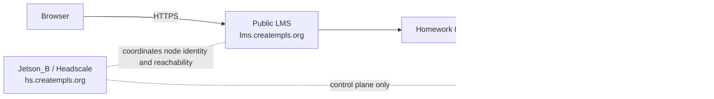

# Headscale Control Plane

## Summary
This is the operator field guide for the recommended control plane behind the createMPLS private LLM path.

For this deployment class:

- `lms.creatempls.org` stays public
- the model host stays private
- only Homework Helper talks to the model host
- the private path is host-to-host over a tailnet
- Jetson_B is the self-hosted Headscale control-plane host for `hs.creatempls.org`

Headscale is coordinating the private path. It is not serving the model and it is not serving the public LMS.

## Purpose

Use Jetson_B's Headscale role for one job only:

- coordinate private tailnet membership for the LMS host and the private model host

Do not treat it as:

- a public reverse proxy
- a transit box for browser traffic
- a general office VPN
- a full-site overlay for `lms.creatempls.org`

## Why it is separate

Keep the Headscale control plane separate from the LMS for boring operations:

- the public LMS should keep working even if you replace the tailnet control plane
- the model host should remain replaceable compute, not the networking source of truth
- control-plane maintenance should not share fate with the public classroom site

## Recommended host

Current default for this deployment:

- Jetson_B
- stable DNS front door at `hs.creatempls.org`
- persistent storage for Headscale config, state, policy, and backups

This node is coordination-only. It does not need GPU, large storage, or public web app capacity.

Recommended hostname/subdomain:

- `hs.creatempls.org`

Keep it distinct from:

- public LMS: `lms.creatempls.org`
- private model endpoint: `thundercompute-vgpu.tail.creatempls.org` until the final Thundercompute tailnet hostname is chosen

## Ubuntu-first assumptions

Assume:

- Ubuntu LTS or equivalent Linux on Jetson_B as the Headscale host
- Ubuntu or another Linux distribution on the LMS host
- Ubuntu or another Linux distribution on the Thundercompute vGPU private model host

This repo now ships a narrow Headscale ops bundle in `ops/headscale/`:

- Ubuntu-first bootstrap via `ops/headscale/install.sh`
- canonical Compose stack via `ops/headscale/docker-compose.yml`
- backup via `ops/headscale/backup.sh`
- restore via `ops/headscale/restore.sh`
- restore rehearsal evidence wrapper via `scripts/headscale_restore_rehearsal_evidence.sh`
- systemd wrappers via `ops/headscale/classhub-headscale.service` and `ops/headscale/classhub-headscale-backup.timer`

The ClassHub app still does not depend on Headscale internals at runtime.

## Canonical repo bundle

Use the repo bundle to make the control plane reproducible instead of memory-driven.

Recommended runtime root on Jetson_B:

- `/srv/headscale`

Recommended repo checkout on Jetson_B:

- `/srv/headscale/app`

Recommended bootstrap sequence:

```bash
cd /srv/headscale/app
sudo bash ops/headscale/install.sh
sudo cp /srv/headscale/.env.example /srv/headscale/.env
sudo cp /srv/headscale/config/config.yaml.example /srv/headscale/config/config.yaml
sudo cp /srv/headscale/config/policy.hujson.example /srv/headscale/config/policy.hujson
sudo systemctl enable --now classhub-headscale
sudo systemctl enable --now classhub-headscale-backup.timer
```

This keeps the Jetson_B Headscale deployment path aligned with the rest of the repo's operator bundle style.

Enroll the LMS/helper host with the canonical LMS tag and this Headscale server, using an operator-created preauth key:

```bash
sudo tailscale up --login-server=https://hs.creatempls.org --auth-key=REPLACE_WITH_PREAUTH_KEY --advertise-tags=tag:classhub-lms
```

The Thundercompute model host uses `tag:thundercompute-gpu`; the default policy permits only `tag:classhub-lms` to reach that host on HTTPS port 443. `tag:ops` retains SSH-only access to the LMS and GPU nodes for break-glass maintenance.

## What joins the tailnet

Default nodes:

- LMS application host running ClassHub + Homework Helper
- Thundercompute vGPU private model host running the model server and optional auth proxy

Jetson_B itself is the Headscale control plane for this topology, not the model host. The older Jetson-B helper-model route is deprecated and kept only in [JETSON_B_HELPER_BACKEND.md](JETSON_B_HELPER_BACKEND.md).

Optional, narrow-use nodes:

- one trusted admin workstation for operator troubleshooting

## What should not join by default

- student browsers
- teacher browsers
- classroom devices
- public edge/CDN nodes serving `lms.creatempls.org`
- unrelated office, school, or home-network devices

If you add more nodes, document the reason first. The default mental model is two servers, plus maybe one operator laptop.

## What traffic uses the tailnet

Allowed/default:

- Homework Helper on the LMS host to the endpoint on the private model host
- operator/admin troubleshooting between the LMS host and private model host
- narrow admin checks against tailnet state when debugging the helper path

## What traffic must never use the tailnet

- public browser traffic to `lms.creatempls.org`
- normal student or teacher page loads
- public asset delivery
- general site routing for ClassHub
- unrelated office or school traffic

The tailnet is only for LLM traffic and related operator troubleshooting.
Remote helper compute activation leases do not change that boundary; they only control when the helper prefers the private remote backend.

## Data plane vs control plane



Important:

- request traffic does not transit through Jetson_B/Headscale
- Headscale coordinates the private path; it does not proxy model traffic, serve the model, or serve the public LMS

## LMS-side relation to helper config

ClassHub runtime stays vendor-neutral at this layer. The LMS side only needs:

- `LLM_BASE_URL`
- `LLM_API_KEY`
- `LLM_BACKEND`
- helper-side probing such as `bash scripts/check_llm_backend.sh --probe-chat`

Example separation:

```bash
DOMAIN=lms.creatempls.org

LLM_ENABLED=1
LLM_BACKEND=openai_compatible
LLM_BASE_URL=https://thundercompute-vgpu.tail.creatempls.org
LLM_API_KEY=REPLACE_ME_STRONG
HELPER_REMOTE_MODE_ACKNOWLEDGED=1
```

That config means:

- browsers use `https://lms.creatempls.org`
- only Homework Helper uses `https://thundercompute-vgpu.tail.creatempls.org`

## Backup expectations

Back up the control plane like a small but important coordination service:

- Headscale config
- database/state directory
- any ACL/policy files
- bootstrap or registration secrets used to enroll nodes

Keep backups off the Headscale host.

Canonical repo-side backup command:

```bash
sudo /usr/local/bin/classhub-headscale-backup --headscale-root /srv/headscale
```

Recommended recurring automation:

```bash
sudo systemctl enable --now classhub-headscale-backup.timer
```

## Replacement and recovery expectations

Treat Jetson_B's Headscale role as important but replaceable:

1. restore Headscale config/state onto a replacement Headscale host
2. keep the same hostname if possible (`hs.creatempls.org`)
3. confirm the LMS host and private model host rejoin cleanly
4. rerun helper probing from the LMS host

Canonical repo-side restore command:

```bash
sudo /usr/local/bin/classhub-headscale-restore \
  --headscale-root /srv/headscale \
  --backup /srv/headscale/backups/headscale_<STAMP>.tgz \
  --start-stack
```

Canonical repo-side rehearsal wrapper for a fresh/replacement host:

```bash
cd /srv/headscale/app
sudo bash scripts/headscale_restore_rehearsal_evidence.sh \
  --backup /srv/headscale/backups/headscale_<STAMP>.tgz \
  --host-class replacement-host \
  --host-label hs-replacement-01
```

That wrapper:

- can bootstrap the replacement Headscale host with `ops/headscale/install.sh`
- runs the shipped restore path against one backup archive
- re-enables the Headscale stack and backup timer
- captures local `systemctl`, `docker compose ps`, metrics, logs, and node-list evidence
- writes manual placeholders for the LMS-host helper probe and optional model-host follow-up
- produces a markdown summary suitable for `artifacts/stability/<date>/headscale_restore_rehearsal/<timestamp>/`

The public LMS and model service remain separate concerns. Replacing the control plane should not require changing application code.

What this does not mean:

- the repo has not already proven blank-host recovery on your infrastructure
- node enrollment, DNS ownership, and LMS-host helper probing are still operator-reviewed steps
- Headscale is still coordination only, not a request proxy or public LMS dependency

## Operator checks

From the LMS host:

```bash
cd /srv/lms/app
bash scripts/check_llm_backend.sh --probe-chat
curl -fsS https://lms.creatempls.org/healthz
```

From the Thundercompute vGPU private model host:

```bash
curl -fsS http://127.0.0.1:8000/v1/models
```

The older Jetson-B llama.cpp route is deprecated reference material. For the active path, probe the configured Thundercompute backend from the LMS host with `bash scripts/check_llm_backend.sh --probe-chat`.

From Jetson_B / Headscale:

```bash
systemctl status classhub-headscale --no-pager
systemctl status classhub-headscale-backup.timer --no-pager
cd /srv/headscale && docker compose ps
curl -fsS http://127.0.0.1:9090/metrics >/dev/null
```

Use Jetson_B to confirm control-plane health, not to test public site routing.

## Related docs

- [PRIVATE_LLM_BACKEND.md](PRIVATE_LLM_BACKEND.md)
- [ARCHITECTURE.md](ARCHITECTURE.md)
- [RUNBOOK.md](RUNBOOK.md)
- [DAY1_DEPLOY_CHECKLIST.md](DAY1_DEPLOY_CHECKLIST.md)
- [JETSON_B_HEADSCALE_ROLE.md](JETSON_B_HEADSCALE_ROLE.md)
- repo ops bundle: `ops/headscale/README.md`
- repo ops bundle: `ops/llm-server/README.md`
