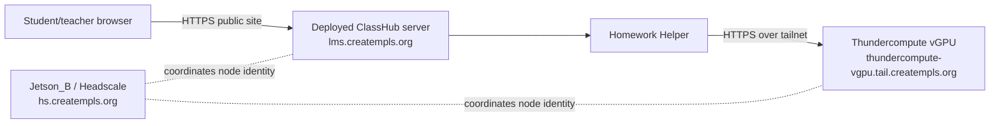

# Jetson_B Headscale Role

## Summary

Jetson_B is the primary Headscale control-plane host for this deployment. It fills the `hs.creatempls.org` role.

The active class helper path is:

```text
browser -> lms.creatempls.org -> Homework Helper -> tailnet -> Thundercompute vGPU model endpoint
```

Jetson_B coordinates tailnet membership and reachability. It does not host ClassHub, serve the class LLM, proxy model requests, or carry browser traffic.

## Active topology



## What Jetson_B does

- runs Headscale for `hs.creatempls.org`
- owns tailnet identity, ACL/policy, node enrollment, and coordination state
- coordinates the deployed ClassHub server and the Thundercompute vGPU model node
- supports narrow operator troubleshooting when explicitly enrolled
- uses the repo Headscale bundle in `ops/headscale/` for bootstrap, backup, restore, and rehearsal evidence

## What Jetson_B does not do

- does not run the ClassHub application
- does not run the class LLM
- does not proxy helper/model request traffic
- does not serve student or teacher browser traffic
- does not become a general office VPN or broad site overlay

## Tailnet nodes

Default nodes:

- deployed ClassHub server: `lms.creatempls.org`
- Thundercompute vGPU private model endpoint: `thundercompute-vgpu.tail.creatempls.org`
- Jetson_B Headscale control plane: `hs.creatempls.org`

Optional node:

- one trusted operator workstation for narrow troubleshooting

Do not enroll student browsers, teacher browsers, classroom devices, or unrelated office devices by default.

## LMS helper configuration

ClassHub remains provider-neutral. The deployed server should use the normal helper runtime env names:

```bash
LLM_ENABLED=1
LLM_BACKEND=openai_compatible
LLM_BASE_URL=https://thundercompute-vgpu.tail.creatempls.org
LLM_API_KEY=REPLACE_ME_WITH_PRIVATE_MODEL_TOKEN
LLM_MODEL=REPLACE_ME_WITH_THUNDERCOMPUTE_MODEL_ID
HELPER_REMOTE_MODE_ACKNOWLEDGED=1
```

Use `ollama` instead of `openai_compatible` only if the Thundercompute endpoint exposes an Ollama-compatible API.

## Operator checks

From the deployed ClassHub server:

```bash
bash scripts/check_llm_backend.sh --probe-chat
```

From Jetson_B:

```bash
cd /srv/headscale/app
sudo systemctl status classhub-headscale
sudo docker compose --project-directory /srv/headscale ps
sudo /usr/local/bin/classhub-headscale-backup --headscale-root /srv/headscale
```

Use [HEADSCALE_CONTROL_PLANE.md](HEADSCALE_CONTROL_PLANE.md) for the full control-plane procedure.

## Deprecated Jetson-B helper route

[JETSON_B_HELPER_BACKEND.md](JETSON_B_HELPER_BACKEND.md) is now historical reference material. The old Jetson-B llama.cpp/Tailscale Serve route is not the active class LLM path for this topology.
