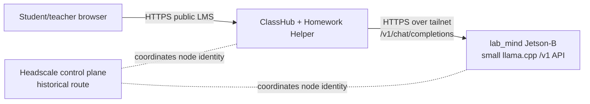

# Jetson-B Helper Backend

!!! warning "Deprecated reference"

    This page documents an older experimental route where Jetson-B served as a small helper-model endpoint. It is not the active topology now.

    Current active topology:

    `browser -> lms.creatempls.org -> Homework Helper -> tailnet -> Thundercompute vGPU model endpoint`

    Jetson_B now primarily fills the Headscale control-plane role for `hs.creatempls.org`. Use [JETSON_B_HEADSCALE_ROLE.md](JETSON_B_HEADSCALE_ROLE.md) and [HEADSCALE_CONTROL_PLANE.md](HEADSCALE_CONTROL_PLANE.md) for active operator guidance.

## Summary
This is a deprecated reference route for using `lab_mind` Jetson-B as a private Homework Helper backend.

This was an intentional exception to the `lab_mind` role map. In the current ClassHub topology, do not treat Jetson-B as the class LLM host. Keep this page only for historical reference if the old route needs to be understood or removed later.

The historical route treated Jetson-B as a small, bounded helper-model appliance:

- use a small model only
- keep the endpoint tailnet-only
- keep browser traffic on the public LMS
- let Homework Helper be the only ClassHub component that talks to Jetson-B
- keep Headscale as reachability control only, not a request proxy

## Lab Mind Machine Map

Use the refreshed `lab_mind` docs as the source of truth for machine roles:

- Dell PowerEdge R900: infrastructure spine for backups, shared storage, monitoring, dashboards, Portainer, docs mirror, known-good-state archive, and operational memory
- Jetson-A Orin Nano: normal assistant/model node for Open WebUI, local model serving, code-assistant workflows, local docs/RAG, and browser-first educator access
- Jetson-B and Jetson-C: edge/support nodes for room status, service polling, local dashboards, and machine-adjacent helper roles
- Raspberry Pi fleet: disposable edge appliances for kiosks, displays, USB or machine bridges, signage, sensors, and cameras
- Headscale: private control plane for remote access and host-to-host reachability, not a public app surface

This ClassHub route does not change that placement map. It only adds a narrowly named Jetson-B helper endpoint for this site.

## Target Topology



## Headscale Policy

Use this repo's ClassHub-specific lab policy starting point:

- `ops/headscale/policy.lab-mind-classhub.hujson.example`

It defines:

- `tag:classhub-lms` for the LMS/helper host
- `tag:lab-mind-jetson-b` for the Jetson-B helper-model host
- `tag:ops` for a narrow operator workstation, if needed

The default allowed model path is intentionally small:

- `tag:classhub-lms` -> `tag:lab-mind-jetson-b:443`

That assumes Jetson-B publishes a localhost auth proxy through Tailscale Serve as tailnet-only HTTPS. Keep raw model ports local to Jetson-B.

## Jetson-B Publish Shape

The current `lab_mind` Jetson-B compose file only runs a status page. Add this repo's Jetson-B route overlay to run a small llama.cpp backend plus a bearer-token auth proxy:

```bash
cd /srv/lab_mind
CLASSHUB_LAB_MIND_ROUTE_ROOT=/srv/classhub/app/ops/lab-mind \
CLASSHUB_JETSON_LLM_API_KEY=REPLACE_ME_WITH_PRIVATE_MODEL_TOKEN \
CLASSHUB_JETSON_MODEL=/models/classhub/REPLACE_ME-small.gguf \
CLASSHUB_JETSON_CTX_SIZE=1024 \
CLASSHUB_JETSON_N_GPU_LAYERS=0 \
docker compose \
  -f compose/jetson-b.compose.yml \
  -f /srv/classhub/app/ops/lab-mind/jetson-b-classhub-route.compose.yml \
  up -d
```

The overlay adds:

- `classhub_llamacpp`, a small OpenAI-compatible llama.cpp `/v1` server
- `classhub_llm_proxy`, a Caddy auth proxy that:
  - accepts only `Authorization: Bearer <CLASSHUB_JETSON_LLM_API_KEY>`
  - reverse-proxies to `classhub_llamacpp:8080`
  - binds only `127.0.0.1:18080` on Jetson-B

Publish the localhost-only proxy to the tailnet from Jetson-B:

```bash
sudo tailscale up \
  --login-server https://hs.creatempls.org \
  --hostname jetson-b \
  --advertise-tags tag:lab-mind-jetson-b

sudo tailscale serve --bg --https=443 http://127.0.0.1:18080
tailscale serve status
```

Do not publish llama.cpp's raw `8080` port publicly. The normal ClassHub route should be:

LMS/helper host -> tailnet HTTPS -> Jetson-B localhost auth proxy -> compose-private llama.cpp.

## LMS Env

After the LMS host is enrolled in the same Headscale tailnet, use:

- `compose/env.jetson-b.example`

Expected production values:

```bash
COMPOSE_LOCAL_OLLAMA_AUTO=0
LLM_ENABLED=1
LLM_BACKEND=openai_compatible
LLM_BASE_URL=https://jetson-b.tail.creatempls.org
LLM_API_KEY=REPLACE_ME_WITH_PRIVATE_MODEL_TOKEN
LLM_MODEL=REPLACE_ME_WITH_LLAMA_CPP_MODEL_ID
HELPER_REMOTE_MODE_ACKNOWLEDGED=1
```

Use `openai_compatible` because llama.cpp exposes `/v1/chat/completions`, not the Ollama `/api/chat` shape.

## Verification

From the LMS host:

```bash
bash scripts/check_jetson_b_route.sh --probe-chat
bash scripts/check_llm_backend.sh --probe-chat
```

The first command verifies the raw private route to Jetson-B. The second verifies that Homework Helper's configured backend can use it.

If the first command fails:

- confirm both nodes are present in Headscale
- confirm the LMS node has `tag:classhub-lms`
- confirm Jetson-B has `tag:lab-mind-jetson-b`
- confirm Tailscale Serve is active on Jetson-B
- confirm `classhub_llamacpp` and `classhub_llm_proxy` are running in the `lab_mind` compose stack
- confirm the Jetson-B endpoint returns `/v1/models`

If the first command passes but `check_llm_backend.sh` fails:

- check `LLM_BACKEND=openai_compatible`
- check `LLM_BASE_URL`
- check `LLM_API_KEY`
- check `LLM_MODEL`
- check Homework Helper logs for provider/auth/timeout errors

## Bounded Remote Compute Option

This doc prepares the steady private backend path. If you want Jetson-B to be used only during staff-activated class windows, keep `LLM_BASE_URL` on the local/default backend and set the `REMOTE_LLM_*` values to the Jetson-B endpoint.

Do not enable `CLASSHUB_REMOTE_HELPER_COMPUTE_ENABLED=1` until an activate/health/stop bridge exists for the Jetson-B path. The remote-compute feature expects a server-side control bridge; Headscale routing alone is only the private network path.
