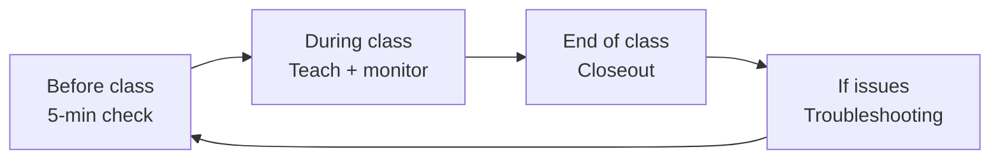

# Non-Developer Guide (Teachers and School Staff)

If you are not writing code, start here.

You do not need to read every docs file. For normal classroom use, this page plus [TEACHER_PORTAL.md](TEACHER_PORTAL.md) is enough.

If you want the shortest role-based path, open [START_HERE_INSTRUCTOR.md](START_HERE_INSTRUCTOR.md). If you need an action-only checklist for tomorrow's class, use [RUN_A_CLASS_TOMORROW.md](RUN_A_CLASS_TOMORROW.md).

## Visual references

## What this system does

- Students join with a class code and a display name (a pseudonym is suggested by default — real names are not required).
- Teachers run classes and review work in the Teacher Portal (`/teach`).
- The Homework Helper gives hints inside lessons.

### Why pseudonyms?

To reduce accidental collection of personal information, the join page pre-fills each student's display name with a friendly pseudonym like "Curious Otter 17." Students can keep it, change it, or type any nickname. If your organization prefers real names, students can simply clear the suggestion and type their own.

**Facilitator script** (read aloud if needed):
> "You don't need to use your real name here. You'll see a fun made-up name already filled in. You can keep it or type your own nickname — just pick something your teacher can recognize."

## 5-minute startup check (before class)

1. Open the site homepage.
2. Open `/teach` and confirm your teacher login works.
3. Open your class and confirm enrollment mode matches today (`Open`, `Invite only`, or `Closed`).
4. If using invite-only enrollment, verify at least one active invite link is ready.
5. Open one lesson and test the Helper once.
6. Confirm submission inbox is visible for your upload lesson.

If any step fails, use [TROUBLESHOOTING.md](TROUBLESHOOTING.md).

## During class: what to do

1. Open your class in `/teach`.
2. In `Lesson Tracker`, open only the lesson you are teaching now.
3. Adjust lesson release (open/lock/date) as needed.
4. Keep the student home clear:
   - `This week` should point to the current lesson.
   - `Course links` should have the expected sequence.
5. Use `Helper tuning` in that lesson row if you want to narrow helper focus.
6. Review missing submissions from the dropbox links.
7. For paid/limited cohorts, monitor invite seat usage and disable links when full.

Deep walkthrough: [TEACHER_PORTAL.md](TEACHER_PORTAL.md)

## End of class: quick closeout

1. Review missing submissions.
2. Rename student entries if needed.
3. Lock lessons or set next lesson date.
4. Export outcomes/summary CSVs for parent/funder reporting if needed.
5. For eligible students, issue certificates from `Certificate Eligibility`.

## Common problems (plain language)

- "Students cannot join":
  check enrollment mode and class lock status:
  - `Invite only` requires an invite link.
  - `Closed` blocks all new joins.
  - "This invite is full" means the seat cap is reached.
- "Helper is not responding":
  check `/helper/healthz` and follow [TROUBLESHOOTING.md](TROUBLESHOOTING.md).
- "Teacher page looks empty":
  sections are collapsed by default; open `Lesson Tracker` and `Roster`.
- "Uploads are failing":
  check allowed file types and upload size in module material settings.

## Read only what you need next

- First-time teacher checklist: [RUN_A_CLASS_TOMORROW.md](RUN_A_CLASS_TOMORROW.md)
- Short playbooks for common issues: [COMMON_SCENARIOS.md](COMMON_SCENARIOS.md)
- Teacher workflow and screen-by-screen guide: [TEACHER_PORTAL.md](TEACHER_PORTAL.md)
- Day-1 setup (operators/admins): [DAY1_DEPLOY_CHECKLIST.md](DAY1_DEPLOY_CHECKLIST.md)
- Incident recovery: [TROUBLESHOOTING.md](TROUBLESHOOTING.md)
- Security and privacy boundaries (policy level): [SECURITY.md](SECURITY.md)
