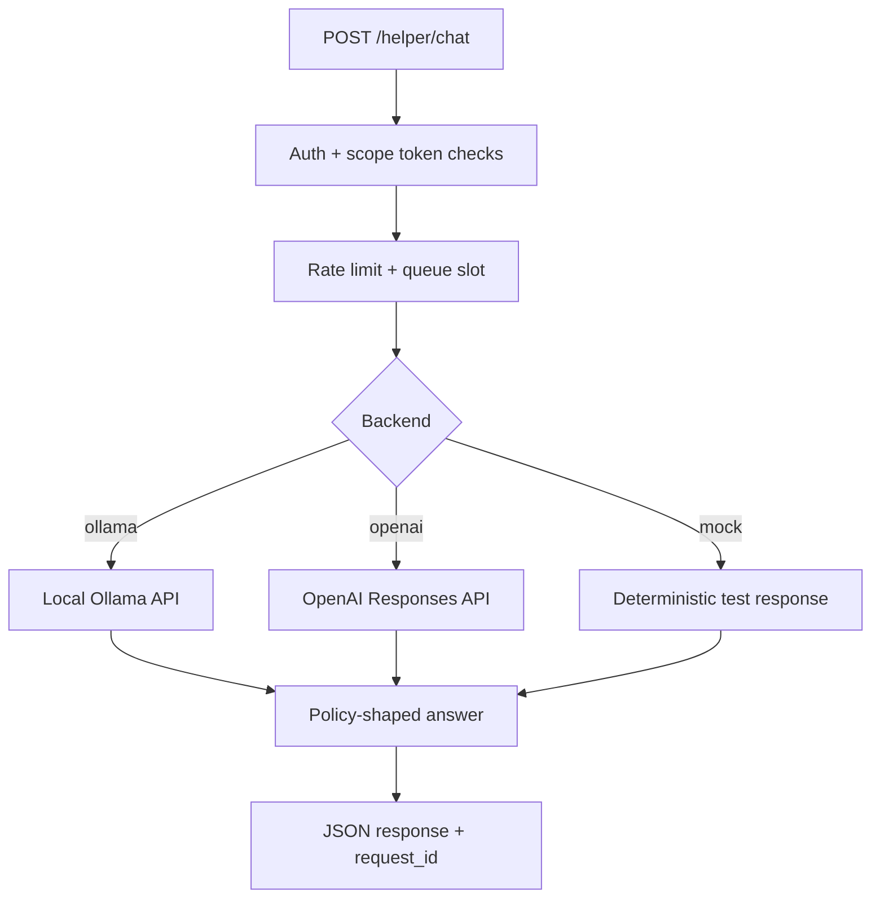
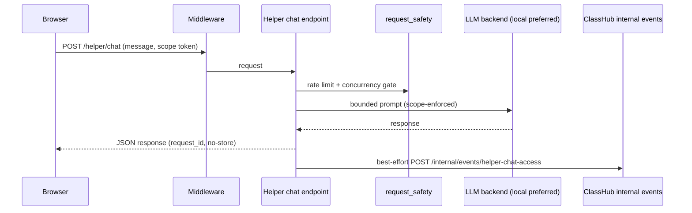

# Homework Helper (LLM backend)

The helper service is a Django app that exposes:

- `GET /helper/healthz`
- `POST /helper/chat`

By default, the helper is wired to a local LLM server (Ollama) for self-hosted reliability and predictable costs.
OpenAI remains an explicit development/future path via the **Responses API** and must be intentionally acknowledged before use.



## Backend selection

Set the backend in `compose/.env`:

```bash
HELPER_LLM_BACKEND=ollama   # or "openai" or "mock" (CI/test only)
HELPER_REMOTE_MODE_ACKNOWLEDGED=0
HELPER_MOCK_RESPONSE_TEXT=
HELPER_STRICTNESS=light     # or "strict"
HELPER_SCOPE_MODE=strict    # or "soft"
HELPER_REFERENCE_FILE=/app/tutor/reference/piper_scratch.md
HELPER_REFERENCE_DIR=/app/tutor/reference
HELPER_REFERENCE_MAP={"piper_scratch":"piper_scratch.md"}
HELPER_SCOPE_TOKEN_MAX_AGE_SECONDS=7200
HELPER_RESPONSE_MAX_CHARS=2200
HELPER_CONVERSATION_ENABLED=1
HELPER_CONVERSATION_MAX_MESSAGES=8
HELPER_CONVERSATION_TTL_SECONDS=3600
HELPER_CONVERSATION_TURN_MAX_CHARS=800
HELPER_CONVERSATION_HISTORY_MAX_CHARS=2400
HELPER_CONVERSATION_SUMMARY_MAX_CHARS=900
HELPER_FOLLOW_UP_SUGGESTIONS_MAX=3
HELPER_MAX_CONCURRENCY=2
HELPER_QUEUE_MAX_WAIT_SECONDS=10
HELPER_QUEUE_POLL_SECONDS=0.2
HELPER_QUEUE_SLOT_TTL_SECONDS=120
HELPER_BACKEND_MAX_ATTEMPTS=2
HELPER_BACKOFF_SECONDS=0.4
HELPER_CIRCUIT_BREAKER_FAILURES=5
HELPER_CIRCUIT_BREAKER_TTL_SECONDS=30
HELPER_TOPIC_FILTER_MODE=strict
HELPER_TEXT_LANGUAGE_KEYWORDS=pascal,python,java,javascript,typescript,c++,c#,csharp,ruby,php,go,golang,rust,swift,kotlin
HELPER_INTERNAL_API_TOKEN=...
HELPER_INTERNAL_RESET_URL=http://helper_web:8000/helper/internal/reset-class-conversations
HELPER_INTERNAL_RESET_TIMEOUT_SECONDS=2
HELPER_INTERNAL_RESET_EXPORT_BEFORE_DELETE=1
HELPER_CLASS_RESET_MAX_KEYS=4000
HELPER_CLASS_RESET_ARCHIVE_ENABLED=1
HELPER_CLASS_RESET_ARCHIVE_DIR=/uploads/helper_reset_exports
HELPER_CLASS_RESET_ARCHIVE_MAX_MESSAGES=120
```

Conversation behavior:
- Each chat request can include a `conversation_id`; the helper now returns one on every response.
- Recent redacted turns are cached per `(actor, scope token, conversation_id)` with TTL, so follow-up questions can build on prior context.
- When history exceeds `HELPER_CONVERSATION_MAX_MESSAGES`, older turns are compacted into a rolling summary to preserve context while keeping prompts short.
- Each response includes an `intent` tag (`debug`, `concept`, `strategy`, etc.) derived from the latest student message.
- Each response includes `follow_up_suggestions` (bounded by `HELPER_FOLLOW_UP_SUGGESTIONS_MAX`) so the UI can offer one-tap next questions.
- Reset by starting a new `conversation_id` (UI `Reset chat` does this), or clear all student helper conversations for a class via teacher dashboard action (`/teach/class/<id>/reset-helper-conversations`).
- On class reset, helper can export a JSON snapshot before cache deletion (controlled by `HELPER_INTERNAL_RESET_EXPORT_BEFORE_DELETE` and `HELPER_CLASS_RESET_ARCHIVE_ENABLED`).

Archive access + audit:
- Helper reset archives are written under uploads storage (default `/uploads/helper_reset_exports`) and are not served by public routes.
- Teacher-triggered reset actions create audit metadata in Class Hub, including archive path/count when export occurs.
- Ops should keep archive filesystem access restricted to trusted teacher/admin operators.
- Default archive retention is 30 days (`RETENTION_HELPER_EXPORT_DAYS=30`) via `scripts/retention_maintenance.sh`.
- `scripts/retention_maintenance.sh` now enforces helper archive path containment under `/uploads` and tightens permissions (`0700` directory, `0600` archive files) during scheduled retention runs.
- Helper reset archives are internal-only and excluded from student-facing portfolio exports.

### Ollama (local)

Required env:

```
OLLAMA_BASE_URL=http://ollama:11434
OLLAMA_MODEL=llama3.2:1b
OLLAMA_TIMEOUT_SECONDS=30
OLLAMA_TEMPERATURE=0.2
OLLAMA_TOP_P=0.9
OLLAMA_NUM_PREDICT=400
```

Ollama is included in `compose/docker-compose.yml` and persists models at
`data/ollama/`. Pull a model with:

```bash
cd compose
docker compose exec ollama ollama pull llama3.2:1b
```

On CPU-only servers with limited RAM, keep the model small (1B–2B range).
Larger models may be too slow or may not fit in memory.

If you run Ollama outside of Compose, set `OLLAMA_BASE_URL` to the host address
that containers can reach.

### OpenAI (optional, explicit opt-in)

If you want to re-enable OpenAI later:

```
HELPER_LLM_BACKEND=openai
HELPER_REMOTE_MODE_ACKNOWLEDGED=1
OPENAI_API_KEY=...
OPENAI_MODEL=gpt-5.2
OPENAI_MAX_OUTPUT_TOKENS=400
```

Safety behavior:
- If `HELPER_LLM_BACKEND=openai` and `HELPER_REMOTE_MODE_ACKNOWLEDGED!=1`, `/helper/chat` returns `remote_backend_not_acknowledged`.
- This prevents remote mode from becoming a silent default.

`openai` is already included in `services/homework_helper/requirements.txt`.

### Mock backend (CI/test)

For deterministic CI smoke checks without external model dependencies:

```bash
HELPER_LLM_BACKEND=mock
HELPER_MOCK_RESPONSE_TEXT=Optional fixed reply text
```

## Tutor stance and strictness

We support two modes:

- `HELPER_STRICTNESS=light` (default): may give direct answers, but must explain
  reasoning and include a check-for-understanding question.
- `HELPER_STRICTNESS=strict`: no final answers for graded work; respond with
  hints, steps, and questions.

The strictness switch is intentionally simple so teachers can “throw the switch”
without code changes.

## Lesson context metadata

Lesson pages now sign contextual metadata and pass it to the helper as a scope token:

- `data-helper-scope-token`: signed payload containing:
  - `context`
  - `topics`
  - `allowed_topics`
  - `reference`

Homework Helper verifies this token server-side and uses only the signed scope
for student requests. This prevents client-side request edits from widening
lesson scope.

## Allowed topics (per lesson)

You can provide an explicit allowed-topics list in lesson front matter to keep
students on the intended scope. Add either of these:

```yaml
helper_allowed_topics:
  - sprites
  - motion blocks
  - saving .sb3
```

The helper will gently redirect questions outside this list when
`HELPER_TOPIC_FILTER_MODE=soft` (no blocking) and will redirect when set to `strict`.

You can also auto-generate a starter list from lesson markdown:

```bash
python3 scripts/add_helper_allowed_topics.py \
  --lessons-dir services/classhub/content/courses/piper_scratch_12_session/lessons \
  --write
```

## New course scaffold

To create a brand-new course folder + lesson stubs + a reference file:

```bash
python3 scripts/new_course_scaffold.py \
  --slug robotics_intro \
  --title "Robotics: Sensors + Motion" \
  --sessions 8 \
  --duration 75 \
  --age-band "5th-7th"
```

## Course reference facts

You can reinforce subject expertise by providing a reference file with concrete
facts and workflows for the course. The helper will include this text in the
system instructions:

```
HELPER_REFERENCE_FILE=/app/tutor/reference/piper_scratch.md
```

The example `piper_scratch.md` lives in the helper image and can be edited to
match your curriculum.

### Multiple reference files (per course or lesson)

Use a reference key in `course.yaml` or `lesson` entries:

```
helper_reference: piper_scratch
```

Then configure a map in `.env` so the helper can resolve the key to a file:

```
HELPER_REFERENCE_DIR=/app/tutor/reference
HELPER_REFERENCE_MAP={"piper_scratch":"piper_scratch.md"}
```

This keeps file access safe and lets you swap references per lesson or course.

### Per-lesson references generated from content

For lesson-specific expertise, generate one reference file per lesson slug.
The helper will load `reference_dir/<lesson_slug>.md` when a lesson sets
`helper_reference: <lesson_slug>` in `course.yaml`.

Generate references from the course markdown:

```bash
python scripts/generate_lesson_references.py \
  --course services/classhub/content/courses/piper_scratch_12_session/course.yaml \
  --out services/homework_helper/tutor/reference
```

## Scope mode

Use `HELPER_SCOPE_MODE` to control how strictly the helper stays within the lesson:

- `soft` (default): prefer lesson scope, gently redirect off-topic requests
- `strict`: refuse unrelated questions and ask students to rephrase

## Queue / concurrency limits

On CPU-only servers, limit concurrent model calls to avoid overload.
The helper uses a small Redis-backed slot queue:

- `HELPER_MAX_CONCURRENCY`: maximum simultaneous LLM calls (default: 2)
- `HELPER_QUEUE_MAX_WAIT_SECONDS`: how long to wait for a slot (default: 10)
- `HELPER_QUEUE_POLL_SECONDS`: polling interval (default: 0.2)
- `HELPER_QUEUE_SLOT_TTL_SECONDS`: auto-release safety timeout (default: 120)

## Response length controls

- `HELPER_RESPONSE_MAX_CHARS`: hard cap on returned assistant text length (default: `2200`, minimum enforced `200`)
- `OPENAI_MAX_OUTPUT_TOKENS`: optional Responses API output-token cap (set `0` to disable)
- `OLLAMA_NUM_PREDICT`: optional Ollama generation-token cap (set `0` to use model default)

## Backend resilience + telemetry

The helper now retries transient backend failures before returning an error.

- `HELPER_BACKEND_MAX_ATTEMPTS`: total backend attempts per request (default: 2)
- `HELPER_BACKOFF_SECONDS`: base exponential backoff (default: 0.4)
- `HELPER_CIRCUIT_BREAKER_FAILURES`: consecutive failures before temporary open-circuit (default: 5)
- `HELPER_CIRCUIT_BREAKER_TTL_SECONDS`: open-circuit duration and failure-window TTL (default: 30)

`POST /helper/chat` responses now include:
- `request_id` (also returned as `X-Request-ID` response header)
- `attempts`
- timing fields (`queue_wait_ms`, `total_ms`) on successful calls
- `truncated` when response text was clipped by `HELPER_RESPONSE_MAX_CHARS`

Service logs now emit structured helper chat events (rate limits, queue busy,
backend failures, successful calls) for easier operational tracing.

## Access boundary

`POST /helper/chat` now requires an authenticated classroom context:

- student session (`student_id` + `class_id` in Django session), or
- staff-authenticated teacher session.

This prevents anonymous/public use of helper capacity. CSRF protection remains enabled.

## End-to-end helper flow (Map D3)



Canonical policy notes live in:

- `services/homework_helper/tutor/fixtures/policy_prompts.md`
- [HELPER_POLICY.md](HELPER_POLICY.md)

## RAG (planned)

Phase 2 will retrieve relevant snippets from class materials and include citations.

## Evals (recommended)

- `services/homework_helper/tutor/fixtures/eval_prompts.jsonl`
- [HELPER_EVALS.md](HELPER_EVALS.md)
