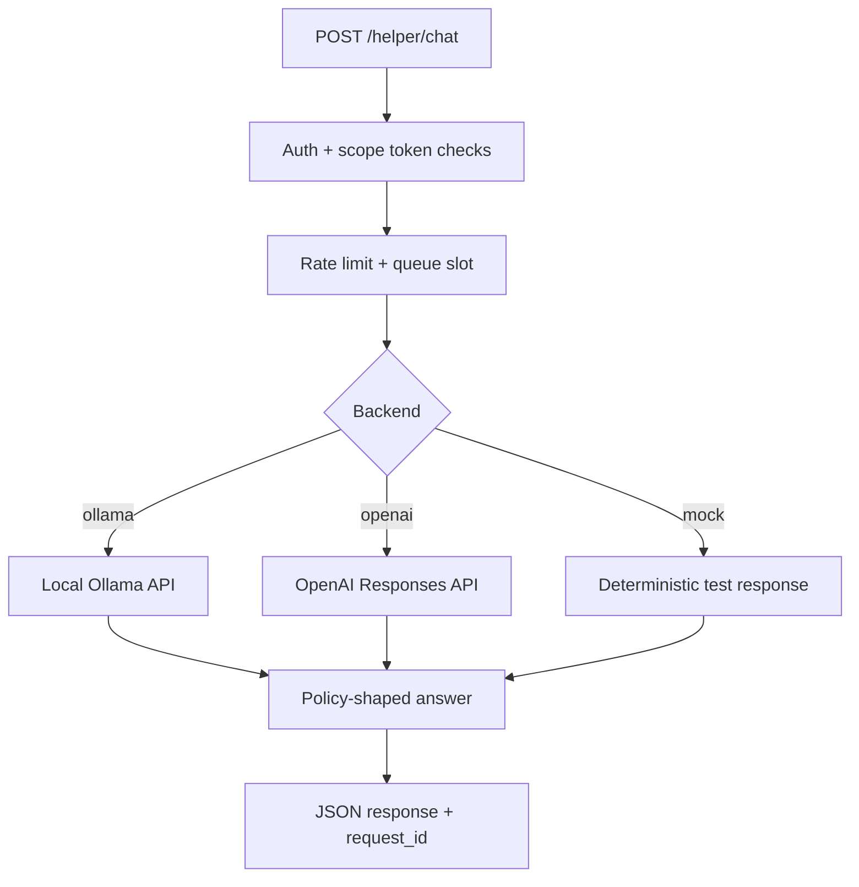
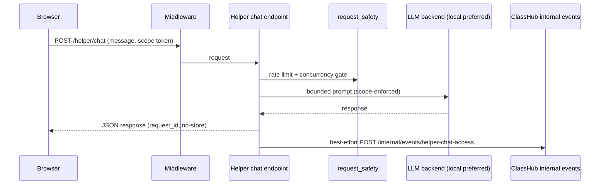

# Homework Helper Backend Operations

## Summary
This page is the runtime/config guide for Homework Helper regardless of provider. The filename is historical: it covers the helper backend in general, not only hosted OpenAI.

Use this page for backend selection, shared runtime knobs, references, curriculum RAG, conversation controls, and queue/resilience settings.

Use these related docs for narrower questions:
- [PRIVATE_LLM_BACKEND.md](PRIVATE_LLM_BACKEND.md) for network topology and the private model-host path
- [HELPER_POLICY.md](HELPER_POLICY.md) for tutor stance and anti-cheating policy
- [SECURITY.md](SECURITY.md) for access boundaries and browser/security posture

## What to do now
1. Choose your backend family in `LLM_BACKEND`.
2. Treat scope, references, conversation controls, and RAG as helper features unless a section says they are provider-specific.
3. Use the provider-specific sections only for the backend you are actually operating.

## Verification signal
An operator should be able to say which settings apply to any helper backend and which settings only apply to one provider family.

The helper service is a Django app that exposes:

- `GET /helper/healthz`
- `POST /helper/chat`
- `POST /helper/internal/reset-class-conversations` (token-protected internal control plane)
- `GET /helper/internal/rag-status` (token-protected internal evidence/status contract)

By default, the helper is wired to a small local LLM path (via Ollama) for self-hosted smoke validation and predictable day-1 ops.
For the serious private scale-out path, use the Thundercompute vGPU private model endpoint and let Homework Helper reach it over the host-to-host tailnet through an OpenAI-compatible or Ollama-compatible private backend.
For the current createMPLS deployment, Jetson_B runs the Headscale control plane behind that path at `hs.creatempls.org`.
Hosted OpenAI remains an explicit optional path via the **Responses API** and must be intentionally acknowledged before use.

Hosted OpenAI path note:
- `LLM_BACKEND=openai` normalizes to the shared provider name `openai_responses`.
- Hosted OpenAI now goes through the same `tutor/llm/*` provider layer as the other helper backends.


```mermaid
flowchart TD
  A[POST /helper/chat] --> B[Auth + scope token checks]
  B --> C[Rate limit + queue slot]
  C --> D{Backend}
  D -->|ollama| E[Local Ollama API]
  D -->|openai| F[OpenAI Responses API]
  D -->|mock| G[Deterministic test response]
  E --> H[Policy-shaped answer]
  F --> H
  G --> H
  H --> I[JSON response + request_id]
```

## Runtime module layout (current)

`/helper/chat` stays in `tutor/views.py` as the HTTP boundary. Internals are split into focused modules:

| Module | Role |
|---|---|
| `tutor/views.py` | endpoint adapter, auth/rate-limit gate, dependency wiring |
| `tutor/views_chat_request.py` | actor/client derivation, payload parse, rate-limit request shaping |
| `tutor/views_chat_deps.py` | `ChatDeps` construction (wiring patch-sensitive callables) |
| `tutor/views_chat_runtime.py` | runtime wrappers for backend/auth/circuit seams |
| `tutor/views_chat_helpers.py` | reference loading, memory helpers, runtime env wrappers, event detail shaping |
| `tutor/engine/service.py` | chat orchestration core (`handle_chat`) |
| `tutor/engine/context_envelope.py` | signed scope token resolution into normalized context envelope |
| `tutor/engine/runtime_config.py` | profile-aware policy defaults (`strictness`, `scope_mode`, topic filter) |
| `tutor/engine/execution_config.py` | execution knobs (backend, queue, conversation limits, references, keyword caps) |
| `tutor/engine/backends.py` | backend registry + retry adapter |
| `tutor/llm/*` | provider abstraction for Ollama, hosted OpenAI Responses, and private OpenAI-compatible servers |
| `tutor/engine/heuristics.py` | intent/follow-up/topic/text-language/Piper heuristics |
| `tutor/engine/memory.py` | conversation cache state and compaction |
| `tutor/engine/reference.py` | reference-file resolution + citation extraction |
| `tutor/engine/rag.py` | optional local pgvector retrieval + curriculum index helpers |
| `tutor/engine/auth.py` | actor and class-table/session boundary checks |
| `tutor/engine/circuit.py` | cache-backed backend failure circuit state |

## Backend selection

Provider-neutral runtime surfaces:

- `LLM_BACKEND`, `LLM_BASE_URL`, `LLM_API_KEY`, `LLM_MODEL`, timeout, and token controls are the shared backend-selection surface.
- Scope enforcement, conversation cache, queue limits, audit/event behavior, references, and lesson-boundary policy are helper features, not OpenAI-only features.
- Curriculum references and curriculum RAG are backend-neutral at the product level:
  - they stay bounded to configured helper reference markdown,
  - they do not index student submissions or student events.
- Current embedding/index build flow for RAG uses the helper's `HELPER_RAG_EMBED_*` settings and an Ollama-style embedding endpoint. That is an implementation detail of the current shipped path, not a claim that every provider automatically supports helper RAG.

Set the backend in `compose/.env`:

```bash
LLM_ENABLED=1
LLM_BACKEND=ollama          # or "openai_compatible", "openai", "openai_responses", or "mock"
HELPER_LLM_BACKEND=ollama   # legacy alias still supported
LLM_BASE_URL=http://ollama:11434
LLM_API_KEY=
LLM_MODEL=llama3.2:1b
LLM_TIMEOUT_SECONDS=30
LLM_MAX_TOKENS=400
LLM_NUM_CTX=0
LLM_TEMPERATURE=0.2
LLM_TOP_P=0.9
LLM_LOG_PROMPT_CONTENT=0
LLM_REDACTION_ENABLED=1
LLM_ALLOWED_ACTOR_TYPES=student,staff
HELPER_REMOTE_MODE_ACKNOWLEDGED=0
HELPER_MOCK_RESPONSE_TEXT=
HELPER_STRICTNESS=light     # or "strict"
HELPER_SCOPE_MODE=strict    # or "soft"
HELPER_REFERENCE_FILE=/app/tutor/reference/piper_scratch.md
HELPER_REFERENCE_DIR=/app/tutor/reference
HELPER_REFERENCE_MAP={"piper_scratch":"piper_scratch.md"}
HELPER_RAG_ENABLED=0
HELPER_RAG_EMBED_BASE_URL=http://ollama:11434
HELPER_RAG_EMBED_MODEL=nomic-embed-text
HELPER_RAG_EMBED_TIMEOUT_SECONDS=12
HELPER_RAG_EMBED_DIMENSIONS=768
HELPER_RAG_MAX_COSINE_DISTANCE=0.42
HELPER_SCOPE_TOKEN_MAX_AGE_SECONDS=7200
HELPER_RESPONSE_MAX_CHARS=2200
HELPER_CONVERSATION_ENABLED=1
HELPER_CONVERSATION_MAX_MESSAGES=12
HELPER_CONVERSATION_TTL_SECONDS=7200
HELPER_CONVERSATION_TURN_MAX_CHARS=1000
HELPER_CONVERSATION_HISTORY_MAX_CHARS=4000
HELPER_CONVERSATION_SUMMARY_MAX_CHARS=1400
HELPER_FOLLOW_UP_SUGGESTIONS_MAX=3
HELPER_MAX_CONCURRENCY=2
HELPER_QUEUE_MAX_WAIT_SECONDS=10
HELPER_QUEUE_POLL_SECONDS=0.2
HELPER_QUEUE_SLOT_TTL_SECONDS=120
HELPER_BACKEND_MAX_ATTEMPTS=2
HELPER_BACKOFF_SECONDS=0.4
HELPER_CIRCUIT_BREAKER_FAILURES=5
HELPER_CIRCUIT_BREAKER_TTL_SECONDS=30
HELPER_TOPIC_FILTER_MODE=strict
HELPER_TEXT_LANGUAGE_KEYWORDS=pascal,python,java,javascript,typescript,c++,c#,csharp,ruby,php,go,golang,rust,swift,kotlin
HELPER_INTERNAL_API_TOKEN=...
HELPER_INTERNAL_ALLOWED_CIDRS=127.0.0.0/8,::1/128,10.0.0.0/8,172.16.0.0/12,192.168.0.0/16,fc00::/7
HELPER_INTERNAL_TRUST_PROXY_HEADERS=0
HELPER_INTERNAL_XFF_INDEX=0
HELPER_INTERNAL_RESET_URL=http://helper_web:8000/helper/internal/reset-class-conversations
HELPER_INTERNAL_ACTOR_CLEAR_URL=http://helper_web:8000/helper/internal/clear-actor-conversations
HELPER_INTERNAL_RESET_TIMEOUT_SECONDS=2
HELPER_INTERNAL_RAG_STATUS_URL=http://helper_web:8000/helper/internal/rag-status
HELPER_INTERNAL_RAG_STATUS_TIMEOUT_SECONDS=1.2
HELPER_INTERNAL_RESET_EXPORT_BEFORE_DELETE=1
HELPER_CLASS_RESET_MAX_KEYS=4000
HELPER_CLASS_RESET_ARCHIVE_ENABLED=0
HELPER_CLASS_RESET_ARCHIVE_DIR=/uploads/helper_reset_exports
HELPER_CLASS_RESET_ARCHIVE_MAX_MESSAGES=120
```

Optional YAML consolidation:
- Set `HELPER_CONFIG_FILE` to a YAML file (recommended in-container path: `/app/config/helper.config.yaml`).
- A baseline file ships in the repo at `services/homework_helper/config/helper.config.yaml` and a host-side template is available at `compose/helper.config.example.yaml`.
- For mapped helper settings, resolution order is:
  1. explicit env var value
  2. YAML value
  3. code default
- Secrets remain env-only by design (for example `OPENAI_API_KEY`, internal tokens, signing keys).

Config resolution model:
- `ContextEnvelope`: derives trusted lesson context from signed `scope_token`.
- `PolicyBundle`: derives helper policy stance (`strictness`, `scope_mode`, topic filter) with profile defaults.
- `ExecutionConfig`: derives runtime execution knobs (queue/backoff/conversation/reference settings).

Precedence:
- explicit env value wins,
- otherwise profile/default contract applies.

Conversation behavior:
- Each chat request can include a `conversation_id`; the helper now returns one on every response.
- Recent redacted student and tutor turns are transiently cached in Redis per `(actor, scope token, conversation_id)` for `HELPER_CONVERSATION_TTL_SECONDS` (default two hours, refreshed when that conversation is saved), so follow-up questions can build on prior context.
- When history exceeds `HELPER_CONVERSATION_MAX_MESSAGES`, older turns are compacted into a rolling summary to preserve context while keeping prompts short.
- Each response includes an `intent` tag (`debug`, `concept`, `strategy`, etc.) derived from the latest student message.
- Each response includes `follow_up_suggestions` (bounded by `HELPER_FOLLOW_UP_SUGGESTIONS_MAX`) so the UI can offer one-tap next questions.
- Class Hub sends `language_code` from the active UI locale; helper normalizes that to the supported set (`en`, `es`, `so`, `ksw`) and returns the applied `response_language` on every response.
- Helper output language follows the active UI locale deterministically. Student message wording alone does not change the helper language.
- `ksw` currently uses S'gaw Karen as the canonical Karen code; helper widget chrome and quick-prompt payloads now have provisional Karen translations, while broader deterministic Karen copy still falls back to English until reviewed translations are added.
- Reset by starting a new `conversation_id` (UI `Reset chat` does this), or clear all student helper conversations for a class via teacher dashboard action (`/teach/class/<id>/reset-helper-conversations`).
- Student immediate deletion calls the authenticated actor-clear endpoint and removes every cached conversation registered to that student actor.
- On class reset, helper can export a JSON snapshot before cache deletion only when explicitly opted in (`HELPER_INTERNAL_RESET_EXPORT_BEFORE_DELETE` and `HELPER_CLASS_RESET_ARCHIVE_ENABLED=1`). Production/domain defaults do not archive helper conversations.

Archive access + audit:
- Archives are off by default. When opted in, a snapshot contains class id, archive time, request id, cache/conversation identifiers, actor key, scope fingerprint, rolling summary, and bounded redacted turns.
- Existing snapshots are files, not an indexed per-student store. Although current snapshots include a parsed actor key, the archive lifecycle does not provide a safe transactional per-student deletion guarantee; student self-deletion clears transient cache only. Operators who opt into archives must handle archive access/deletion under their approved retention process.
- Helper reset archives are written under uploads storage (default `/uploads/helper_reset_exports`) and are not served by public routes.
- Teacher-triggered reset actions create audit metadata in Class Hub, including archive path/count when export occurs.
- Ops should keep archive filesystem access restricted to trusted teacher/admin operators.
- Default archive retention is 30 days (`RETENTION_HELPER_EXPORT_DAYS=30`) via `scripts/retention_maintenance.sh`.
- `scripts/retention_maintenance.sh` now enforces helper archive path containment under `/uploads` and tightens permissions (`0700` directory, `0600` archive files) during scheduled retention runs.
- Helper reset archives are internal-only and excluded from student-facing portfolio exports.

Internal RAG status contract:
- `/helper/internal/rag-status` requires the same bearer token as reset operations (`HELPER_INTERNAL_API_TOKEN`).
- Helper internal control/status endpoints also require the caller IP to fall inside `HELPER_INTERNAL_ALLOWED_CIDRS`.
- If helper is behind a trusted reverse proxy, set `HELPER_INTERNAL_TRUST_PROXY_HEADERS=1` and, if needed, adjust `HELPER_INTERNAL_XFF_INDEX`.
- Response includes:
  - `rag_enabled`, `index_ready`,
  - `indexed_chunk_count`, `reference_source_count`,
  - per-source chunk counts and last indexed timestamps,
  - `student_data_excluded_from_index: true`.

### Ollama (local)

Required env:

```
OLLAMA_BASE_URL=http://ollama:11434
OLLAMA_MODEL=llama3.2:1b
OLLAMA_TIMEOUT_SECONDS=30
OLLAMA_TEMPERATURE=0.2
OLLAMA_TOP_P=0.9
OLLAMA_NUM_CTX=0
OLLAMA_NUM_PREDICT=400
```

Local Ollama is available as an opt-in Compose profile (`local-ollama`) and
persists models at `data/ollama/`. Start it and pull a model with:

```bash
cd compose
docker compose --profile local-ollama up -d ollama
docker compose exec ollama ollama pull llama3.2:1b
```

On CPU-only servers with limited RAM, keep the model small (1B–2B range).
Larger models may be too slow or may not fit in memory.

If you run Ollama outside of Compose, set `OLLAMA_BASE_URL` to the host address
that containers can reach.

For hosted or remote model deployments, set `OLLAMA_NUM_CTX`/`LLM_NUM_CTX`
explicitly when the model's default context window is too large for your
runtime. A value like `4096` is a practical starting point for smoke checks and
short classroom hints.

### Private remote model host (Thundercompute vGPU over private tailnet)

Recommended production pattern:
- keep the tailnet client host-managed, not in `docker-compose.yml`
- run the model server on the Thundercompute vGPU host
- publish it privately as a tailnet-only HTTPS endpoint
- point Class Hub at the Thundercompute host's private HTTPS hostname
- for the current createMPLS deployment, Jetson_B runs Headscale behind that private path

Why this is the preferred remote pattern:
- keeps the app Compose stack least-privilege
- avoids public edge proxies between `helper_web` and the private model backend
- gives operators a stable URL that works in both browsers and env config

Thundercompute host bring-up:

```bash
curl -fsSL https://tailscale.com/install.sh | sh
tailscale up --login-server=https://hs.creatempls.org --auth-key=REPLACE_WITH_PREAUTH_KEY --advertise-tags=tag:thundercompute-gpu --ssh
curl http://127.0.0.1:11434/api/tags
tailscale serve --bg 443 http://127.0.0.1:11434
tailscale serve status
```

If the Thundercompute environment does not run `systemd`, start `tailscaled` manually in
userspace-networking mode before `tailscale up`:

```bash
sudo mkdir -p /var/lib/tailscale /run/tailscale
sudo nohup tailscaled \
  --state=/var/lib/tailscale/tailscaled.state \
  --socket=/run/tailscale/tailscaled.sock \
  --tun=userspace-networking \
  >/tmp/tailscaled.log 2>&1 &
sudo tailscale --socket=/run/tailscale/tailscaled.sock up --login-server=https://hs.creatempls.org --auth-key=REPLACE_WITH_PREAUTH_KEY --advertise-tags=tag:thundercompute-gpu --ssh
sudo tailscale --socket=/run/tailscale/tailscaled.sock serve --bg 443 http://127.0.0.1:11434
sudo tailscale --socket=/run/tailscale/tailscaled.sock serve status
```

LMS host env example:

```bash
LLM_ENABLED=1
LLM_BACKEND=openai_compatible
LLM_BASE_URL=https://thundercompute-vgpu.tail.creatempls.org
LLM_API_KEY=REPLACE_ME_STRONG
LLM_MODEL=REPLACE_ME_WITH_THUNDERCOMPUTE_MODEL_ID
LLM_TIMEOUT_SECONDS=45
LLM_NUM_CTX=4096
LLM_MAX_TOKENS=64
HELPER_REMOTE_MODE_ACKNOWLEDGED=1

HELPER_RAG_EMBED_BASE_URL=https://thundercompute-vgpu.tail.creatempls.org
HELPER_RAG_EMBED_MODEL=nomic-embed-text
```

Verification flow:

```bash
curl https://thundercompute-vgpu.tail.creatempls.org/v1/models
curl --max-time 60 https://thundercompute-vgpu.tail.creatempls.org/v1/chat/completions \
  -H 'Content-Type: application/json' \
  -H 'User-Agent: ClassHub-HomeworkHelper/1.0' \
  --data '{"model":"REPLACE_ME_WITH_THUNDERCOMPUTE_MODEL_ID","messages":[{"role":"system","content":"Be brief."},{"role":"user","content":"Give one short Scratch hint about moving a sprite."}],"max_tokens":64,"temperature":0.2}'
```

Smoke check recommendation for remote vGPU:

```bash
SMOKE_TIMEOUT_SECONDS=45 \
SMOKE_HELPER_MESSAGE='Give one short Scratch hint about moving a sprite.' \
make smoke-full
```

Tailscale references:
- Serve CLI: https://tailscale.com/docs/reference/tailscale-cli/serve
- Userspace networking: https://tailscale.com/kb/1112/userspace-networking
- MagicDNS / `.ts.net` names: https://tailscale.com/kb/1081/magicdns

Private backend ops bundle:
- [PRIVATE_LLM_BACKEND.md](PRIVATE_LLM_BACKEND.md)
- `ops/llm-server/README.md` (in repo root, outside docs site)

### OpenAI-compatible / private API servers

Use this when the helper should call a private or self-hosted API that speaks the current OpenAI-compatible request shape used by the helper runtime.

```bash
LLM_BACKEND=openai_compatible
LLM_BASE_URL=https://private-llm.example.org
LLM_API_KEY=REPLACE_ME
LLM_MODEL=your-model-name
HELPER_REMOTE_MODE_ACKNOWLEDGED=1
```

Notes:
- This is distinct from hosted OpenAI Responses.
- Helper scope, references, conversation memory, and policy behavior stay the same.
- Advanced helper features such as curriculum references and RAG still use the helper-specific config surfaces documented on this page.

### OpenAI (optional, explicit opt-in)

If you want to re-enable hosted OpenAI later:

```
HELPER_LLM_BACKEND=openai
HELPER_REMOTE_MODE_ACKNOWLEDGED=1
OPENAI_API_KEY=...
OPENAI_MODEL=gpt-5.2
OPENAI_MAX_OUTPUT_TOKENS=400
```

Equivalent generic env form:

```bash
LLM_BACKEND=openai
HELPER_REMOTE_MODE_ACKNOWLEDGED=1
LLM_API_KEY=...
LLM_MODEL=gpt-5.2
LLM_MAX_TOKENS=400
```

Safety behavior:
- If `HELPER_LLM_BACKEND=openai` and `HELPER_REMOTE_MODE_ACKNOWLEDGED!=1`, `/helper/chat` returns `remote_backend_not_acknowledged`.
- This prevents remote mode from becoming a silent default.

`openai` is already included in `services/homework_helper/requirements.txt`.

### Mock backend (CI/test)

For deterministic CI smoke checks without external model dependencies:

```bash
HELPER_LLM_BACKEND=mock
HELPER_MOCK_RESPONSE_TEXT=Optional fixed reply text
```

## Tutor stance and strictness

We support two modes:

- `HELPER_STRICTNESS=light` (default): may give direct answers, but must explain
  reasoning and include a check-for-understanding question.
- `HELPER_STRICTNESS=strict`: no final answers for graded work; respond with
  hints, steps, and questions.

The strictness switch is intentionally simple so teachers can “throw the switch”
without code changes.

## Lesson context metadata

Lesson pages now sign contextual metadata and pass it to the helper as a scope token:

- `data-helper-scope-token`: signed payload containing:
  - `context`
  - `topics`
  - `allowed_topics`
  - `reference`

Homework Helper verifies this token server-side and uses only the signed scope
for student requests. This prevents client-side request edits from widening
lesson scope.

## Allowed topics (per lesson)

You can provide an explicit allowed-topics list in lesson front matter to keep
students on the intended scope. Add either of these:

```yaml
helper_allowed_topics:
  - sprites
  - motion blocks
  - saving .sb3
```

The helper will gently redirect questions outside this list when
`HELPER_TOPIC_FILTER_MODE=soft` (no blocking) and will redirect when set to `strict`.

You can also auto-generate a starter list from lesson markdown:

```bash
python3 scripts/add_helper_allowed_topics.py \
  --lessons-dir services/classhub/content/courses/piper_scratch_12_session/lessons \
  --write
```

## New course scaffold

To create a brand-new course folder + lesson stubs + a reference file:

```bash
python3 scripts/new_course_scaffold.py \
  --slug robotics_intro \
  --title "Robotics: Sensors + Motion" \
  --sessions 8 \
  --duration 75 \
  --age-band "5th-7th"
```

## Course reference facts

You can reinforce subject expertise by providing a reference file with concrete
facts and workflows for the course. This is a helper feature, not a provider-specific one. The helper will include this text in the
system instructions:

```
HELPER_REFERENCE_FILE=/app/tutor/reference/piper_scratch.md
```

The example `piper_scratch.md` lives in the helper image and can be edited to
match your curriculum.

### Multiple reference files (per course or lesson)

Use a reference key in `course.yaml` or `lesson` entries:

```
helper_reference: piper_scratch
```

Then configure a map in `.env` so the helper can resolve the key to a file:

```
HELPER_REFERENCE_DIR=/app/tutor/reference
HELPER_REFERENCE_MAP={"piper_scratch":"piper_scratch.md"}
```

This keeps file access safe and lets you swap references per lesson or course.

### Optional local pgvector RAG (curriculum only)

This is backend-neutral at the product level: retrieval stays bounded to helper curriculum references, not to a vendor-managed knowledge base.

Enable RAG only after preparing a curriculum index in Postgres:

```bash
python services/homework_helper/manage.py build_curriculum_rag --clear-first
```

Then set:

```bash
HELPER_RAG_ENABLED=1
```

Scope boundary:
- Indexed content comes only from helper reference markdown.
- Student submissions/events are not embedded and are not queried in retrieval.
- If pgvector/index data is unavailable, helper falls back to lexical lesson citations.

### Per-lesson references generated from content

For lesson-specific expertise, generate one reference file per lesson slug.
The helper will load `reference_dir/<lesson_slug>.md` when a lesson sets
`helper_reference: <lesson_slug>` in `course.yaml`.

Generate references from the course markdown:

```bash
python scripts/generate_lesson_references.py \
  --course services/classhub/content/courses/piper_scratch_12_session/course.yaml \
  --out services/homework_helper/tutor/reference
```

### Batch-sync helper references across all courses

For server ops, use the batch sync command instead of running the lesson generator
course by course:

```bash
python scripts/sync_helper_references.py --dry-run
python scripts/sync_helper_references.py
```

Default behavior:
- scans all `services/classhub/content/courses/*/course.yaml` manifests,
- preserves existing hand-written course-level reference files,
- generates lesson reference files only for lessons whose `helper_reference`
  differs from the course-level `helper_reference`.

Useful overrides:

```bash
# regenerate course-level reference files too
python scripts/sync_helper_references.py --overwrite-course-refs

# emit one lesson reference file per lesson slug, even when a course uses one shared reference
python scripts/sync_helper_references.py --all-lesson-refs

# limit the run to one course folder
python scripts/sync_helper_references.py --course-slug piper_scratch_12_session
```

## Scope mode

Use `HELPER_SCOPE_MODE` to control how strictly the helper stays within the lesson:

- `soft`: prefer lesson scope, gently redirect off-topic requests
- `strict`: refuse unrelated questions and ask students to rephrase

If `HELPER_SCOPE_MODE` is unset, profile defaults apply (see [PROGRAM_PROFILES.md](PROGRAM_PROFILES.md)).

## Queue / concurrency limits

On CPU-only servers, limit concurrent model calls to avoid overload.
The helper uses a small Redis-backed slot queue:

- `HELPER_MAX_CONCURRENCY`: maximum simultaneous LLM calls (default: 2)
- `HELPER_QUEUE_MAX_WAIT_SECONDS`: how long to wait for a slot (default: 10)
- `HELPER_QUEUE_POLL_SECONDS`: polling interval (default: 0.2)
- `HELPER_QUEUE_SLOT_TTL_SECONDS`: auto-release safety timeout (default: 120)

## Response length controls

- `HELPER_RESPONSE_MAX_CHARS`: hard cap on returned assistant text length (default: `2200`, minimum enforced `200`)
- `OPENAI_MAX_OUTPUT_TOKENS`: optional Responses API output-token cap (set `0` to disable)
- `OLLAMA_NUM_PREDICT`: optional Ollama generation-token cap (set `0` to use model default)
- `OLLAMA_NUM_CTX`: optional Ollama context-window cap (set `0` to use model default)

## Backend resilience + telemetry

The helper now retries transient backend failures before returning an error.

- `HELPER_BACKEND_MAX_ATTEMPTS`: total backend attempts per request (default: 2)
- `HELPER_BACKOFF_SECONDS`: base exponential backoff (default: 0.4)
- `HELPER_CIRCUIT_BREAKER_FAILURES`: consecutive failures before temporary open-circuit (default: 5)
- `HELPER_CIRCUIT_BREAKER_TTL_SECONDS`: open-circuit duration and failure-window TTL (default: 30)

`POST /helper/chat` responses now include:
- `request_id` (also returned as `X-Request-ID` response header)
- `response_language` (normalized helper output language)
- `attempts`
- timing fields (`queue_wait_ms`, `total_ms`) on successful calls
- `truncated` when response text was clipped by `HELPER_RESPONSE_MAX_CHARS`

Service logs now emit structured helper chat events (rate limits, queue busy,
backend failures, successful calls) for easier operational tracing.

## Access boundary

`POST /helper/chat` now requires an authenticated classroom context:

- student session (`student_id` + `class_id` in Django session), or
- staff-authenticated teacher session.

This prevents anonymous/public use of helper capacity. CSRF protection remains enabled.

## End-to-end helper flow (Map D3)


```mermaid
sequenceDiagram
  participant B as Browser
  participant MW as Middleware
  participant H as Helper chat endpoint
  participant RS as request_safety
  participant LLM as LLM backend (local preferred)
  participant CH as ClassHub internal events

  B->>MW: POST /helper/chat (message, scope token)
  MW->>H: request
  H->>RS: rate limit + concurrency gate
  H->>LLM: bounded prompt (scope-enforced)
  LLM-->>H: response
  H-->>B: JSON response (request_id, no-store)
  H->>CH: best-effort POST /internal/events/helper-chat-access
```

Canonical policy notes live in:

- `services/homework_helper/tutor/fixtures/policy_prompts.md`
- [HELPER_POLICY.md](HELPER_POLICY.md)

## RAG (current)

Local curriculum RAG is available now when enabled:
- Build/update the curriculum-only index: `python services/homework_helper/manage.py build_curriculum_rag --clear-first`
- Enable retrieval: `HELPER_RAG_ENABLED=1`
- Retrieval scope remains bounded to configured curriculum references; student submissions/events are not embedded or queried.
- Current shipped embedding/index build flow uses `HELPER_RAG_EMBED_*` against the helper's configured embedding endpoint, typically local or private Ollama-compatible infrastructure.
- If pgvector/index data is unavailable, helper falls back to lexical lesson citations so chat remains available.

## Evals (recommended)

- `services/homework_helper/tutor/fixtures/eval_prompts.jsonl`
- `services/homework_helper/tutor/fixtures/eval_prompts_classroom_realistic.jsonl`
- `bash scripts/run_helper_classroom_eval.sh --url http://localhost/helper/chat --student-auth --class-code "$SMOKE_CLASS_CODE" --out-dir /tmp/classhub_helper_eval_light`
- [HELPER_EVALS.md](HELPER_EVALS.md)
