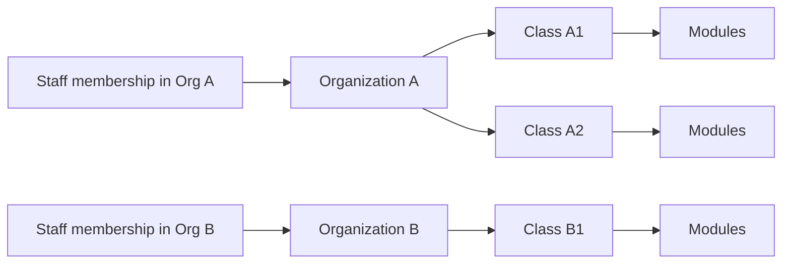

# Organization Boundaries: Inside an Org vs Across Orgs

## Summary
This page explains how `Organization` boundaries work in ClassHub and what changes when staff are in one org versus multiple orgs.

It is written for operators, school/district admins, and teacher leads who need predictable access rules.

## What to do now
1. Decide your boundary posture:
   - transitional mode: `REQUIRE_ORG_MEMBERSHIP_FOR_STAFF=0`
   - strict mode: `REQUIRE_ORG_MEMBERSHIP_FOR_STAFF=1`
2. Confirm every staff user has the correct org membership role (`owner`, `admin`, `teacher`, `viewer`).
3. If you need module-range limitations (example: TA only modules 1-3), enable `CLASSHUB_RBAC_SCOPED_GRANTS_ENABLED=1` and configure scoped grants.
4. Test one real staff account from each role in `/teach`.

## Verification signal
Given two orgs (`Org A`, `Org B`):
- a staff user with membership only in `Org A` cannot access `Org B` classes,
- a `viewer` can read class/submission views but cannot run manage/delete actions,
- a module-range scoped grant can allow module 1-3 while denying module 4+ when feature-flagged on.

## Mental model

Rule of thumb:
- org membership decides **which classes are visible**,
- role/capabilities decide **what actions are allowed** inside those classes.

## Inside one org

If a staff user is a member of an org, they can see classes in that org (subject to role and deployment settings).

Current capability behavior (Phase 1 RBAC evaluator):

| Role | Class visibility | Manage class | Create class | Submission view | Submission delete | Syllabus export |
|---|---|---|---|---|---|---|
| `owner` | Yes | Yes | Yes | Yes | Yes | Yes |
| `admin` | Yes | Yes | Yes | Yes | Yes | Yes |
| `teacher` | Yes | Yes | Yes | Yes | Yes | No |
| `viewer` | Yes | No | No | Yes | No | No |

Notes:
- `ClassStaffAssignment` is a prioritization hint ("show these classes first"), not an access boundary.
- Superusers can see/manage all classes.

## Across orgs

By default, staff cannot cross org boundaries unless they have memberships in multiple orgs.

Examples:
- Teacher with membership in `Org A` only:
  - can access classes in `Org A`,
  - cannot access classes in `Org B`.
- District support user with memberships in `Org A` and `Org B`:
  - can access classes in both orgs according to their role in each org.

## Fallback vs strict boundary modes

### `REQUIRE_ORG_MEMBERSHIP_FOR_STAFF=0` (transitional)
- Staff users with **no memberships** keep legacy global class view/manage/create behavior.
- Useful for migration periods.
- Risk: broader-than-intended class visibility.

### `REQUIRE_ORG_MEMBERSHIP_FOR_STAFF=1` (strict)
- Staff users with no active membership cannot list/access/create classes.
- Recommended for multi-org production environments.

## Module-range scoped grants (feature-flagged)

Feature flag:
- `CLASSHUB_RBAC_SCOPED_GRANTS_ENABLED=0` (default): role-only behavior.
- `CLASSHUB_RBAC_SCOPED_GRANTS_ENABLED=1`: module-range grant enforcement for module-scoped submission checks.

Current scope-grant model:
- `ClassStaffModuleScopeGrant`
- per class + per user + per capability (`submission.view`, `submission.delete`)
- range by module order (`module_order_start`..`module_order_end`)

Behavior when enabled:
- if no scoped grants exist for that user/class/capability, role allow remains (backward-compatible),
- if scoped grants exist, module-scoped checks must match at least one active range grant.

## Practical scenarios

### Scenario A: TA can only review modules 1-3
- Role: `teacher` or `viewer` depending on desired base actions.
- Enable scoped grants.
- Add grant rows for `submission.view` with `start=0`, `end=2`.
- Optionally add `submission.delete` grant only if deletion is allowed for TA policy.

### Scenario B: Partner org isolation
- Put each partner in a separate `Organization`.
- Set `REQUIRE_ORG_MEMBERSHIP_FOR_STAFF=1`.
- Ensure each staff account has only required org memberships.

## Operator checklist

1. Verify boundary mode in environment settings.
2. Audit org memberships monthly.
3. Verify one account per role in `/teach`.
4. If scoped grants are enabled, verify deny behavior for out-of-range modules.

## Related docs
- [DECISIONS.md](DECISIONS.md)
- [RBAC_GUIDE.md](RBAC_GUIDE.md)
- [TEACHER_PORTAL.md](TEACHER_PORTAL.md)
- [SECURITY.md](SECURITY.md)
- [RISK_AND_DATA_POSTURE.md](RISK_AND_DATA_POSTURE.md)
