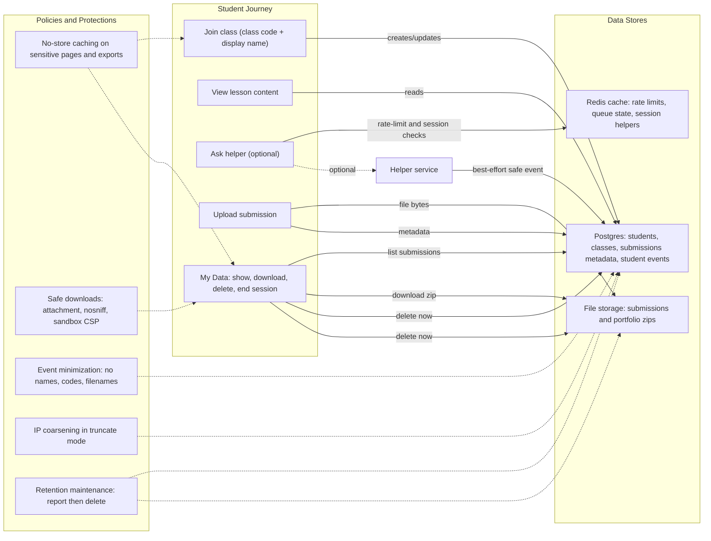

# Privacy Addendum (ClassHub)

## Summary
This addendum lists exactly what ClassHub stores, where it lives, how long it is retained, and how to delete it now.

## What to do now
1. Confirm your retention defaults in `compose/.env` (`CLASSHUB_SUBMISSION_RETENTION_DAYS`, `CLASSHUB_STUDENT_EVENT_RETENTION_DAYS`).
2. Verify student self-service controls at `/student/my-data`.
3. Verify teacher delete control at `/teach/class/<id>` (roster table).
4. If enabling remote LLM mode later, set `HELPER_REMOTE_MODE_ACKNOWLEDGED=1` intentionally.

## Verification signal
A student can open `/student/my-data` and perform download/delete/end-session without filing a ticket.

## Student data lifecycle and controls (Map B)

## Data Categories (Exact Fields)
- Student identity: `StudentIdentity.display_name`, `StudentIdentity.return_code`, `StudentIdentity.created_at`, `StudentIdentity.last_seen_at`, class link.
- Student submissions: `Submission.original_filename`, `Submission.file`, `Submission.note`, `Submission.uploaded_at`, material/student links.
- Student events (metadata-only): `StudentEvent.event_type`, `StudentEvent.source`, `StudentEvent.details`, minimized `StudentEvent.ip_address`, `StudentEvent.created_at`, optional classroom/student links.
- Teacher/admin accounts: Django auth user fields (`username`, `email`, password hash, staff/superuser flags, auth/session metadata).

## Storage Locations
- Primary relational data: Postgres (`classhub_postgres`).
- Uploaded files: filesystem volume mounted at `/uploads` in `classhub_web`.
- Lesson assets/videos: upload storage under the same app storage backend.
- Operational logs: container logs (`classhub_web`, `helper_web`, `caddy`).
- Backups (if enabled): operator-defined backup locations for Postgres/uploads/MinIO.

## Retention Defaults and Tuning
- Submission retention default: `CLASSHUB_SUBMISSION_RETENTION_DAYS=90`.
  - `0` means no automatic age-based deletion.
- Student event retention default: `CLASSHUB_STUDENT_EVENT_RETENTION_DAYS=180`.
  - `0` means no automatic age-based deletion.
- Student event IP precision default: `CLASSHUB_STUDENT_EVENT_IP_MODE=truncate`.
  - `truncate`: IPv4 `/24`, IPv6 `/56` network address only.
  - `full`: store full client IP.
  - `none`: do not store IP on student events.
- Portfolio export download filename default: `CLASSHUB_PORTFOLIO_FILENAME_MODE=generic`.
  - `generic`: `portfolio_YYYYMMDD.zip`.
  - `descriptive`: `<class>_<student>_portfolio_YYYYMMDD.zip`.
- Retention maintenance entrypoint: `scripts/retention_maintenance.sh`.
- Helper reset archive retention defaults:
  - `RETENTION_HELPER_EXPORT_DAYS=180` (set `0` to skip age-based cleanup)
  - `RETENTION_HELPER_EXPORT_DIR=/uploads/helper_reset_exports`
- Backups should be pruned with the same policy window used for live data.

## Data That Stays Local
- With `HELPER_LLM_BACKEND=ollama`, helper inference is local to your infrastructure.
- With `HELPER_LLM_BACKEND=mock`, helper responses are deterministic local test data.
- OpenAI mode is an explicit development/future path and must not be enabled silently.

## Remote Helper Mode (Explicit Consent Switch)
- To use remote helper mode (`HELPER_LLM_BACKEND=openai`), set:
  - `HELPER_REMOTE_MODE_ACKNOWLEDGED=1`
- If this acknowledgment is not set, `/helper/chat` returns `remote_backend_not_acknowledged` and remote mode stays blocked.

## Deletion Paths
- Student self-service:
  - `/student/my-data` -> `Delete my work now` (deletes submissions + upload-event records).
  - `/student/my-data` -> `End my session on this device`.
- Teacher control:
  - `/teach/class/<id>` roster -> `Delete student data` (student identity + related submissions/events).
- Class reset:
  - `/teach/class/<id>` -> `Reset roster now` (deletes all students/submissions in class and bumps session epoch).
- Admin/ops retention:
  - `manage.py prune_submissions`
  - `manage.py prune_student_events`
  - `scripts/retention_maintenance.sh`

## Operational Logging
- Logged:
  - request id (`request_id`), route-level status/error class, timing (`queue_wait_ms`, `total_ms`), backend name.
  - helper class-reset archive metadata in teacher audit events (`archived_conversations`, `archive_path`) when export-before-reset is enabled.
- Not logged by design:
  - student names, return codes, raw helper prompts, submission file contents, filenames in helper event forwarding logs.
- Log rotation/retention:
  - enforce at container runtime/host policy (for example Docker `max-size` + `max-file`) and align with school policy.

## Anti-Surveillance Statement
- No ad-tech beacons.
- No third-party analytics trackers by default.
- No data broker sharing.
- No shadow telemetry beyond operational safety/error logging.
