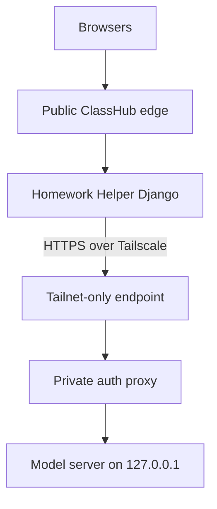

# Private LLM Backend

This document describes the first-pass private model architecture for ClassHub.

Current production recommendation:

- keep ClassHub public
- keep the model host private
- use Tailscale host-to-host only
- use a loopback-bound model server on the GPU node
- let Homework Helper be the only component that talks to the model



## End-to-end request path

The student-facing flow is:

1. A student opens a lesson or class page in Class Hub.
2. The helper widget submits to `/helper/chat` on the same public LMS site.
3. Homework Helper applies policy, redaction, scope checks, and rate limits.
4. Homework Helper reaches the remote model host over Tailscale, not over the public internet.
5. The GPU-side auth proxy forwards only authorized requests to the loopback-bound model server.
6. The model response returns to Homework Helper, then back into the student LMS view.

This is the practical topology to keep in mind:

- browser -> public LMS
- LMS helper service -> Tailscale
- Tailscale -> private GPU host
- private GPU host -> Tailscale -> LMS helper
- LMS renders the response back into the student page

See also [ARCHITECTURE.md](ARCHITECTURE.md) for the broader Class Hub / Homework Helper split.

## Why this boundary exists

- Student and teacher browsers never reach the GPU node directly.
- The helper can redact obvious identifiers before upstream calls.
- The LMS keeps the policy boundary, request logs, and classroom context.
- The GPU node is treated as replaceable compute, not the source of truth.

## Current backend modes

- `LLM_BACKEND=ollama`
  - current active path for private Ollama distributions
  - can use `tailscale serve` plus a local Caddy bearer-token wrapper
- `LLM_BACKEND=openai_compatible`
  - future path for vLLM or another OpenAI-compatible private server
- `LLM_BACKEND=mock`
  - deterministic local/test path only

Legacy `HELPER_LLM_BACKEND` remains supported, but `LLM_*` env names are now the preferred abstraction layer.

## LMS env block

```bash
LLM_ENABLED=1
LLM_BACKEND=ollama
LLM_BASE_URL=https://llm-gpu.example-tail.ts.net
LLM_API_KEY=REPLACE_ME_STRONG
LLM_MODEL=llama3.2:3b
LLM_TIMEOUT_SECONDS=30
LLM_MAX_TOKENS=256
LLM_NUM_CTX=4096
LLM_TEMPERATURE=0.2
LLM_LOG_PROMPT_CONTENT=0
LLM_REDACTION_ENABLED=1
LLM_ALLOWED_ACTOR_TYPES=student,staff
HELPER_REMOTE_MODE_ACKNOWLEDGED=1
```

If you are still using `OLLAMA_BASE_URL`, it remains supported as a compatibility fallback, but new deployments should prefer `LLM_BASE_URL`.

## Health and smoke path

Direct backend probe:

```bash
cd /srv/lms/app
bash scripts/check_llm_backend.sh --probe-chat
```

Full stack:

```bash
cd /srv/lms/app
bash scripts/system_doctor.sh
```

`system_doctor` now runs a helper-container LLM connectivity check before end-to-end smoke.

## Logging defaults

Default helper behavior:

- prompt redaction enabled
- prompt body logging disabled
- metadata logging only:
  - provider
  - request id
  - model
  - prompt/response lengths

Only set `LLM_LOG_PROMPT_CONTENT=1` for short, time-boxed debugging windows.

## Privacy boundary

This architecture is privacy-forward, not privacy-magical.

- Avoid sending unnecessary personal details upstream.
- Do not market the helper as authoritative or autonomous.
- Keep teacher review and classroom policy in ClassHub.
- Keep retention minimal and intentional.

FERPA-style caution:

- do not enable raw prompt/response retention by default
- do not place unrestricted staff notes or student dossiers on the GPU node
- document any exception before enabling it

## Warm / stop / replace

Warm:

```bash
bash scripts/check_llm_backend.sh --probe-chat
```

Stop:

- stop the systemd unit on the GPU node
- keep the LMS up; helper should degrade gracefully

Replace:

1. build a fresh GPU node
2. restore `/etc/classhub/llm-server.env`
3. re-enable Tailscale + model service + proxy
4. rerun `bash scripts/check_llm_backend.sh --probe-chat`
5. keep LMS config unchanged if hostname/key remain the same

## Troubleshooting

Fast classifications:

- `dns_resolution_failed`
  - Tailscale / MagicDNS / Serve hostname mismatch
- `auth_error`
  - LMS `LLM_API_KEY` and proxy key diverged
- `upstream_unavailable`
  - proxy reachable, model not ready or instance stopped
- `timeout`
  - model too cold/heavy for current timeout or context cap
- `malformed_response`
  - proxy or access page returned non-JSON

The operator runbook and GPU-host artifacts live in:

- `ops/llm-server/README.md` (in repo root, outside docs site)

## Known limits

- The current production-ready path is private Ollama over Tailscale with a small auth proxy, not a full service-mesh identity story.
- Helper-side redaction is intentionally minimal and pattern-based; it reduces obvious leakage but does not make arbitrary free-text prompts safe by itself.
- Public helper health checks no longer expose the private backend URL, but operator probes still need direct shell access on the LMS host.
