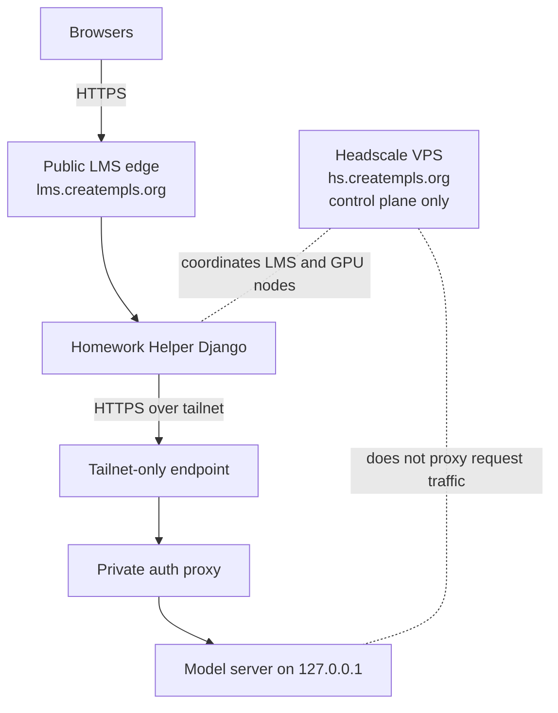

# Private LLM Backend

This is the canonical topology doc for the serious private-LLM production path.

For the createMPLS deployment at `lms.creatempls.org`, the expected mental model is:

- `lms.creatempls.org` remains public
- the model host remains private
- browsers never talk to the model host directly
- Homework Helper is the only component that talks to the model host
- private LLM traffic is host-to-host only
- the tailnet exists only for LLM traffic and related operator/admin troubleshooting
- for this deployment class, the recommended control plane is a self-hosted Headscale server on a tiny Ubuntu VPS
- Headscale is a control-plane concern; ClassHub runtime remains control-plane-agnostic

Current deploy/test default:

- use the bundled CPU-local Ollama service only for day-1 compose deploys and bounded smoke checks
- keep that local smoke path intentionally small so modest LMS nodes can still validate `/helper/chat`
- treat remote private-backend validation as optional pass/fail evidence, not as a blocker for the rest of the stack
- for the serious private backend, prefer a Gemma-family model on the private GPU host, served through Ollama or another compatible private backend



## End-to-end request path

The student-facing flow is:

1. A student opens a lesson or class page on the public LMS.
2. The helper widget submits to `/helper/chat` on the same public LMS site.
3. Homework Helper applies policy, redaction, scope checks, and rate limits.
4. Homework Helper reaches the remote model host over the private tailnet, not over the public internet.
5. The GPU-side auth proxy forwards only authorized requests to the loopback-bound model server.
6. The model response returns to Homework Helper, then back into the student LMS view.

Keep this topology in mind:

- browser -> public LMS
- public LMS -> Homework Helper
- Homework Helper -> private tailnet
- private tailnet -> private GPU host
- GPU host -> private tailnet -> Homework Helper
- Homework Helper -> public LMS response

See also [ARCHITECTURE.md](ARCHITECTURE.md) for the broader Class Hub / Homework Helper split.

## Traffic boundary

Public browser traffic:

- goes to `lms.creatempls.org`
- stays on the public LMS path
- must never use the tailnet

Private tailnet traffic:

- goes only between the LMS host and the private model host
- exists only for LLM traffic and related operator/admin troubleshooting
- must not become general site routing or a general-purpose overlay network

## Why this boundary exists

- Student and teacher browsers never reach the GPU node directly.
- Homework Helper is the only component that talks to the model host.
- The helper can redact obvious identifiers before upstream calls.
- The LMS keeps the policy boundary, request logs, and classroom context.
- The GPU node is treated as replaceable compute, not the source of truth.
- The Headscale VPS stays small and stable because it only coordinates the private path.

## Control plane recommendation

For createMPLS-style production deployments, recommend:

- a self-hosted Headscale server on a tiny Ubuntu VPS
- a separate public hostname such as `hs.creatempls.org`
- only the LMS host and GPU host joined by default

Important:

- Headscale coordinates the private path
- Headscale does not carry request traffic
- Headscale is not the model server
- Headscale is not the public LMS edge

The ClassHub runtime stays agnostic here. It only depends on:

- `LLM_BASE_URL`
- `LLM_API_KEY`
- `LLM_BACKEND`
- helper-side probing from the LMS host

## Bounded remote compute activation

For expensive remote GPU/provider capacity, the repo now supports a bounded staff-only activation lease:

- remote helper compute stays off by default
- a teacher/admin can activate it for a live class window from `/teach/class/<id>`
- the intended use is a partner-site or on-site class/session window, not a permanent global mode
- the control call stays server-side from ClassHub to Homework Helper to your orchestration URL
- provider credentials and orchestration APIs stay server-side
- student browsers never get a remote-compute control affordance
- the helper only routes to the remote backend when the lease state is `ready`
- `requested`, `starting`, `degraded`, `stopping`, and `error` all stay on local/default helper compute
- if the remote path fails during an active lease, helper requests fall back to local/default compute

Reference:

- [REMOTE_HELPER_COMPUTE_CONTROL.md](REMOTE_HELPER_COMPUTE_CONTROL.md)

## Current backend modes

- `LLM_BACKEND=ollama`
  - practical path for local smoke and for remote private hosts that expose an Ollama-compatible API
  - common serious deployment example: a Gemma-family model on the private GPU host behind a tailnet-only HTTPS endpoint
- `LLM_BACKEND=openai_compatible`
  - swap-ready path for vLLM, TGI, or another OpenAI-compatible private server
- `LLM_BACKEND=mock`
  - deterministic local/test path only

Legacy `HELPER_LLM_BACKEND` remains supported, but `LLM_*` env names are now the preferred abstraction layer.

## LMS env block

Example separation between public LMS and private model endpoint:

```bash
DOMAIN=lms.creatempls.org

LLM_ENABLED=1
LLM_BACKEND=ollama
LLM_BASE_URL=https://llm-gpu.tail.creatempls.org
LLM_API_KEY=REPLACE_ME_STRONG
LLM_MODEL=gemma3:4b
LLM_TIMEOUT_SECONDS=30
LLM_MAX_TOKENS=256
LLM_NUM_CTX=4096
LLM_TEMPERATURE=0.2
LLM_LOG_PROMPT_CONTENT=0
LLM_REDACTION_ENABLED=1
LLM_ALLOWED_ACTOR_TYPES=student,staff

# Only for deployments that intentionally enable bounded paid remote compute
CLASSHUB_REMOTE_HELPER_COMPUTE_ENABLED=1
CLASSHUB_REMOTE_HELPER_COMPUTE_ACKNOWLEDGED=1
```

If you are still using `OLLAMA_BASE_URL`, it remains supported as a compatibility fallback, but new deployments should prefer `LLM_BASE_URL`.

## Health and smoke path

Direct backend probe from the LMS host:

```bash
cd /srv/lms/app
bash scripts/check_llm_backend.sh --probe-chat
```

Full stack:

```bash
cd /srv/lms/app
bash scripts/system_doctor.sh
```

`system_doctor` runs a helper-container LLM connectivity check before end-to-end smoke.
When the backend is remote/private, that backend check and helper smoke path run in advisory mode by default; small local helper validation remains required.
`make smoke-full` now reinforces that local lane with a reduced context window, short reply budget, and single backend attempt so the LMS host can validate the helper path without impersonating the serious remote inference node.

## Logging defaults

Default helper behavior:

- prompt redaction enabled
- prompt body logging disabled
- metadata logging only:
  - provider
  - request id
  - model
  - prompt/response lengths

Only set `LLM_LOG_PROMPT_CONTENT=1` for short, time-boxed debugging windows.

## Privacy boundary

This architecture is privacy-forward, not privacy-magical.

- Avoid sending unnecessary personal details upstream.
- Do not market the helper as authoritative or autonomous.
- Keep teacher review and classroom policy in ClassHub.
- Keep retention minimal and intentional.

FERPA-style caution:

- do not enable raw prompt/response retention by default
- do not place unrestricted staff notes or student dossiers on the GPU node
- document any exception before enabling it

## Warm / stop / replace

Warm:

```bash
bash scripts/check_llm_backend.sh --probe-chat
```

Stop:

- stop the systemd unit on the GPU node
- keep the LMS up; helper should degrade gracefully

Replace:

1. build a fresh GPU node
2. restore `/etc/classhub/llm-server.env`
3. re-enable tailnet client + model service + proxy
4. rerun `bash scripts/check_llm_backend.sh --probe-chat`
5. keep LMS config unchanged if hostname/key remain the same

## Troubleshooting

Fast classifications:

- `dns_resolution_failed`
  - tailnet DNS or private endpoint hostname mismatch
- `auth_error`
  - LMS `LLM_API_KEY` and proxy key diverged
- `upstream_unavailable`
  - proxy reachable, model not ready or instance stopped
- `timeout`
  - model too cold/heavy for current timeout or context cap
- `malformed_response`
  - proxy or access page returned non-JSON

The operator runbook and GPU-host artifacts live in:

- [RUNBOOK.md](RUNBOOK.md)
- [HEADSCALE_CONTROL_PLANE.md](HEADSCALE_CONTROL_PLANE.md)
- `ops/llm-server/README.md`

## Known limits

- The current production-ready path is a private model endpoint behind a tailnet-only HTTPS hop with a small auth proxy, not a full service-mesh identity story.
- Helper-side redaction is intentionally minimal and pattern-based; it reduces obvious leakage but does not make arbitrary free-text prompts safe by itself.
- Public helper health checks no longer expose the private backend URL, but operator probes still need direct shell access on the LMS host.
