# Public Overview

## Summary
Class Hub is a self-hosted classroom platform with a separate Homework Helper service. It is designed for calm classroom operations, easy student access, and clear control over infrastructure and data. The current release prioritizes operational clarity over polish: teams can see what is live, what is optional, and what remains intentionally deferred.

## What to do now
1. Decide if this fits your context (quick bullets below).
2. Try the local demo path in [TRY_IT_LOCAL.md](TRY_IT_LOCAL.md).
3. If your team plans to host this publicly, read [SECURITY.md](SECURITY.md), then [DAY1_DEPLOY_CHECKLIST.md](DAY1_DEPLOY_CHECKLIST.md) and [RUNBOOK.md](RUNBOOK.md).
4. For plain-language trust boundaries, review [RISK_AND_DATA_POSTURE.md](RISK_AND_DATA_POSTURE.md) and [PRIVACY-ADDENDUM.md](PRIVACY-ADDENDUM.md).
5. For partner or district-facing boundary questions, review [LEGAL_AND_PARTNER_NOTES.md](LEGAL_AND_PARTNER_NOTES.md).
6. If docs feel overlapping, use [CANONICAL_TRUTHS.md](CANONICAL_TRUTHS.md) to identify one source per policy area.

If you are reading this as leadership rather than as a technical evaluator, start with:
- [START_HERE_BOARD.md](START_HERE_BOARD.md)
- [START_HERE_ED.md](START_HERE_ED.md)
- [START_HERE_FUNDRAISING.md](START_HERE_FUNDRAISING.md)
- [RISK_AND_DATA_POSTURE.md](RISK_AND_DATA_POSTURE.md)
- [LEGAL_AND_PARTNER_NOTES.md](LEGAL_AND_PARTNER_NOTES.md)
- [PROGRAM_LIFECYCLE.md](PROGRAM_LIFECYCLE.md)

## Verification signal
If this page is useful, you should be able to answer: who this is for, what it deliberately does not do, and the next 2 docs to read for an evaluation.

## Organization and place acknowledgment
- createMPLS is a Minneapolis-based 501(c)(3) nonprofit organization.
- Minneapolis is located on the ancestral and contemporary homeland of the Dakota Nation (specifically the Mdewakanton, Wahpeton, and Sisseton bands of the Očhéthi Šakówiŋ). The area is known as Mni Sota Makoce and is also a significant territory for the Anishinaabe/Ojibwe people, following their migration to the region.

## What it is
- A self-hosted learning hub for classes, modules, and lesson materials.
- A simple student join flow (`class code + pseudonym display name`) without student password accounts in the current release.
- A teacher/admin workflow with staff sign-in and safety controls for public websites.
- A deployment path that keeps the public LMS public while allowing Homework Helper to reach a separate private model host over a server-to-server tailnet path.

## Who it is for
- Small schools and programs that want self-hosted control.
- Makerspaces, after-school labs, and classroom pilots.
- Teams that prefer straightforward operations over platform sprawl.

## What makes it different
- Privacy-first defaults (minimal student identity and clear retention controls).
- Plain-language trust controls in-product (`/trust`, `/student/my-data`) for rename/export/delete without filing a ticket.
- Class-by-class data retention settings.
- Calm student join model (no student email/password in the current release).
- Student home starts with a clear weekly launch path (`This week` + `Course links` + `Account`).
- Artifact-first student flow (`/student/portfolio`) with opt-in gallery sharing (`/student/gallery`) and teacher moderation.
- Help-first facilitation support board surfaces “I'm stuck”, deletion requests, upload errors, and context without rankings.
- Multi-lingual UI support on the bounded family/student tranche (`en`, `es`, `so`, and provisional `ksw` pending native-speaker review).
- Course content stays portable through file-first authoring, coursepack builds, static registry publishing/import, and print-friendly HTML handouts with simple PDF fallback downloads.
- Public website hardening options (content-security policy, safe-site modes, and proxy protections).
- Self-hosted architecture using widely used components (Django, Postgres, Redis, Caddy).
- Helper support is lesson-scoped and does not archive student prompts.

## What it will not do
- No student surveillance scoring.
- No ad-tech or data resale model.
- No dark-pattern growth loops.
- No hidden SaaS lock-in requirement for core operation.

## Try it in 10 minutes
- Local demo path: [TRY_IT_LOCAL.md](TRY_IT_LOCAL.md)

## Visual reference

Current captured baseline:

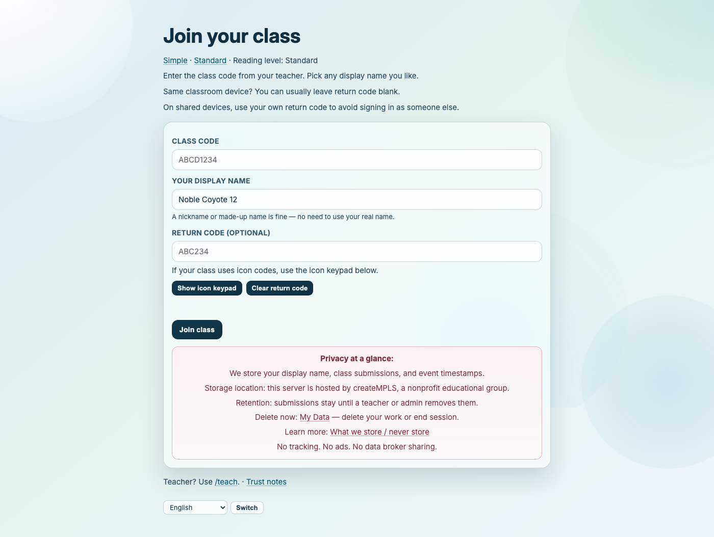

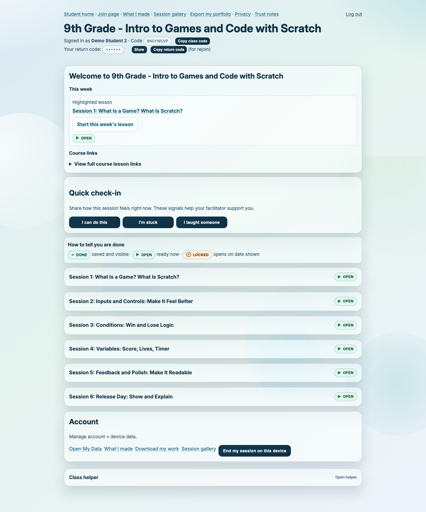

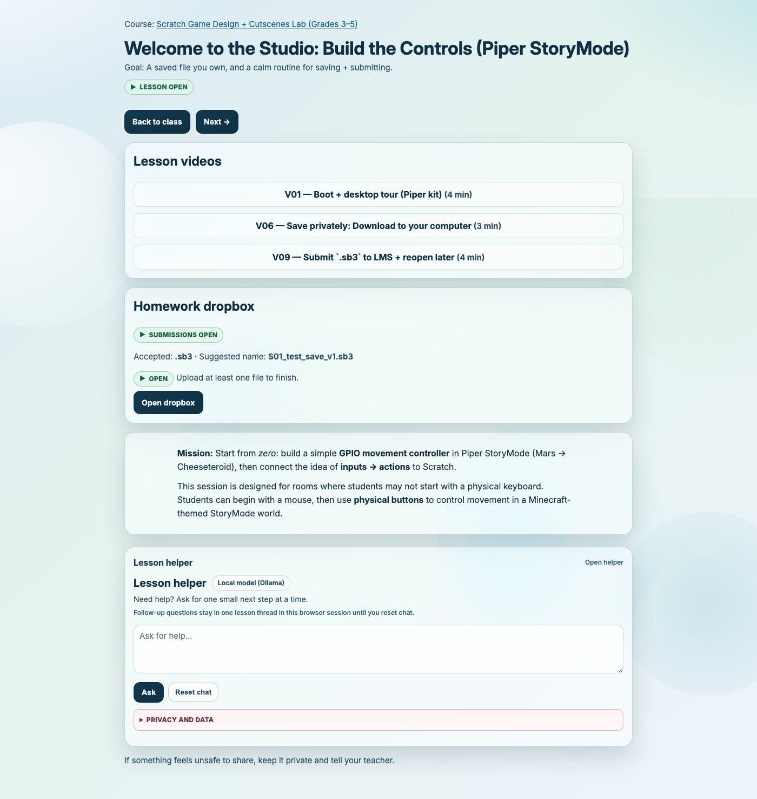

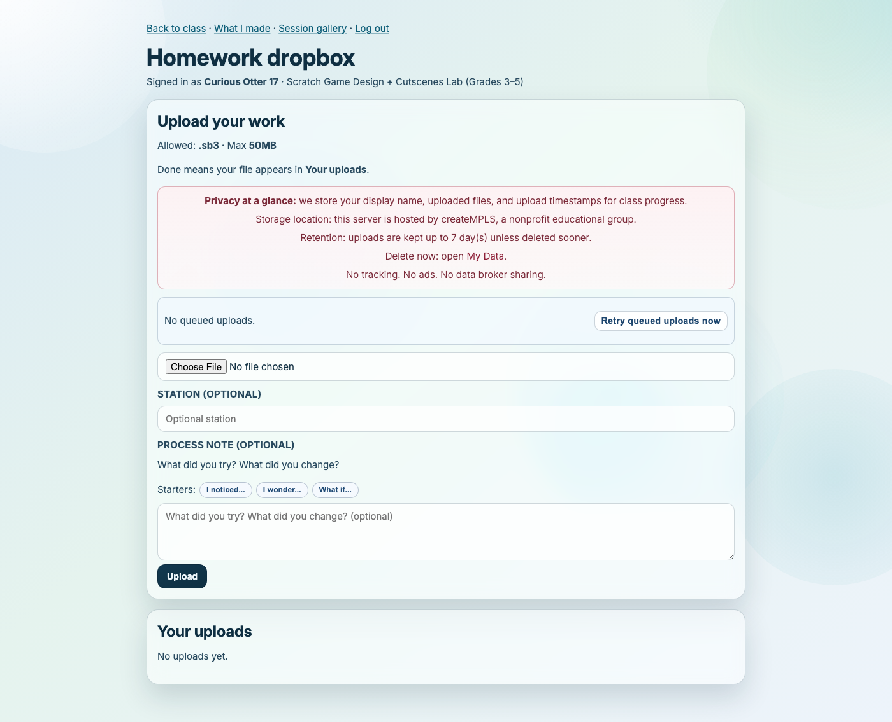

Captured workflow references:

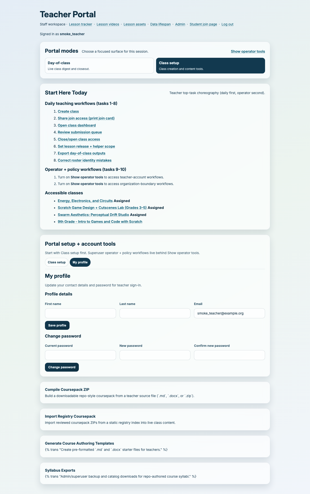

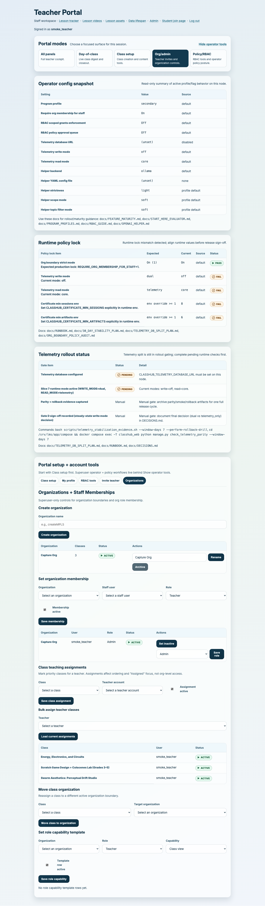

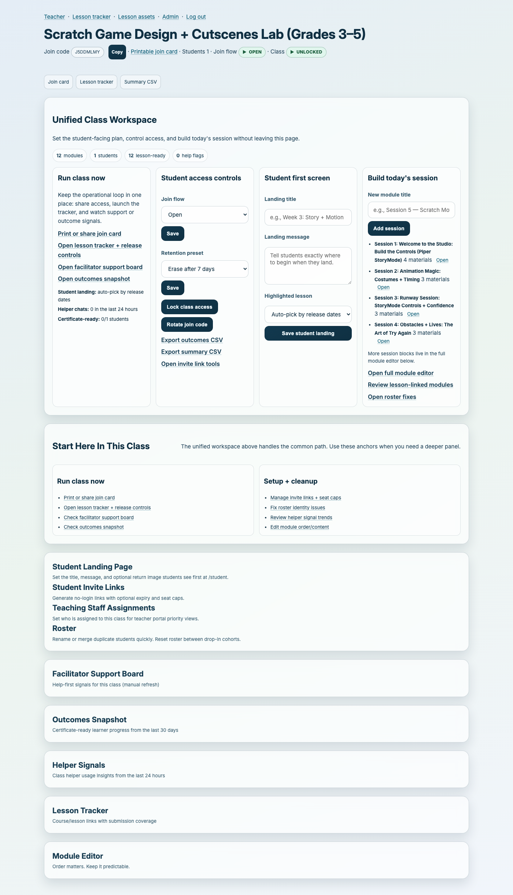

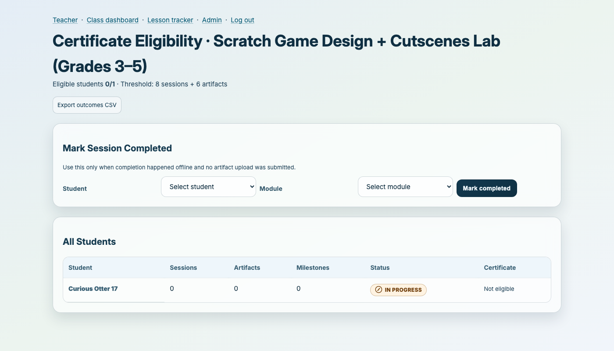

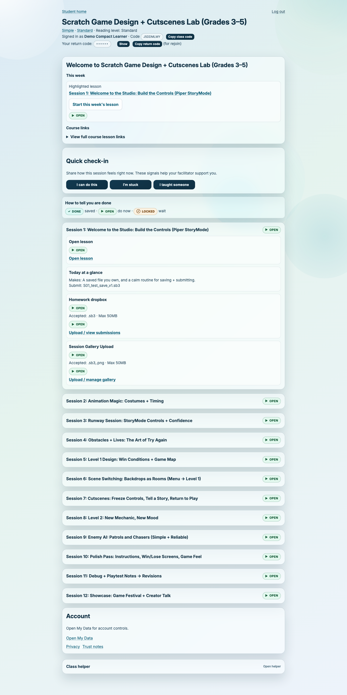

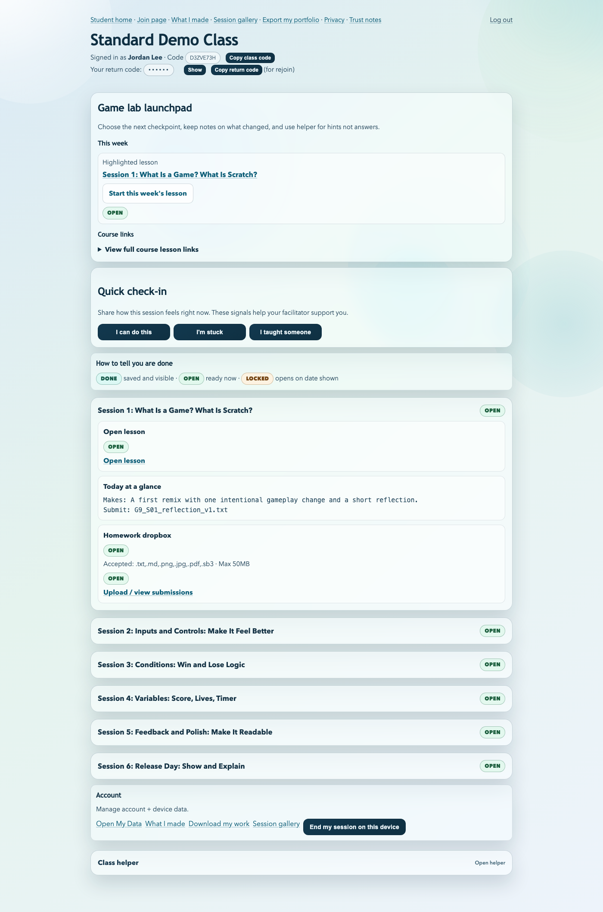

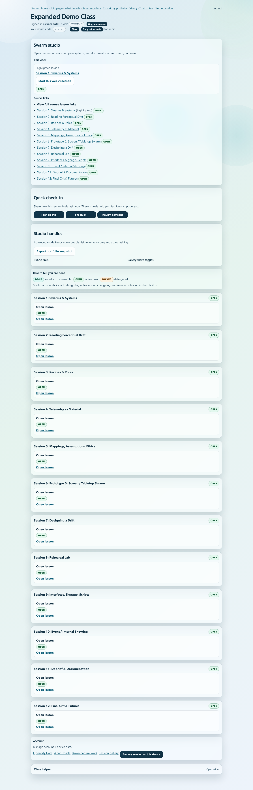

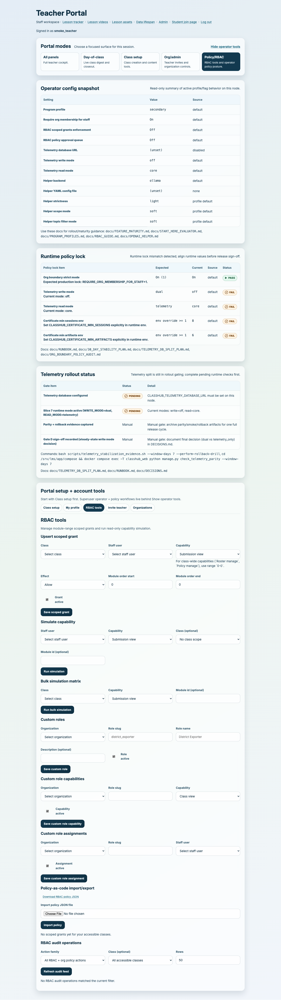

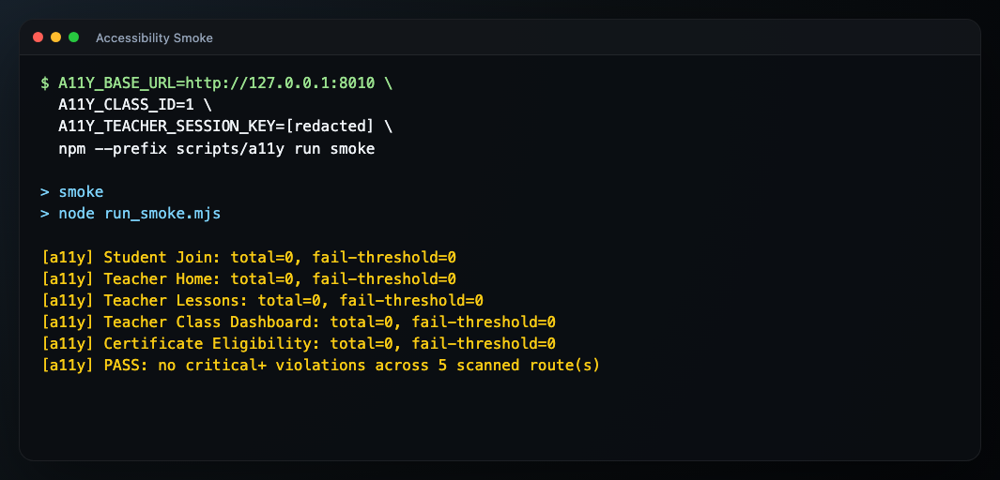

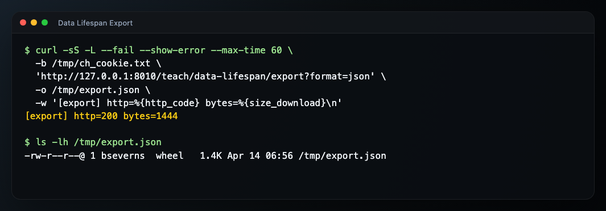

Public screenshots are current in `press/screenshots/` and `docs/images/press/`.
The public screenshot set is complete through `21`, plus optional companion `19-rbac-tools-tab-approval-on.png`.
No pending captures are currently tracked in `press/screenshots/PLACEHOLDERS.md`.
Capture instructions live in `press/screenshots/SHOTLIST.md`.

## Technical ops and security links
- [SECURITY.md](SECURITY.md)
- [PRIVACY-ADDENDUM.md](PRIVACY-ADDENDUM.md)
- [DAY1_DEPLOY_CHECKLIST.md](DAY1_DEPLOY_CHECKLIST.md)
- [RUNBOOK.md](RUNBOOK.md)
