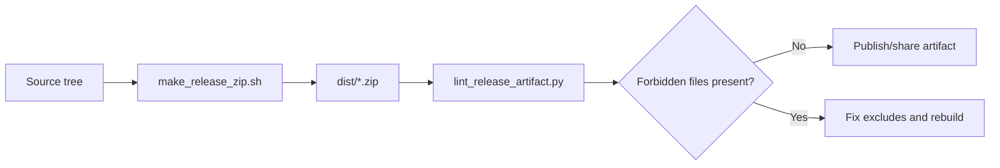

# Releasing

Use this when creating a shareable source archive.

Canonical rule:
- Only publish artifacts generated by `scripts/make_release_zip.sh`.
- Manual zips (`zip -r`, Finder/Explorer compression, ad-hoc tarballs) are unsupported and should be treated as invalid.



## Build release zip

```bash
cd /srv/lms/app
bash scripts/make_release_zip.sh
```

Optional output path:

```bash
bash scripts/make_release_zip.sh /srv/lms/releases/classhub_release.zip
```

## What is excluded

Release archives intentionally exclude local/runtime artifacts, including:

- `.git/`
- `.venv/`
- `__pycache__/`
- `media/`
- `staticfiles/`
- `data/`
- `.deploy/`
- `compose/.env` and local backup variants (`compose/.env.bak*`, `compose/.env.local*`)
- `dist/`
- common OS metadata (`.DS_Store`, `__MACOSX`)

## Verify artifact contents locally

```bash
export ZIP_PATH="$(ls -t dist/classhub_release_*.zip | head -n1)"
python3 scripts/lint_release_artifact.py "${ZIP_PATH}"
```

CI enforces this same rule in `.github/workflows/test-suite.yml` (`release-artifact-check`).

## Ops + Security Notes (per release)

Use this as the standard release appendix/checklist.

### Operational doctrine
- Production deploys use `RUN_MIGRATIONS_ON_START=0`. Migrations run explicitly during deploy (`scripts/deploy_with_smoke.sh`).
- Health checks:
  - `/healthz` = edge/proxy health
  - `/upstream-healthz` = ClassHub upstream health
- Backups: Postgres + uploaded media (and MinIO if enabled). See [DISASTER_RECOVERY.md](DISASTER_RECOVERY.md).

### Access controls
- Staff surfaces require OTP when enabled:
  - Admin: `DJANGO_ADMIN_2FA_REQUIRED=1`
  - Teacher portal: `DJANGO_TEACHER_2FA_REQUIRED=1`
- Proxy safety defaults:
  - Do not trust forwarded headers unless `REQUEST_SAFETY_TRUST_PROXY_HEADERS=1` is explicitly set for known reverse-proxy deployments.

### Data minimization and retention
- Student identity is minimal by design (no default email/password accounts required).
- Retention is configurable:
  - `CLASSHUB_SUBMISSION_RETENTION_DAYS` (default `90`)
  - `CLASSHUB_STUDENT_EVENT_RETENTION_DAYS` (default `180`)
- Student self-service:
  - `/student/my-data` export/delete controls exist for student data control.

### Content and XSS safety
- Markdown rendering is sanitized (Bleach allowlist) before display.
- Images are optional and gated by config; external hosts may be allowlisted.
- Lesson metadata parse failures return generic user-facing errors; detailed exceptions stay server-side.

### Security hardening notes (include when applicable)
Add these bullets to the release summary when shipped:
- Redirect hardening: dynamic teacher/admin redirects now pass through same-origin internal redirect validation.
- Path containment: lesson/template file resolution is rooted with safe path join and boundary checks.
- Error redaction: exception details are removed from end-user HTTP responses for lesson metadata failures.
- Verification: CodeQL alerts for `py/url-redirection`, `py/path_injection`, and `py/stack-trace-exposure` were re-run and reviewed.

### Uploads and file safety
- Upload limits are enforced at both layers:
  - Caddy `max_body_size`
  - Django upload limits
- Upload validation includes filetype policy; optional AV scanning can be enabled.
- If AV scanning is enabled, consider fail-closed for maximum safety.

### Homework Helper boundary
- Helper is a separate service routed behind `/helper/*`.
- Requests are constrained (`1MB`) and rate limited.
- Helper scope tokens constrain context; events record access metadata, not prompt content.

### Reproducibility
- Core infra images are pinned in compose where possible (`Caddy`, `Postgres`, `Redis`).
- Supporting services may intentionally track `latest` depending on operator preference.

### Operator checklist
- Confirm `.env` has no placeholder secrets (`bash scripts/validate_env_secrets.sh`).
- Confirm OTP works for `/teach/*` and `/admin/*`.
- Confirm `/upstream-healthz` returns OK after deploy.
- Confirm retention jobs/timers are configured if using pruning.
