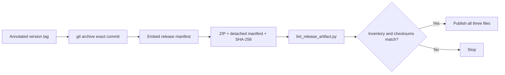

# Releasing

Use this when creating a shareable source archive.

Canonical rule:
- Only publish artifacts generated by `scripts/make_release_zip.sh`.
- Published artifacts must come from an annotated tag matching `VERSION`.
- Manual zips (`zip -r`, Finder/Explorer compression, ad-hoc tarballs) are unsupported and should be treated as invalid.


```mermaid
flowchart LR
  A[Annotated version tag] --> B[git archive exact commit]
  B --> C[Embed release manifest]
  C --> D[ZIP + detached manifest + SHA-256]
  D --> E[lint_release_artifact.py]
  E --> F{Inventory and checksums match?}
  F -->|Yes| G[Publish all three files]
  F -->|No| H[Stop]
```

## Prepare a release tag

The tracked `VERSION` file is the release identity. Development
commits use a SemVer prerelease such as `1.9.0-dev`. To publish:

```bash
cd /srv/lms/app
# Update VERSION to the final value and move CHANGELOG entries out of Unreleased.
git add VERSION CHANGELOG.md
git commit -m "Prepare 1.9.0 release"
git tag -a 1.9.0 -m "ClassHub 1.9.0"
```

The tag may be cryptographically signed (`git tag -s`) when operator signing
keys are available. Lightweight tags are rejected.

Review `release/policy.json` in the same release commit. Its
`supported_upgrade_origins` list is embedded in the release manifest.

## Build the tagged release

```bash
cd /srv/lms/app
bash scripts/make_release_zip.sh --ref 1.9.0
```

An optional output path remains supported:

```bash
bash scripts/make_release_zip.sh --ref 1.9.0 /srv/lms/releases/classhub_1.9.0.zip
```

The builder emits three files. Publish them together:

1. `classhub_<version>_<commit>.zip`
2. `classhub_<version>_<commit>.zip.manifest.json`
3. `classhub_<version>_<commit>.zip.sha256`

`--allow-untagged` exists only for CI exact-commit verification. Never publish
an artifact built with that option.

## Artifact identity contract

`make_release_zip.sh` requires a completely clean worktree, requires `HEAD` to
be the tagged commit for publishing, and resolves the requested ref to a full
commit SHA. It exports that Git object with
`git archive`; working-directory modifications cannot enter the ZIP.

The embedded `RELEASE-MANIFEST.json` records:

- semantic version and full commit SHA
- source ref and annotated tag object
- UTC build timestamp
- supported upgrade origins
- ClassHub, Helper, and infrastructure runtime versions
- repository-owned Django migration heads
- every payload path, mode, size, and SHA-256
- a canonical payload-inventory checksum

The detached manifest repeats that metadata and adds the final ZIP filename,
size, and SHA-256. The `.sha256` file is the minimal checksum sidecar.

The ZIP contains the files tracked at the referenced commit plus the generated
embedded manifest. Generated stability evidence remains a separate companion
artifact.

Lint rejects:

- missing or malformed release metadata
- payload paths absent from or added beyond the manifest inventory
- file content, size, or mode mismatches
- detached-manifest or checksum-sidecar mismatches
- runtime/local paths such as `.git`, `.venv`, `data`, `media`, `staticfiles`,
  `dist`, and live or backup `compose/.env` files

## Source zip vs companion evidence bundle

For release review or evaluator handoff, treat these as separate artifacts:

1. Source bundle (`dist/classhub_release_*.zip`) built by `make_release_zip.sh`
2. Companion evidence bundle (`artifacts/stability/<release-date>/`) captured during closeout

Build/share both from the server:

```bash
cd /srv/lms/app
RELEASE_DATE=2026-03-10

bash scripts/make_release_zip.sh --ref 1.9.0
tar -C artifacts/stability -czf "dist/classhub_evidence_${RELEASE_DATE}.tgz" "${RELEASE_DATE}"
sha256sum dist/classhub_1.9.0_*.zip "dist/classhub_evidence_${RELEASE_DATE}.tgz" > "dist/release_checksums_${RELEASE_DATE}.sha256"
```

Evidence consumers should start with:

- `artifacts/stability/<release-date>/EVIDENCE_INDEX.md` (inside the companion evidence bundle)

## Verify artifact contents locally

```bash
export ZIP_PATH="$(ls -t dist/classhub_*.zip | head -n1)"
python3 scripts/lint_release_artifact.py "${ZIP_PATH}"
```

CI builds the exact `GITHUB_SHA` in explicit untagged verification mode,
validates all three outputs, and runs release-tool tests from the extracted
ZIP. `.github/workflows/stack-smoke.yml` also runs the full doctor and
accessibility smoke from an extracted exact-commit artifact rather than the
checkout.

Use the manifest-aware extractor instead of a generic ZIP extractor so
executable Git modes are restored after integrity verification:

```bash
python3 scripts/release_artifact.py extract "${ZIP_PATH}" /tmp/classhub_release
```

## Ops + Security Notes (per release)

Use this as the standard release appendix/checklist.

### Operational doctrine
- Production deploys use `RUN_MIGRATIONS_ON_START=0`. Migrations run explicitly during deploy (`scripts/deploy_with_smoke.sh`).
- Health checks:
  - `/healthz` = edge/proxy health
  - `/upstream-healthz` = ClassHub upstream health (only when `CADDY_EXPOSE_UPSTREAM_HEALTHZ=1`)
- Backups: Postgres + uploaded media (and MinIO if enabled). See [DISASTER_RECOVERY.md](DISASTER_RECOVERY.md).

### Access controls
- Staff surfaces require OTP when enabled:
  - Admin: `DJANGO_ADMIN_2FA_REQUIRED=1`
  - Teacher portal: `DJANGO_TEACHER_2FA_REQUIRED=1`
- Proxy safety defaults:
  - Do not trust forwarded headers unless `REQUEST_SAFETY_TRUST_PROXY_HEADERS=1` is explicitly set for known reverse-proxy deployments.

### Data minimization and retention
- Student identity is minimal by design (no default email/password accounts required).
- Retention is configurable:
  - `CLASSHUB_SUBMISSION_RETENTION_DAYS` (default `90`)
  - `CLASSHUB_STUDENT_EVENT_RETENTION_DAYS` (default `180`)
- Student self-service:
  - `/student/my-data` export/delete controls exist for student data control.

### Content and XSS safety
- Markdown rendering is sanitized (Bleach allowlist) before display.
- Images are optional and gated by config; external hosts may be allowlisted.
- Lesson metadata parse failures return generic user-facing errors; detailed exceptions stay server-side.

### Security hardening notes (include when applicable)
Add these bullets to the release summary when shipped:
- Redirect hardening: dynamic teacher/admin redirects now pass through same-origin internal redirect validation.
- Path containment: lesson/template file resolution is rooted with safe path join and boundary checks.
- Error redaction: exception details are removed from end-user HTTP responses for lesson metadata failures.
- Verification: CodeQL alerts for `py/url-redirection`, `py/path_injection`, and `py/stack-trace-exposure` were re-run and reviewed.

### Uploads and file safety
- Upload limits are enforced at both layers:
  - Caddy `max_body_size`
  - Django upload limits
- Upload validation includes filetype policy; optional AV scanning can be enabled.
- If AV scanning is enabled, consider fail-closed for maximum safety.

### Homework Helper boundary
- Helper is a separate service routed behind `/helper/*`.
- Requests are constrained (`1MB`) and rate limited.
- Helper scope tokens constrain context; events record access metadata, not prompt content.
- When a remote/private model backend is used, public LMS browser traffic stays on the public domain and only Homework Helper server-to-server traffic uses the private tailnet path.

### Reproducibility
- Core infra images are pinned in compose where possible (`Caddy`, `Postgres`, `Redis`).
- Supporting services may intentionally track `latest` depending on operator preference.

### Operator checklist
- Confirm `.env` has no placeholder secrets (`bash scripts/validate_env_secrets.sh`).
- Confirm OTP works for `/teach/*` and `/admin/*`.
- Confirm `/upstream-healthz` returns OK after deploy if `CADDY_EXPOSE_UPSTREAM_HEALTHZ=1` (otherwise expect `404`).
- Confirm retention jobs/timers are configured if using pruning.
