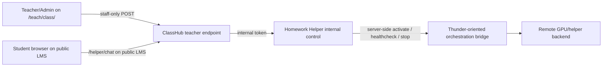

# Remote Helper Compute Control

## Summary
This doc is the canonical contract for bounded staff-only remote helper compute.

The purpose is narrow:

- remote helper compute stays off by default
- a teacher/admin can request it for a live partner-site or on-site class window
- provider credentials and orchestration APIs stay server-side
- student browsers never see or control this path
- public LMS/browser traffic never routes directly to the remote provider
- helper requests fall back to local/default compute when the remote path is off, not ready, or degraded

This is a cost-control and operations path, not a student-facing AI feature.

## Product shape

When enabled in deployment config, `/teach/class/<id>` exposes a bounded staff-only control:

- request remote helper compute for this class
- see the current remote-compute state
- export the current remote-helper state/accounting snapshot as JSON or CSV
- stop the remote path and return to local/default helper compute

The control is:

- class-scoped
- time-bounded
- capability-gated
- server-side only after the teacher/admin click

Students never see provider names, credentials, instance ids, or raw orchestration controls.

## Activation workflow



Important:

- the student browser still talks only to the public LMS
- the LMS-side staff action is the only browser step
- all Thunder/provider orchestration stays server-to-server
- the remote provider is never called directly from the browser

## State model

The repo now uses an explicit bounded state model:

- `off`
  - no active class lease
  - helper uses local/default compute
- `requested`
  - staff asked for remote compute
  - orchestration accepted the request, but helper does not route remote traffic yet
- `starting`
  - the remote path is warming or healthchecks are still pending
  - helper stays on local/default compute
- `ready`
  - the remote backend is healthy for the class lease
  - helper may route class traffic to the remote backend
- `degraded`
  - the lease still exists, but remote execution or healthchecks failed
  - helper stays on local/default compute
- `stopping`
  - the stop request was issued and the remote path is being returned to `off`
  - helper stays on local/default compute
- `error`
  - activation/stop/health orchestration failed in a bounded way
  - helper stays on local/default compute

Only `ready` allows remote helper routing.

## Current runtime behavior

Current shipped behavior is:

- local/default helper compute remains the baseline path
- remote helper compute is feature-flagged and opt-in
- the helper only uses the remote backend when the class lease state is `ready`
- `ready` now means helper-side verification passed:
  - provider status says the backend is available,
  - helper can reach the remote LLM endpoint with the configured auth/model path,
  - a warm chat probe succeeds within `HELPER_REMOTE_COMPUTE_READY_MAX_SECONDS`
- if the state is `requested`, `starting`, `degraded`, `stopping`, or `error`, helper stays on local/default compute
- if a remote execution fails during a `ready` lease, the helper logs `remote_compute_fallback_local`, marks the lease degraded, and retries locally for that request
- the lease expires automatically after its bounded window
- optional idle auto-stop can return remote compute to `off`
- helper startup runs `python manage.py reconcile_remote_compute_state` by default (`RUN_REMOTE_COMPUTE_RECONCILE_ON_START=1`) so durable lease state is normalized after restarts
- `/teach/class/<id>/export-helper-remote-snapshot?format=json|csv` exports the current class-scoped helper snapshot and records `class.remote_helper_snapshot_export`

## Flags and env contract

The deployment-level gate is:

```bash
CLASSHUB_REMOTE_HELPER_COMPUTE_ENABLED=1
CLASSHUB_REMOTE_HELPER_COMPUTE_ACKNOWLEDGED=1
```

Notes:

- `CLASSHUB_REMOTE_HELPER_COMPUTE_ENABLED=1` enables the capability
- `CLASSHUB_REMOTE_HELPER_COMPUTE_ACKNOWLEDGED=1` is the explicit operator acknowledgement for paid remote usage
- legacy helper-side names remain supported as compatibility aliases:
  - `HELPER_REMOTE_COMPUTE_ENABLED`
  - `HELPER_REMOTE_MODE_ACKNOWLEDGED`

Example bounded remote-compute block:

```bash
# Deployment-level gate
CLASSHUB_REMOTE_HELPER_COMPUTE_ENABLED=1
CLASSHUB_REMOTE_HELPER_COMPUTE_ACKNOWLEDGED=1

# Provider adapter seam
HELPER_REMOTE_COMPUTE_PROVIDER_ADAPTER=thunder_webhook
HELPER_REMOTE_COMPUTE_PROVIDER_LABEL=thunder-orchestration
HELPER_REMOTE_COMPUTE_ACTIVATE_URL=https://ops.creatempls.org/helper-remote/activate
HELPER_REMOTE_COMPUTE_DEACTIVATE_URL=https://ops.creatempls.org/helper-remote/deactivate
HELPER_REMOTE_COMPUTE_HEALTHCHECK_URL=https://ops.creatempls.org/helper-remote/health
HELPER_REMOTE_COMPUTE_CONTROL_API_KEY=REPLACE_ME_STRONG
HELPER_REMOTE_COMPUTE_CONTROL_TIMEOUT_SECONDS=8
CLASSHUB_REMOTE_HELPER_COMPUTE_IDLE_TIMEOUT_SECONDS=1800
HELPER_REMOTE_COMPUTE_READY_MAX_SECONDS=12
RUN_REMOTE_COMPUTE_RECONCILE_ON_START=1

# Internal LMS -> helper control path
HELPER_INTERNAL_REMOTE_COMPUTE_STATUS_URL=http://helper_web:8000/helper/internal/remote-compute-status
HELPER_INTERNAL_REMOTE_COMPUTE_CONTROL_URL=http://helper_web:8000/helper/internal/remote-compute-control
HELPER_INTERNAL_REMOTE_COMPUTE_TIMEOUT_SECONDS=2

# Remote helper target used only when state == ready
REMOTE_LLM_BASE_URL=https://llm-gpu.tail.creatempls.org
REMOTE_LLM_API_KEY=REPLACE_ME_STRONG
REMOTE_LLM_MODEL=llama3.2:3b
REMOTE_LLM_TIMEOUT_SECONDS=45
REMOTE_LLM_NUM_CTX=4096
REMOTE_LLM_TEMPERATURE=0.2
REMOTE_LLM_TOP_P=0.9
```

## Server-side orchestration seam

The app does not embed raw Thunder logic in templates or student chat flows.

The seam is:

- ClassHub `/teach` action
- Homework Helper internal control endpoint
- provider adapter in `services/homework_helper/tutor/remote_compute_provider.py`
- operator bridge URL(s) behind that adapter

Current adapter choices:

- `generic_webhook`
- `thunder_webhook`

The `thunder_webhook` adapter is still a narrow webhook bridge, not a hard-coded Thunder SDK dependency. That keeps the runtime control-plane-agnostic while still naming the intended createMPLS operator path.

Expected bridge responsibilities:

- activate/build/connect remote helper compute
- report health/warm readiness
- disconnect/stop the expensive backend
- keep provider secrets and raw orchestration APIs off the browser-facing path

## Minimal bridge contract

The first-pass webhook contract is intentionally small.

Activation response:

```json
{"ok": true, "state": "starting", "request_id": "req-123", "detail": "booting Thunder GPU node"}
```

Healthcheck response:

```json
{"ok": true, "state": "ready", "detail": "model warm and reachable"}
```

Stop response:

```json
{"ok": true, "state": "off", "detail": "remote helper compute returned to off"}
```

The bridge may also return `requested`, `degraded`, `stopping`, or `error`.
If the bridge does not report `ready`, the helper does not use the remote backend.

## Staff workflow

Recommended on-site class-day flow:

1. Teacher/admin opens `/teach/class/<id>`.
2. Confirm this is a live partner-site or on-site class window.
3. Request remote helper compute for a short lease.
4. Watch the state move from `requested` or `starting` to `ready`.
5. Once `ready`, helper traffic for that class may use the remote backend.
6. At class end, stop remote helper compute explicitly or let TTL/idle auto-stop return it to `off`.

Plain-language cost posture for staff:

- keep it off unless the class window actually needs remote GPU capacity
- use the shortest reasonable lease
- stop it after class
- do not treat it as “turn on AI forever”

## How helper routing decides

Routing rule:

- if state is `ready` for the same class, helper may apply the `REMOTE_LLM_*` overrides
- otherwise, helper uses the normal/default path

This preserves the main boundary:

- browser -> public LMS
- Homework Helper -> private backend
- remote model host remains private and replaceable

## Fallback and bounded failures

Expected failure behavior:

- activation failure keeps the class on local/default helper compute
- remote path not yet ready keeps the class on local/default helper compute
- remote path degradation causes local/default retry for the current request
- stop failure is staff-visible, logged, and bounded; it does not expose provider APIs to the browser

High-signal evidence:

- `/teach/class/<id>` shows the remote-compute state and whether helper will use the remote backend
- helper logs `remote_compute_fallback_local` when it has to retry locally
- helper internal status shows the last transition, healthcheck, and routed timestamps

## What remains private and server-to-server

- Thunder/provider credentials
- orchestration URLs
- provider request ids beyond staff/operator displays
- the remote model host itself
- health/warm checks between the helper and the orchestration bridge

Public browser traffic must never touch the remote provider directly.

## Related docs

- [PRIVATE_LLM_BACKEND.md](PRIVATE_LLM_BACKEND.md)
- [HEADSCALE_CONTROL_PLANE.md](HEADSCALE_CONTROL_PLANE.md)
- [ARCHITECTURE.md](ARCHITECTURE.md)
- [RUNBOOK.md](RUNBOOK.md)
- repo ops bundles: `ops/llm-server/README.md`, `ops/remote-helper-compute/README.md`
