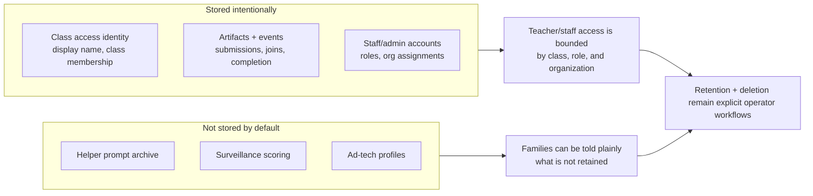

# Risk & Data Posture

This page is the plain-language version of the system's data posture. It is meant for program leadership, operations, instructors, and partners who need to understand what ClassHub stores, what it does not store, and why.

## Executive summary

ClassHub is designed to support teaching and reporting without expanding into student surveillance. The default posture is:

- collect the minimum data needed to run a `Class`
- keep staff access bounded by role and `Organization`
- make reporting exportable without storing helper prompt content
- document retention and recovery instead of relying on guesswork

## Posture in one view

Read this as a boundary statement: the system keeps enough to run class and reporting, but it does not quietly turn helper use into a hidden behavior archive.

## Data handling table

| Data type | Stored? | Where | Retention | Who can access? |
| --- | --- | --- | --- | --- |
| Student identity for class access (`display_name`, class membership, return code/session context) | Yes | ClassHub database | Kept as class data unless removed through documented admin/retention workflows | Teachers/staff with access to that class; admins/superusers as part of system administration |
| Student submissions and uploaded artifacts | Yes | ClassHub uploads/object storage, depending on deployment | Kept as class artifacts until deleted through normal content or retention handling | Teachers/staff with access to that class; admins with system-level access |
| Student event and outcome records (join, submission, completion, helper access count) | Yes | ClassHub database | Subject to event retention settings and retention-only deletion path where applicable | Teachers/staff with access to that class; admins/superusers |
| Helper usage counts (limited) | Yes, in limited form | ClassHub database | Retained as operational event data | Teachers via aggregate reporting; admins for support and audit |
| AI helper prompt content | Transient cache only by default | Redis for the configured conversation TTL; not stored in ClassHub reporting/event records | Default two-hour sliding TTL; actor-scoped clear on student deletion | Not available in normal teacher reporting; an explicitly opted-in class-reset archive is a restricted operator artifact |
| Teacher/admin sign-in account data (email, password hash, profile details) | Yes | Django auth tables in ClassHub database | Kept while account is active and needed for administration | The account owner for profile changes; admins/superusers for administration |
| Organization and staff-role assignment data | Yes | ClassHub database | Kept while org/staff relationship is active and needed for accountability | Superusers/admins; teachers only insofar as UI reflects their access |
| System logs used for troubleshooting | Yes | Server logs / container logs | Controlled by host logging retention | Technical maintainers and operators |

## What ClassHub does not store by default

- AI helper prompt transcripts as a teacher-reporting dataset
- behavior scoring or surveillance analytics
- ad-tech identifiers
- student email/password credentials for current class access
- hidden engagement profiles assembled for fundraising or discipline use

## Practical meaning for staff

- Instructors can report on joins, submissions, completion, and certificate status without opening a private AI transcript archive.
- Leadership can describe the system as privacy-forward without making vague promises.
- Technical teams still retain enough records to support recovery, troubleshooting, and export-driven reporting.

## Verify in teacher portal

Some reporting and certificate screens depend on deployment settings. Verify the exact workflow in `/teach/class/<id>` and `/teach/class/<id>/certificate-eligibility` before promising a process to outside partners.

## Go deeper

- Security controls and org-boundary settings: [SECURITY.md](SECURITY.md)
- Org boundary behavior by deployment mode and role: [ORG_BOUNDARY_EXPLAINER.md](ORG_BOUNDARY_EXPLAINER.md)
- Privacy rationale and helper boundaries: [PRIVACY-ADDENDUM.md](PRIVACY-ADDENDUM.md)
- Teacher-visible reporting/certificate flows: [TEACHER_PORTAL.md](TEACHER_PORTAL.md)
- Recovery and continuity planning: [DISASTER_RECOVERY.md](DISASTER_RECOVERY.md)
