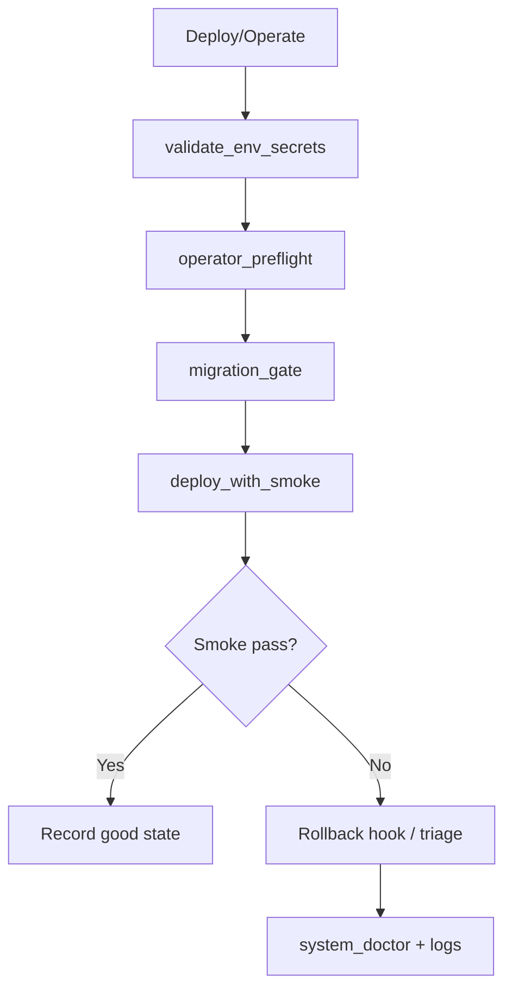

# Runbook

This is the operator playbook for running the stack safely in production.

If you are new, start with [START_HERE.md](START_HERE.md) and [DAY1_DEPLOY_CHECKLIST.md](DAY1_DEPLOY_CHECKLIST.md) first.
If you need the exact operator skill floor first, read [MINIMUM_VIABLE_OPERATOR.md](MINIMUM_VIABLE_OPERATOR.md).
If docs seem to overlap, resolve policy-source questions with [CANONICAL_TRUTHS.md](CANONICAL_TRUTHS.md).



## Working directories

- Repo root (server): `/srv/lms/app`
- Compose folder: `/srv/lms/app/compose`

Use repo root unless a section explicitly says otherwise.

## 60-second quick command set

```bash
cd /srv/lms/app
bash scripts/system_doctor.sh
python3 scripts/operator_preflight.py --env-file compose/.env
bash scripts/check_llm_backend.sh --probe-chat

cd /srv/lms/app/compose
docker compose ps
docker compose logs --tail=200 classhub_web helper_web caddy
```

If `system_doctor` passes, the platform is usually in good shape.

Secret and token inventory / rotation reference:
- [SECRET_ROTATION.md](SECRET_ROTATION.md)

One-command full-stack smoke (golden + a11y):

```bash
cd /srv/lms/app
make smoke-full
```

Common overrides:

```bash
SMOKE_COMPOSE_MODE=dev make smoke-full
SMOKE_BASE_URL=http://localhost make smoke-full
SMOKE_INSTALL_BROWSERS=0 make smoke-full
```

## Standard operations

### Secret rotation

Use the canonical secret inventory and rotation steps here:

- [SECRET_ROTATION.md](SECRET_ROTATION.md)

Minimum post-rotation verification:

```bash
cd /srv/lms/app
bash scripts/validate_env_secrets.sh
python3 scripts/operator_preflight.py --env-file compose/.env
bash scripts/system_doctor.sh --smoke-mode golden
```

### Start / stop stack

```bash
cd /srv/lms/app/compose
# Start
docker compose up -d
# Stop
docker compose down
```

Verify:

```bash
docker compose ps
curl -fsS http://localhost/healthz
curl -fsS http://localhost/upstream-healthz
curl -fsS http://localhost/helper/healthz
```

If `CADDY_EXPOSE_UPSTREAM_HEALTHZ=0`, expect `/upstream-healthz` to return `404` from Caddy.

### Guardrailed deploy (recommended)

```bash
cd /srv/lms/app
bash scripts/deploy_with_smoke.sh
```

What this deploy command enforces:

- environment and secret validation
- deploy-time operator preflight for routing/env coherence
- migration gate for both Django services
- runtime `manage.py migrate --noinput` for both Django services
- compose launch via `compose/docker-compose.yml` only
- Caddy template mount sanity checks
- smoke checks (`/healthz`, `/helper/healthz`, join, helper chat, teacher login)

Optional rollback hook:

```bash
cd /srv/lms/app
ROLLBACK_CMD='echo "replace with your rollback command"' bash scripts/deploy_with_smoke.sh
```

### Full stack self-check (doctor)

```bash
cd /srv/lms/app
bash scripts/system_doctor.sh
```

### Operator preflight

Run this before a domain/TLS deploy any time `compose/.env` changed:

```bash
cd /srv/lms/app
python3 scripts/operator_preflight.py --env-file compose/.env
```

What it checks:

- Caddy routing mode vs public host settings
- `DJANGO_ALLOWED_HOSTS` / `CSRF_TRUSTED_ORIGINS` coherence
- required internal helper URL contracts
- feature-gated helper/remote-compute env completeness

Useful variants:

```bash
# Strict smoke using existing SMOKE_* env values
bash scripts/system_doctor.sh --smoke-mode strict

# Fast baseline smoke
bash scripts/system_doctor.sh --smoke-mode basic

# Infra/content checks only
bash scripts/system_doctor.sh --smoke-mode off
```

### Smoke checks only

```bash
cd /srv/lms/app
bash scripts/smoke_check.sh --strict
bash scripts/check_llm_backend.sh --probe-chat
```

Notes:

- `scripts/check_llm_backend.sh` runs inside `helper_web`, so it validates the same DNS reachability and private backend path the app actually uses.
- `/helper/chat` smoke retries transient helper backend failures by default (`502` + `ollama_error`, `503` + `busy`) using `SMOKE_HELPER_CHAT_RETRIES=3`.
- Default retry delays are `SMOKE_HELPER_CHAT_RETRY_DELAY_SECONDS=3` for transport/`ollama_error`, and `SMOKE_HELPER_CHAT_BUSY_RETRY_DELAY_SECONDS=30` for `busy`.
- Increase those values in `compose/.env` if Ollama cold starts or queue wait regularly exceed your current retry budget.

### Remote GPU over private tailnet

Current recommended path:

- browsers talk only to the public LMS edge
- Caddy routes `/helper/*` to `helper_web`
- `helper_web` is the only service that talks to the remote model host
- that model hop goes over a private tailnet to a tailnet-only endpoint
- the GPU host keeps the model server loopback-bound behind its local auth proxy
- for createMPLS-style production deployments, the recommended tailnet control plane is a self-hosted Headscale server on a tiny Ubuntu VPS
- the Headscale server is control plane only; it does not proxy request traffic

Operational meaning:

- if the GPU node is unavailable, the LMS should still load and core classroom flows should stay up
- `bash scripts/check_llm_backend.sh --probe-chat` is the fastest way to validate the helper-to-GPU path from the same runtime context the app uses
- use `LLM_BASE_URL` and the rest of the `LLM_*` env vars as the primary configuration surface; legacy `OLLAMA_*` names remain compatibility fallbacks
- public browser traffic to `lms.creatempls.org` must never use the tailnet
- the tailnet is reserved for helper-to-model traffic and related operator/admin troubleshooting

Reference:

- [PRIVATE_LLM_BACKEND.md](PRIVATE_LLM_BACKEND.md)
- [HEADSCALE_CONTROL_PLANE.md](HEADSCALE_CONTROL_PLANE.md)
- [REMOTE_HELPER_COMPUTE_CONTROL.md](REMOTE_HELPER_COMPUTE_CONTROL.md)

### Headscale control-plane bundle

If this deployment uses Headscale for the helper/model tailnet, use the repo bundle in `ops/headscale/` instead of a one-off VPS setup.

Recommended bootstrap on the Headscale VPS:

```bash
cd /srv/headscale/app
sudo bash ops/headscale/install.sh
sudo cp /srv/headscale/.env.example /srv/headscale/.env
sudo cp /srv/headscale/config/config.yaml.example /srv/headscale/config/config.yaml
sudo cp /srv/headscale/config/policy.hujson.example /srv/headscale/config/policy.hujson
sudo systemctl enable --now classhub-headscale
sudo systemctl enable --now classhub-headscale-backup.timer
```

Canonical backup command:

```bash
sudo /usr/local/bin/classhub-headscale-backup --headscale-root /srv/headscale
```

Canonical restore command on a replacement VPS:

```bash
sudo /usr/local/bin/classhub-headscale-restore \
  --headscale-root /srv/headscale \
  --backup /srv/headscale/backups/headscale_<STAMP>.tgz \
  --start-stack
```

Canonical rehearsal evidence wrapper on a replacement VPS:

```bash
cd /srv/headscale/app
sudo bash scripts/headscale_restore_rehearsal_evidence.sh \
  --backup /srv/headscale/backups/headscale_<STAMP>.tgz \
  --host-class replacement-host \
  --host-label hs-replacement-01 \
  --evidence-note "Quarterly blank-VPS Headscale recovery rehearsal"
```

Operational intent:

- keep the Headscale VPS small and replaceable
- back it up like coordination state, not like the LMS itself
- recover it with one archive + one restore command + one LMS-side helper probe

The Headscale bundle is not part of the public LMS Compose stack.
It is a separate control-plane bundle for the separate VPS.

The rehearsal wrapper writes a timestamped artifact directory under:

- `artifacts/stability/<date>/headscale_restore_rehearsal/<timestamp>/`

Expected artifacts:

- `headscale_restore_rehearsal.log`
- `headscale_restore_rehearsal_metrics.json`
- `headscale_restore_rehearsal_summary.md`
- `manual_verification_checklist.md`
- automated Headscale VPS captures (`systemctl`, `docker compose ps`, metrics sample, node list, logs)
- LMS/GPU-side evidence placeholders for helper probe, node rejoin notes, and optional GPU health output

Important:

- this wrapper is for operator rehearsal on the real Headscale VPS; it does not claim the repo has already proven blank-VPS recovery
- the LMS-side helper probe still needs to be run from the LMS host and attached to the artifact
- do not treat the Headscale VPS as a place to test public LMS routing; keep public browser traffic on the public LMS path

### Staff-only remote helper compute lease

If you enable bounded remote helper compute control:

- keep it off by default
- activate it only for live partner/class windows
- let staff use `/teach/class/<id>` to activate/deactivate it
- use `CLASSHUB_REMOTE_HELPER_COMPUTE_ENABLED=1` and `CLASSHUB_REMOTE_HELPER_COMPUTE_ACKNOWLEDGED=1` as the deployment gate
- keep provider control URLs and credentials server-side only
- expect state transitions such as `requested`, `starting`, `ready`, `degraded`, `stopping`, and `error`
- expect helper traffic to use the remote backend only when the class state is `ready`
- expect helper requests to fall back to local/default mode if the remote path is not ready or later errors
- keep the lease short and stop it after class; optional idle auto-stop is acceptable but does not replace operator awareness
- use `HELPER_REMOTE_COMPUTE_ESTIMATED_USD_PER_HOUR` only as an approximate operator hint, not as exact billing truth

Useful inspection surfaces:

- the configured internal helper URLs:
  - `HELPER_INTERNAL_REMOTE_COMPUTE_STATUS_URL`
  - `HELPER_INTERNAL_REMOTE_COMPUTE_EVIDENCE_URL`
- the teacher/admin export path below
- helper logs plus `system_doctor` when reconciling drift between lease state and actual backend behavior

Teacher/admin export path:

- `/teach/class/<id>/export-helper-remote-snapshot?format=json`
- `/teach/class/<id>/export-helper-remote-snapshot?format=csv`

What the export/evidence layer now makes visible:

- requested duration vs leased minutes
- actual time spent in `starting`, `ready`, and `degraded`
- remote-routed request count
- local fallback count after remote attempt
- manual stop count
- auto-stop count
- recent lease sessions and reason-coded events

Golden-path smoke (auto fixture bootstrap):

```bash
cd /srv/lms/app
bash scripts/golden_path_smoke.sh
```

`golden_path_smoke.sh` also validates invite-only enrollment behavior and class summary CSV export (teacher session path).

Telemetry stabilization evidence capture (Slice 7):

```bash
cd /srv/lms/app
bash scripts/telemetry_stabilization_evidence.sh --window-days 7 --perform-rollback-drill
```

Notes:

- Writes timestamped artifacts to `/tmp/classhub_telemetry_stabilization_<timestamp>/`.
- Includes parity output, strict smoke output, and optional rollback-drill output.
- To render a non-placeholder `slo_summary.md`, pass explicit baseline/observed values for:
  - `--student-home-p95-baseline-ms` and `--student-home-p95-ms`
  - `--student-upload-success-rate-baseline-pct` and `--student-upload-success-rate-pct`
  - `--helper-chat-5xx-rate-baseline-pct` and `--helper-chat-5xx-rate-pct`
- Keep telemetry `READ_MODE=core` if parity reports drift.
- Endpoint policy and env presets for telemetry rollout live in [TELEMETRY_DB_SPLIT_PLAN.md](TELEMETRY_DB_SPLIT_PLAN.md#endpoint-policy-and-concrete-env-presets).

Full stability + telemetry closeout cycle (Phase 1 + Slice 7):

```bash
cd /srv/lms/app
make stability-cycle-closeout STABILITY_RELEASE_DATE=<YYYY-MM-DD> SMOKE_COMPOSE_MODE=prod TELEMETRY_WINDOW_DAYS=7
```

Notes:

- Enforces `scripts/check_runtime_policy_lock.py --profile release` against `compose/.env`:
  - `REQUIRE_ORG_MEMBERSHIP_FOR_STAFF=1`
  - `CLASSHUB_TELEMETRY_WRITE_MODE=dual`
  - `CLASSHUB_TELEMETRY_READ_MODE=telemetry`
  - explicit `CLASSHUB_CERTIFICATE_MIN_SESSIONS` / `CLASSHUB_CERTIFICATE_MIN_ARTIFACTS` values (`>=1`)
- Baseline-vs-release runtime lock profile behavior is documented in [RUNTIME_LOCK_PROFILES.md](RUNTIME_LOCK_PROFILES.md).
- Writes release artifacts under `artifacts/stability/<date>/` and telemetry artifacts under `artifacts/stability/<date>/telemetry/`.
- Includes evaluator-facing evidence index at `artifacts/stability/<date>/EVIDENCE_INDEX.md`.
- Fails the run if parity/smoke/rollback drill do not pass or required artifacts are missing.
- Produces `cycle_closeout_summary.md` with doc-update checklist before sign-off.
- For cycles where kiosk drill is tracked separately, set `STABILITY_SKIP_KIOSK=1` to skip kiosk resilience in this command.
- To validate example env files without release lock expectations, run:
  - `python3 scripts/check_runtime_policy_lock.py --profile baseline --env-file compose/.env.example.local`

Accessibility smoke:

```bash
cd /srv/lms/app
bash scripts/a11y_smoke.sh --compose-mode prod --install-browsers
```

Notes:

- Run this after `golden_path_smoke.sh` or `system_doctor --smoke-mode golden` so class/teacher fixtures exist.
- Default fail threshold is `critical`; override with `--fail-impact` when intentionally broadening checks.
- Expected success line: `[a11y] PASS`.

Reference: [ACCESSIBILITY.md](ACCESSIBILITY.md)

Kiosk resilience drill:

```bash
cd /srv/lms/app
bash scripts/kiosk_resilience_check.sh --class-code <SMOKE_CLASS_CODE>
```

Notes:

- Runs deterministic checks for kiosk manifest/service-worker endpoints and route guard redirects.
- Prompts through unstable-network upload queue validation steps and writes a report to `/tmp/classhub_kiosk_resilience_<timestamp>.md`.
- Use `--non-interactive` to emit a checklist-only report for later manual completion.

Outcome/reporting semantics reference:
- [OUTCOME_SEMANTICS.md](OUTCOME_SEMANTICS.md)

End-to-end reporting rehearsal playbook:
- [REPORTING_REHEARSAL.md](REPORTING_REHEARSAL.md)

Recurring ops cadence checklist:
- [OPS_CADENCE_CHECKLIST.md](OPS_CADENCE_CHECKLIST.md)

Turnover drill evidence log:
- [TURNOVER_DRILL_LOG.md](TURNOVER_DRILL_LOG.md)

Org boundary policy audit template:
- [ORG_BOUNDARY_POLICY_AUDIT.md](ORG_BOUNDARY_POLICY_AUDIT.md)

## Public domain deployment notes

When running behind Caddy on a real domain, use these defaults to avoid false rate-limit identity and upload mismatches:

- Proxy/IP trust:
  - Set `REQUEST_SAFETY_TRUST_PROXY_HEADERS=1` so Django rate limiting sees client IPs forwarded by Caddy.
  - Keep `REQUEST_SAFETY_XFF_INDEX=0` when Caddy is the first trusted hop.
- Upload size alignment:
  - Set `CADDY_CLASSHUB_MAX_BODY` slightly above `CLASSHUB_UPLOAD_MAX_MB` (for example, `220MB` vs `200`).
  - `CLASSHUB_UPLOAD_MAX_MB` controls Django request body cap for class uploads.
  - Keep `CLASSHUB_GUNICORN_TIMEOUT_SECONDS` high enough for large uploads on classroom Wi-Fi (default `1200` seconds).
  - Keep `HELPER_GUNICORN_TIMEOUT_SECONDS` above helper queue/retry budget (`HELPER_QUEUE_MAX_WAIT_SECONDS`, `HELPER_BACKEND_MAX_ATTEMPTS`, `OLLAMA_TIMEOUT_SECONDS`, `HELPER_BACKOFF_SECONDS`); `scripts/validate_env_secrets.sh` now blocks unsafe combinations.
- Retention timer:
  - Enable the `classhub-retention.timer` unit so submission/event cleanup runs automatically.
  - Timer setup commands are in [Automate retention + orphan cleanup](#automate-retention-and-orphan-cleanup).
- Teacher/admin proxy armor:
  - Preferred: set IP allowlist for `/admin*` + `/teach*`:
    - `CADDY_STAFF_IP_ALLOWLIST_V4`
    - `CADDY_STAFF_IP_ALLOWLIST_V6`
  - Optional extra basic-auth gate for `/admin*`:
    - `CADDY_ADMIN_BASIC_AUTH_ENABLED=1`
    - `CADDY_ADMIN_BASIC_AUTH_USER`
    - `CADDY_ADMIN_BASIC_AUTH_HASH`
    - `/admin/login*` is intentionally excluded so staff can complete Django OTP login.
    - If the bcrypt hash includes `$` (it will), quote it in `compose/.env` or escape as `$$` to avoid Compose interpolation warnings.
  - If you intentionally leave allowlists open, set explicit acknowledgement:
    - `CADDY_ALLOW_PUBLIC_STAFF_ROUTES=1`

## Incident degradation modes

Use `CLASSHUB_SITE_MODE` in `compose/.env`, then redeploy:

- `normal`
- `read-only`
- `join-only`
- `maintenance`

Example:

```bash
cd /srv/lms/app
sed -i.bak 's/^CLASSHUB_SITE_MODE=.*/CLASSHUB_SITE_MODE=join-only/' compose/.env
bash scripts/deploy_with_smoke.sh
```

Optional status message shown to users on blocked routes:

- `CLASSHUB_SITE_MODE_MESSAGE`

## Health and logs

### Health checks

```bash
cd /srv/lms/app/compose
docker compose ps
curl -I http://localhost/healthz
curl -I http://localhost/upstream-healthz
curl -I http://localhost/helper/healthz
```

If `CADDY_EXPOSE_UPSTREAM_HEALTHZ=0`, `/upstream-healthz` should return `404`.

### Tail logs

```bash
cd /srv/lms/app/compose
docker compose logs -f --tail=200 classhub_web
docker compose logs -f --tail=200 helper_web
docker compose logs -f --tail=200 caddy
```

Helper logs include structured events like `success`, `queue_busy`, and `backend_transport_error` with `request_id`.

## Migration and content gates

### Migration gate only

```bash
cd /srv/lms/app
bash scripts/migration_gate.sh
```

`migration_gate.sh` checks that migration files are committed. It does not apply DB migrations.

### Apply runtime migrations

```bash
cd /srv/lms/app/compose
docker compose exec -T classhub_web python manage.py migrate --noinput
docker compose exec -T helper_web python manage.py migrate --noinput
```

`RUN_MIGRATIONS_ON_START=0` is the production default to avoid boot-time migration races; keep it `1` only for local/dev workflows where container boot should self-migrate.

### Content preflight

```bash
cd /srv/lms/app
bash scripts/content_preflight.sh piper_scratch_12_session
```

Strict global sequence checks:

```bash
cd /srv/lms/app
bash scripts/content_preflight.sh piper_scratch_12_session --strict-global
```

## Helper backend operations

### Ollama model setup

```bash
cd /srv/lms/app/compose
docker compose exec ollama ollama pull llama3.2:1b
curl http://localhost:11434/api/tags
```

Note: Ollama is host-bound at `127.0.0.1:11434` by default.

### Helper queue tuning (CPU-focused)

Set in `compose/.env`:

```dotenv
HELPER_MAX_CONCURRENCY=2
HELPER_QUEUE_MAX_WAIT_SECONDS=10
HELPER_QUEUE_POLL_SECONDS=0.2
HELPER_QUEUE_SLOT_TTL_SECONDS=120
```

## Security and edge limits

### Env/secret gate only

```bash
cd /srv/lms/app
bash scripts/validate_env_secrets.sh
```

### Caddy request size limits

Set in `compose/.env`:

```dotenv
CADDY_CLASSHUB_MAX_BODY=220MB
CADDY_HELPER_MAX_BODY=1MB
CLASSHUB_UPLOAD_MAX_MB=200
```

## Teacher/admin operations

### Teacher account workflow

- [TEACHER_PORTAL.md](TEACHER_PORTAL.md)
- [TEACHER_HANDOFF_CHECKLIST.md](TEACHER_HANDOFF_CHECKLIST.md)
- [TEACHER_HANDOFF_RECORD_TEMPLATE.md](TEACHER_HANDOFF_RECORD_TEMPLATE.md)

Helper script:

- `scripts/examples/teacher_accounts.sh` (dry-run by default; set `RUN=1` to execute)

### Admin OTP bootstrap

```bash
cd /srv/lms/app/compose
docker compose exec classhub_web python manage.py bootstrap_admin_otp --username <admin_username> --with-static-backup
```

Use `--rotate` to replace an existing device name.

## Backups and recovery hooks

Backup scripts:

- `scripts/backup_postgres.sh`
- `scripts/backup_minio.sh`
- `scripts/backup_uploads.sh`
- `scripts/backup_restore_rehearsal.sh` (core backup + restore rehearsal engine)
- `scripts/restore_rehearsal_evidence.sh` (recommended evidence wrapper)

Disaster recovery guide:

- [DISASTER_RECOVERY.md](DISASTER_RECOVERY.md)

Recommended restore drill (single command):

```bash
bash scripts/restore_rehearsal_evidence.sh \
  --compose-mode prod \
  --out-dir artifacts/stability/$(date +%F)
```

Automated cadence:
- GitHub Actions workflow: `.github/workflows/restore-rehearsal.yml` (weekly + manual dispatch)
- Artifacts: rehearsal log, metrics (`RTO`/`RPO`), and backup checksums retained per run

This command:
1. Runs `backup_restore_rehearsal.sh` (fresh backups + non-destructive restore validation).
2. Captures rehearsal log and metrics (`RTO`/`RPO`) to the evidence directory.
3. Copies backup artifacts and writes checksums for auditability.
4. Writes a markdown summary for operator review.

Telemetry-aware restore drill:

```bash
bash scripts/restore_rehearsal_evidence.sh \
  --compose-mode prod \
  --include-telemetry-db \
  --out-dir artifacts/stability/$(date +%F)
```

Use this mode when `CLASSHUB_TELEMETRY_DATABASE_URL` is active and you want the rehearsal to validate both the core and telemetry databases.

Optional reuse of existing artifacts:

```bash
bash scripts/restore_rehearsal_evidence.sh \
  --compose-mode prod \
  --skip-backup \
  --out-dir artifacts/stability/$(date +%F)
```

Rehearsal evidence log template:
- [RESTORE_REHEARSAL_LOG.md](RESTORE_REHEARSAL_LOG.md)

## Release artifact packaging

Create a shareable source zip without local machine clutter (`.venv`, `.git`, macOS metadata, caches):

```bash
cd /srv/lms/app
bash scripts/make_release_zip.sh
```

Optional output path:

```bash
bash scripts/make_release_zip.sh /srv/lms/releases/classhub_release.zip
```

Validate the generated archive explicitly:

```bash
python3 scripts/lint_release_artifact.py /srv/lms/releases/classhub_release.zip
```

Release packaging policy and verification details:

- [RELEASING.md](RELEASING.md)

Companion evidence bundle packaging (separate from source zip):

```bash
cd /srv/lms/app
RELEASE_DATE=2026-03-10
tar -C artifacts/stability -czf "dist/classhub_evidence_${RELEASE_DATE}.tgz" "${RELEASE_DATE}"
```

For evaluator/partner handoff, provide both:

1. `dist/classhub_release_*.zip` (source bundle)
2. `dist/classhub_evidence_<release-date>.tgz` (closeout evidence bundle with `EVIDENCE_INDEX.md`)

## Retention operations

### Submission retention

Dry run:

```bash
cd /srv/lms/app/compose
docker compose exec classhub_web python manage.py prune_submissions --older-than-days 90 --dry-run
```

Apply:

```bash
cd /srv/lms/app/compose
docker compose exec classhub_web python manage.py prune_submissions --older-than-days 90
```

Optional default (`compose/.env`):

```dotenv
CLASSHUB_SUBMISSION_RETENTION_DAYS=90
```

### Student event retention

Dry run:

```bash
cd /srv/lms/app/compose
docker compose exec classhub_web python manage.py prune_student_events --older-than-days 180 --dry-run
```

Dry run with CSV export snapshot:

```bash
cd /srv/lms/app/compose
docker compose exec classhub_web python manage.py prune_student_events --older-than-days 180 --dry-run --export-csv /tmp/student_events_older_than_180d.csv
```

Apply:

```bash
cd /srv/lms/app/compose
docker compose exec classhub_web python manage.py prune_student_events --older-than-days 180
```

Apply with export-before-delete snapshot:

```bash
cd /srv/lms/app/compose
docker compose exec classhub_web python manage.py prune_student_events --older-than-days 180 --export-csv /srv/lms/backups/student_events_before_prune_$(date +%Y%m%d).csv
```

Optional default (`compose/.env`):

```dotenv
CLASSHUB_STUDENT_EVENT_RETENTION_DAYS=180
```

Verification (operator dashboard):

- Open `/teach/data-lifespan` as owner/admin/superuser.
- Confirm `Last successful retention prune` timestamp updated.
- Confirm `Policy-overdue rows` is at or near expected value for your policy window.
- Use `Export JSON` / `Export CSV` from the same page to capture an evidence snapshot.

Evidence export (headless, optional):

```bash
curl -L -b classhub_teach_cookie.txt \
  "https://YOUR_DOMAIN/teach/data-lifespan/export?format=json" \
  -o data_lifespan_snapshot.json

curl -L -b classhub_teach_cookie.txt \
  "https://YOUR_DOMAIN/teach/data-lifespan/export?format=csv" \
  -o data_lifespan_snapshot.csv
```

Demonstration script (recommended):

```bash
cd /srv/lms/app
bash scripts/demo_data_lifespan_evidence.sh \
  --base-url https://YOUR_DOMAIN \
  --cookie-file classhub_teach_cookie.txt \
  --out-dir /tmp/classhub_evidence_demo
```

RAG evidence panel prerequisites:

- `HELPER_INTERNAL_API_TOKEN` must match between ClassHub and helper.
- `HELPER_INTERNAL_ALLOWED_CIDRS` should include the ClassHub caller address range. Defaults allow loopback plus RFC1918/ULA private ranges.
- If helper receives proxied requests, set `HELPER_INTERNAL_TRUST_PROXY_HEADERS=1` and verify `HELPER_INTERNAL_XFF_INDEX` matches the trusted client position.
- `HELPER_INTERNAL_RAG_STATUS_URL` should point to helper (`http://helper_web:8000/helper/internal/rag-status` in Compose).
- `HELPER_INTERNAL_RAG_STATUS_TIMEOUT_SECONDS` controls request timeout (default `1.2`).

### Orphan upload scavenger (legacy cleanup)

Report orphaned upload files (files on disk with no matching DB row):

```bash
cd /srv/lms/app/compose
docker compose exec classhub_web python manage.py scavenge_orphan_uploads
```

Delete orphans (use after reviewing report output):

```bash
cd /srv/lms/app/compose
docker compose exec classhub_web python manage.py scavenge_orphan_uploads --delete
```

### Legacy temp ZIP cleanup (one-time)

Older builds could leave export zips in `/tmp`.

Inspect:

```bash
ls -lh /tmp/classhub_closeout_*.zip /tmp/classhub_latest_*.zip 2>/dev/null || true
```

Delete:

```bash
rm -f /tmp/classhub_closeout_*.zip /tmp/classhub_latest_*.zip
```

## Helper event ingest check

Helper chat telemetry now forwards through an authenticated internal Class Hub endpoint.

Required env:

- `CLASSHUB_INTERNAL_EVENTS_URL`
- `CLASSHUB_INTERNAL_EVENTS_TOKEN`

Quick validation:

```bash
cd /srv/lms/app
bash scripts/validate_env_secrets.sh
bash scripts/system_doctor.sh --smoke-mode golden
```

### Automate retention and orphan cleanup

Run once manually:

```bash
cd /srv/lms/app
bash scripts/retention_maintenance.sh --compose-mode prod
```

Helper reset export retention (optional override):

```bash
export RETENTION_HELPER_EXPORT_DAYS=30
export RETENTION_HELPER_EXPORT_DIR=/uploads/helper_reset_exports
bash scripts/retention_maintenance.sh --compose-mode prod
```

Optional webhook alerts (for unattended runs):

```bash
export RETENTION_ALERT_WEBHOOK_URL="https://hooks.example.org/classhub"
bash scripts/retention_maintenance.sh --compose-mode prod --alert-on-success
```

Systemd timer (recommended):

```bash
sudo cp /srv/lms/app/ops/systemd/classhub-retention.service /etc/systemd/system/
sudo cp /srv/lms/app/ops/systemd/classhub-retention.timer /etc/systemd/system/
sudo systemctl daemon-reload
sudo systemctl enable --now classhub-retention.timer
sudo systemctl status classhub-retention.timer
```

Before enabling, edit `/etc/systemd/system/classhub-retention.service` if your app path or runtime user differs from `/srv/lms/app`.
Shipped defaults are:

```ini
[Service]
User=lms
Group=docker
```

If your host uses a different account, override `User=` / `Group=` in the copied unit.
Ensure the runtime user exists and can access Docker:

```ini
[Service]
User=<your-maintenance-user>
Group=docker
```

```bash
id <your-maintenance-user>
getent group docker
sudo usermod -aG docker <your-maintenance-user>
```

The unit also ships with baseline hardening (`NoNewPrivileges`, `PrivateTmp`, `ProtectSystem`, `ProtectHome`, etc.) and refuses to run as root unless `CLASSHUB_ALLOW_ROOT_MAINTENANCE=1` is set as an explicit break-glass override.

Review last run:

```bash
systemctl list-timers | grep classhub-retention
journalctl -u classhub-retention.service -n 200 --no-pager
```

One-command monthly retention health snapshot (recommended):

```bash
cd /srv/lms/app
bash scripts/retention_health_snapshot.sh \
  --compose-mode prod \
  --out artifacts/stability/$(date +%F)/retention_health.log
```

### Unattended remote-compute evidence watch

Run once manually:

```bash
cd /srv/lms/app
python3 scripts/remote_compute_operator_watch.py --compose-mode prod
```

Optional webhook alerts:

```bash
export REMOTE_COMPUTE_ALERT_WEBHOOK_URL="https://hooks.example.org/classhub"
python3 scripts/remote_compute_operator_watch.py --compose-mode prod
```

If you want notice-level `watch` states to fail the timer run as well as `attention` states:

```bash
export REMOTE_COMPUTE_FAIL_ON_WATCH=1
python3 scripts/remote_compute_operator_watch.py --compose-mode prod
```

The watcher executes the snapshot export inside `classhub_web`, so the default internal helper URL contract can stay private (`http://helper_web:8000/...`) and does not need host port exposure.

Systemd timer (recommended):

```bash
sudo cp /srv/lms/app/ops/systemd/classhub-remote-compute-watch.service /etc/systemd/system/
sudo cp /srv/lms/app/ops/systemd/classhub-remote-compute-watch.timer /etc/systemd/system/
sudo systemctl daemon-reload
sudo systemctl enable --now classhub-remote-compute-watch.timer
sudo systemctl status classhub-remote-compute-watch.timer
```

Review last run:

```bash
systemctl list-timers | grep classhub-remote-compute-watch
journalctl -u classhub-remote-compute-watch.service -n 200 --no-pager
```

Artifacts land under `artifacts/stability/<YYYY-MM-DD>/remote_compute_watch_<HHMMSSZ>/` and include:

- `remote_compute_operator_snapshot.json`
- `remote_compute_operator_report.json`
- `remote_compute_operator_summary.md`
- `remote_compute_operator_watch.log`

## Disk Space Management

ClassHub is designed to be operationally calm and run on a single host. If disk space exceeds 85%, take these steps:

1. **Verify automated backups aren't ballooning**
   Check your `backups/` directory. Are old backups being rotated out? If you use the bundled `backup_*.sh` scripts, consider adding a `find ./backups -type f -mtime +30 -delete` step to your cron jobs.
2. **Check for abandoned or completed classroom data**
   Navigate to the Django `/admin` surface. Identify classrooms from previous academic terms or completed workshops.
   Use the Teacher Dashboard or `/admin` to bulk-export their portfolios, then use the "Reset Roster" and "Delete Student Data" actions to clear the uploaded assets for those classes.
3. **Quota Policies**
   ClassHub sets a default `CLASSHUB_CLASSROOM_QUOTA_MB` (default 2048 MB, or 2GB) per classroom to prevent large video uploads from exhausting the server. Adjust this environment variable as necessary based on your host's capacity.

## Log rotation

Cron jobs (`crontab.example`) write to:
- `/var/log/classhub_backup.log` — nightly backup script
- `/var/log/classhub_rehearsal.log` — backup restore rehearsal
- `/var/log/classhub_retention.log` — submission/event retention pruning

Install the rotation config:

```bash
sudo cp ops/logrotate/classhub /etc/logrotate.d/classhub
sudo chown root:root /etc/logrotate.d/classhub
```

Verify (dry run):

```bash
sudo logrotate -d /etc/logrotate.d/classhub
```

Rotation runs weekly, keeps 4 compressed archives. Check `/var/log/classhub_*.log*` weekly to confirm rotation is working.

## Escalate when

Move to incident workflow ([TROUBLESHOOTING.md](TROUBLESHOOTING.md), then [DISASTER_RECOVERY.md](DISASTER_RECOVERY.md)) when any of these are true:

- health checks still fail after config verification
- migrations fail in production
- repeated auth failures without expected config drift
- data integrity issues (missing classes/submissions without intended prune/reset)
