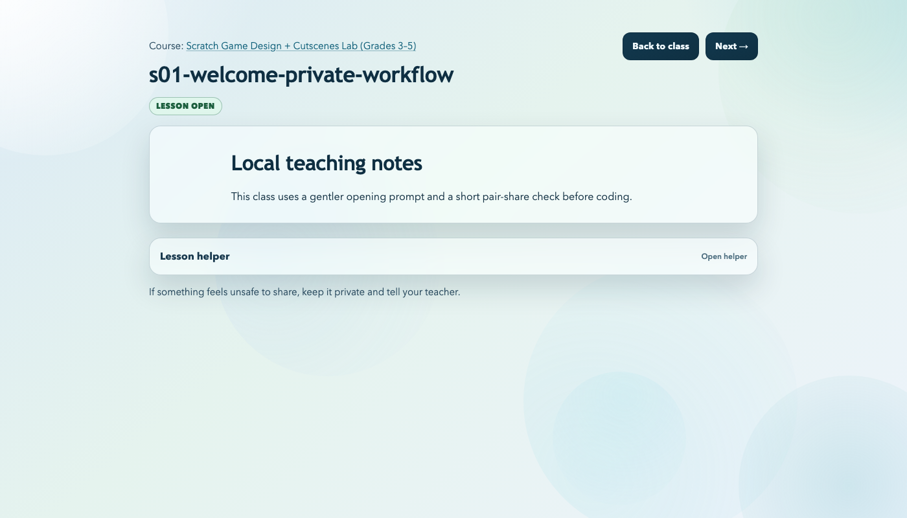
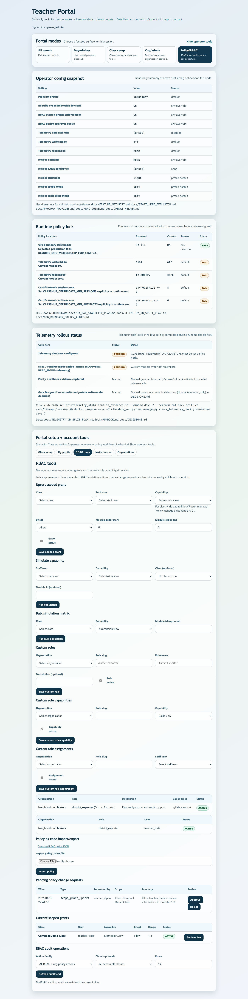
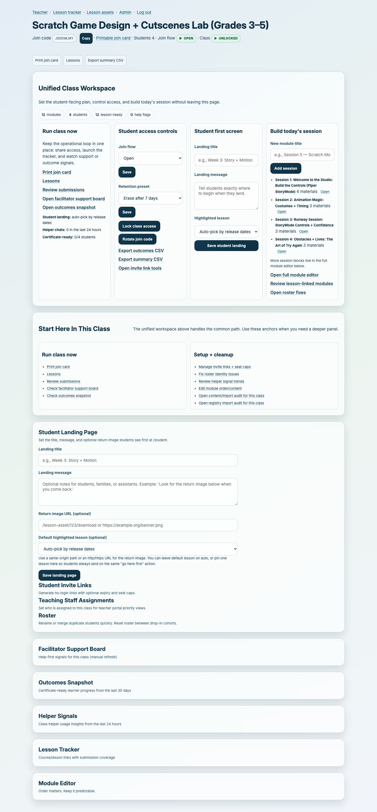
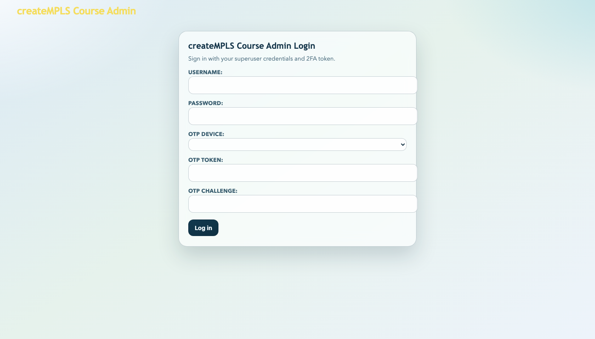
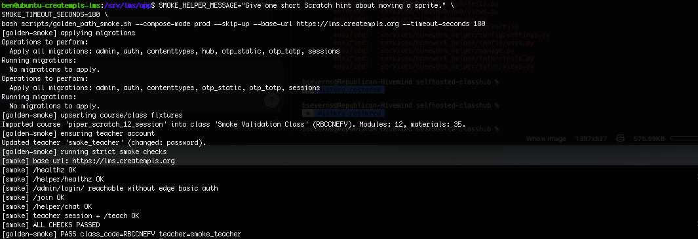
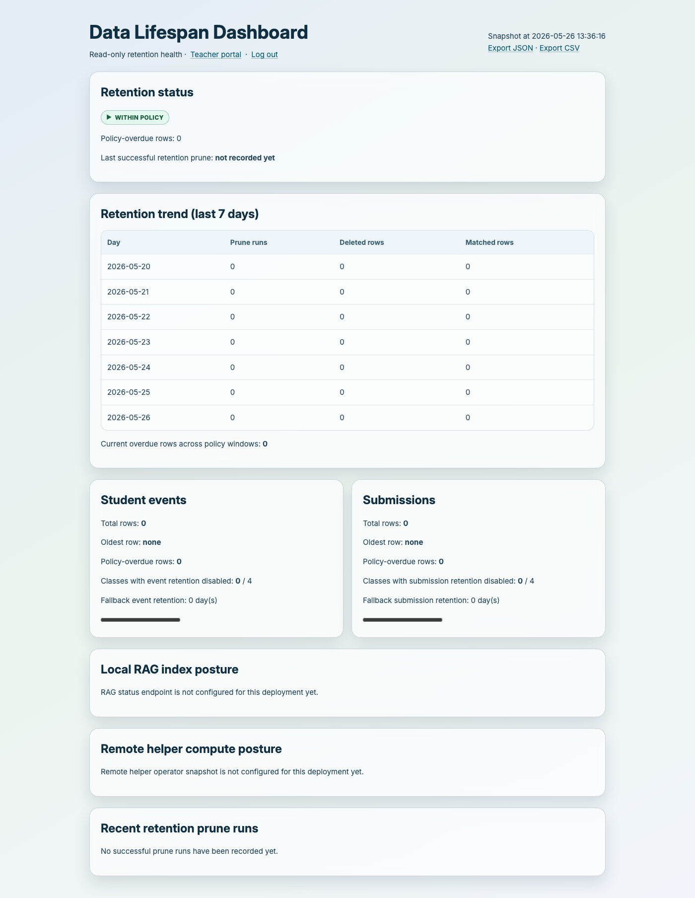

# Screenshot Gallery

This gallery embeds the current captured screenshot set from `press/screenshots/SHOTLIST.md`.
`press/screenshots/PLACEHOLDERS.md` remains the backlog tracker if future screenshot drift appears.

Status model:
- `Captured`: real screenshot from current product UI.

## Student experience

### 01. Student join (`Captured`)

What to notice: the entry path asks for only the class code and a display name, which keeps day-one access low-friction and avoids student password-account overhead.

### 02. Student class landing (`Captured`)

What to notice: the student home is organized around immediate next actions instead of a crowded LMS dashboard.

### 05. Lesson with helper open (`Captured`)

What to notice: the helper is embedded as a bounded lesson aid, not a separate product that takes over the whole classroom flow.

### 14. Student compact density (`Captured`)

### 15. Lesson helper collapsed (`Captured`)

### 16. Student standard density (`Captured`)

### 17. Student expanded density (`Captured`)

## Teacher and superuser experience

### 03. Teacher dashboard (`Captured`)

What to notice: the teacher view is class-first and help-first, with live classroom work surfaced ahead of analytics or rankings.

### 04. Teacher lesson tracker (`Captured`)

### 06. Submission dropbox (`Captured`)

What to notice: student artifacts are treated as first-class evidence, with a direct path from lesson work to submission.

### 09. Teacher profile tab (`Captured`)

### 10. Organization management tab (rename/archive/class-move + membership actions) (`Captured`)

### 19. RBAC tools tab (scoped grants + custom roles + policy approval queue) (`Captured`)

What to notice: advanced permissions are explicit staff tools, not hidden behind undocumented server toggles.
Optional companion capture with approval workflow ON is also available:

### 11. Invite-only enrollment controls (`Captured`)

What to notice: enrollment can be constrained with expiring links and seat limits without forcing full student account creation.

### 12. Certificate eligibility (`Captured`)

What to notice: completion evidence is visible inside the teacher workflow rather than being reconstructed later in a separate reporting tool.

### 18. Teacher landing editor (`Captured`)

## Operations and platform checks

### 07. Admin login (`Captured`)

### 08. Health checks terminal (`Captured`)

### 13. A11y smoke terminal (`Captured`)

### 20. Data lifespan evidence (`Captured`)

What to notice: retention posture is visible to staff as an operational surface, not just buried in policy text.

### 21. Data lifespan export terminal (`Captured`)

## Source files

- Shot list: `press/screenshots/SHOTLIST.md`
- Placeholder tracker: `press/screenshots/PLACEHOLDERS.md`

## Pending capture slots (not yet embedded)

None currently.
