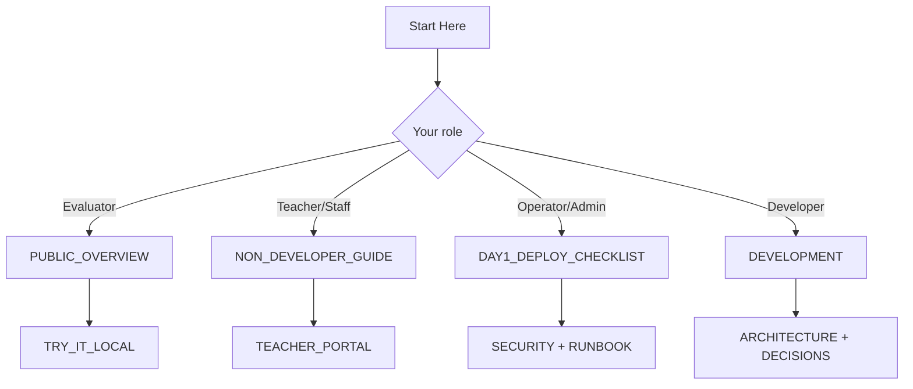

# Start Here

## Summary
This is the canonical docs landing page. Use it to pick the shortest path for your role.

Evaluating whether this fits your org? Start with `docs/PUBLIC_OVERVIEW.md`.

## What to do now
1. Pick your role from the table below.
2. Open only the listed starting pages.
3. Use the common URLs/commands section once the stack is running.

## Verification signal
You should be able to pick a role path in under 30 seconds and identify the exact next doc to open.

## Quick picks (by role)

| Role | Start here | Then read |
|---|---|---|
| Evaluator / decision-maker | `docs/PUBLIC_OVERVIEW.md` | `docs/TRY_IT_LOCAL.md`, `docs/SECURITY.md` |
| Teacher / school staff | `docs/NON_DEVELOPER_GUIDE.md` | `docs/TEACHER_PORTAL.md` |
| Operator / admin | `docs/DAY1_DEPLOY_CHECKLIST.md` | `docs/SECURITY.md`, `docs/RUNBOOK.md`, `docs/TROUBLESHOOTING.md` |
| Developer | `docs/DEVELOPMENT.md` | `docs/ARCHITECTURE.md`, `docs/DECISIONS.md` |

## Core docs map

### Classroom use
- `docs/NON_DEVELOPER_GUIDE.md`
- `docs/TEACHER_PORTAL.md`
- `docs/COURSE_AUTHORING.md`
- `docs/TEACHER_HANDOFF_CHECKLIST.md`

### Operations
- `docs/DAY1_DEPLOY_CHECKLIST.md`
- `docs/SECURITY.md` (public-domain posture and reporting)
- `docs/SECURITY_BASELINE.md` (edge vs app ownership)
- `docs/RUNBOOK.md`
- `docs/TROUBLESHOOTING.md`
- `docs/DISASTER_RECOVERY.md`

### Engineering
- `docs/DEVELOPMENT.md`
- `docs/ARCHITECTURE.md`
- `docs/OPENAI_HELPER.md`
- `docs/HELPER_POLICY.md`
- `docs/REQUEST_SAFETY.md`
- `docs/HELPER_EVALS.md`

### Design rationale
- `docs/DECISIONS.md`
- `docs/decisions/archive/`

## Common URLs

- Student join: `/`
- Student class view: `/student`
- Teacher portal: `/teach`
- Admin login: `/admin/login/`
- Class Hub health: `/healthz`
- Helper health: `/helper/healthz`

## Common commands

- Local demo path: `docs/TRY_IT_LOCAL.md`
- Full health check: `bash scripts/system_doctor.sh`
- Guardrailed deploy: `bash scripts/deploy_with_smoke.sh`

## If you are overwhelmed

Read one page only:
- Evaluator: `docs/PUBLIC_OVERVIEW.md`
- Teacher/staff: `docs/NON_DEVELOPER_GUIDE.md`
- Operator: `docs/RUNBOOK.md`
- Developer: `docs/DEVELOPMENT.md`
