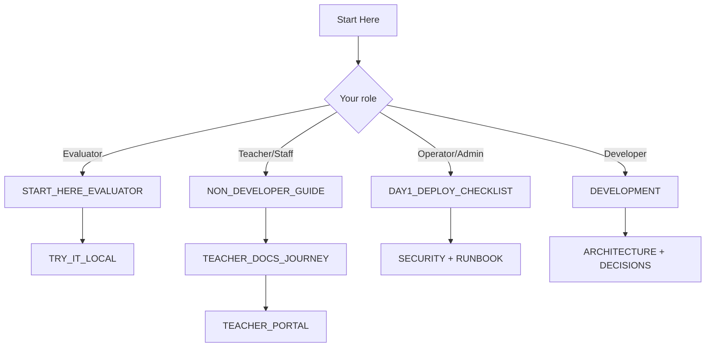

# Start Here

## Summary
This is the canonical docs landing page. Use it to pick the shortest path for your role.

Evaluating whether this fits your org? Start with [PUBLIC_OVERVIEW.md](PUBLIC_OVERVIEW.md).
Need a live shipped-capabilities snapshot first? Start with [CURRENT_STATE.md](CURRENT_STATE.md).

## What to do now
1. Pick your role from the table below.
2. Open only the listed starting pages.
3. Use the common URLs section first; technical command references are optional.

## Start Here for Humans

If you need the shortest role-specific briefing, use one of these pages:

- Evaluator (non-technical): [START_HERE_EVALUATOR.md](START_HERE_EVALUATOR.md)
- Executive Director: [START_HERE_ED.md](START_HERE_ED.md)
- Ops Director: [START_HERE_OD.md](START_HERE_OD.md)
- Fundraising: [START_HERE_FUNDRAISING.md](START_HERE_FUNDRAISING.md)
- Instructor / Assistant: [START_HERE_INSTRUCTOR.md](START_HERE_INSTRUCTOR.md)
- Teacher wiki journey (recommended read order): [TEACHER_DOCS_JOURNEY.md](TEACHER_DOCS_JOURNEY.md)
- First-time class run: [RUN_A_CLASS_TOMORROW.md](RUN_A_CLASS_TOMORROW.md)
- Plain-language data handling: [RISK_AND_DATA_POSTURE.md](RISK_AND_DATA_POSTURE.md)
- Org boundary behavior (inside one org vs across orgs): [ORG_BOUNDARY_EXPLAINER.md](ORG_BOUNDARY_EXPLAINER.md)
- Field-level retention + deletion behavior: [PRIVACY-ADDENDUM.md](PRIVACY-ADDENDUM.md)
- Program narrative for partners/funders: [PROGRAM_LIFECYCLE.md](PROGRAM_LIFECYCLE.md)
- Short instructor/ops playbooks: [COMMON_SCENARIOS.md](COMMON_SCENARIOS.md)
- Live platform snapshot: [CURRENT_STATE.md](CURRENT_STATE.md)
- Feature maturity (what is live vs optional vs planned): [FEATURE_MATURITY.md](FEATURE_MATURITY.md)

## Verification signal
You should be able to pick a role path in under 30 seconds and identify the exact next doc to open.

## Things you need to install first

If your school or org already hosts ClassHub for you, you may not need to install anything beyond a browser.

| Role | Install first | Notes |
|---|---|---|
| Teacher / school staff (using an existing ClassHub site) | Modern web browser (Chrome, Edge, Firefox, or Safari) | For 2FA-enabled teacher/admin accounts, also install an authenticator app on your phone. |
| Evaluator / decision-maker | Modern web browser | Use this with [PUBLIC_OVERVIEW.md](PUBLIC_OVERVIEW.md) and [TRY_IT_LOCAL.md](TRY_IT_LOCAL.md). |
| Operator / admin (self-hosting) | Docker Engine, Docker Compose v2, Git, Bash, curl | See [DAY1_DEPLOY_CHECKLIST.md](DAY1_DEPLOY_CHECKLIST.md) for full server setup. |
| Developer | Same as Operator/admin, plus Python 3.12 + pip (recommended) | Most app work still runs in Docker; Python is mainly for local tooling/docs tasks. |

Optional quick check for Operator/Developer machines:

```bash
docker --version
docker compose version
git --version
bash --version
curl --version
```


```mermaid
flowchart TD
  A[Start Here] --> B{Your role}
  B -->|Evaluator| C[START_HERE_EVALUATOR]
  C --> D[TRY_IT_LOCAL]
  B -->|Teacher/Staff| E[NON_DEVELOPER_GUIDE]
  E --> F[TEACHER_DOCS_JOURNEY]
  F --> G[TEACHER_PORTAL]
  B -->|Operator/Admin| H[DAY1_DEPLOY_CHECKLIST]
  H --> I[SECURITY + RUNBOOK]
  B -->|Developer| J[DEVELOPMENT]
  J --> K[ARCHITECTURE + DECISIONS]
```

## Quick picks (by role)

| Role | Start here | Then read |
|---|---|---|
| Evaluator / decision-maker | [START_HERE_EVALUATOR.md](START_HERE_EVALUATOR.md) | [PUBLIC_OVERVIEW.md](PUBLIC_OVERVIEW.md), [TRY_IT_LOCAL.md](TRY_IT_LOCAL.md) |
| Teacher / school staff | [TEACHER_DOCS_JOURNEY.md](TEACHER_DOCS_JOURNEY.md) | [NON_DEVELOPER_GUIDE.md](NON_DEVELOPER_GUIDE.md), [TEACHER_PORTAL.md](TEACHER_PORTAL.md) |
| Operator / admin | [DAY1_DEPLOY_CHECKLIST.md](DAY1_DEPLOY_CHECKLIST.md) | [SECURITY.md](SECURITY.md), [RUNBOOK.md](RUNBOOK.md), [TROUBLESHOOTING.md](TROUBLESHOOTING.md) |
| Developer | [DEVELOPMENT.md](DEVELOPMENT.md) | [ARCHITECTURE.md](ARCHITECTURE.md), [DECISIONS.md](DECISIONS.md) |

## Core docs map

### Classroom use
- [TEACHER_DOCS_JOURNEY.md](TEACHER_DOCS_JOURNEY.md)
- [NON_DEVELOPER_GUIDE.md](NON_DEVELOPER_GUIDE.md)
- [TEACHER_PORTAL.md](TEACHER_PORTAL.md)
- [COURSE_AUTHORING.md](COURSE_AUTHORING.md)
- [TEACHER_HANDOFF_CHECKLIST.md](TEACHER_HANDOFF_CHECKLIST.md)

### Operations
- [DAY1_DEPLOY_CHECKLIST.md](DAY1_DEPLOY_CHECKLIST.md)
- [FEATURE_MATURITY.md](FEATURE_MATURITY.md)
- [SECURITY.md](SECURITY.md) (public-domain posture and reporting)
- [ORG_BOUNDARY_EXPLAINER.md](ORG_BOUNDARY_EXPLAINER.md) (staff access scope across organizations)
- [PRIVACY-ADDENDUM.md](PRIVACY-ADDENDUM.md) (field-level data lifecycle + deletion controls)
- [SECURITY_BASELINE.md](SECURITY_BASELINE.md) (edge vs app ownership)
- [RUNBOOK.md](RUNBOOK.md)
- [ACCESSIBILITY.md](ACCESSIBILITY.md) (automated + manual accessibility checks)
- [TROUBLESHOOTING.md](TROUBLESHOOTING.md)
- [DISASTER_RECOVERY.md](DISASTER_RECOVERY.md)

### Engineering
- [DEVELOPMENT.md](DEVELOPMENT.md)
- [ARCHITECTURE.md](ARCHITECTURE.md)
- [OPENAI_HELPER.md](OPENAI_HELPER.md)
- [HUBCTL.md](HUBCTL.md)
- [KIOSK_PWA.md](KIOSK_PWA.md)
- [HELPER_POLICY.md](HELPER_POLICY.md)
- [REQUEST_SAFETY.md](REQUEST_SAFETY.md)
- [HELPER_EVALS.md](HELPER_EVALS.md)

### Design rationale
- [DECISIONS.md](DECISIONS.md)
- [decisions/archive/2026-02.md](decisions/archive/2026-02.md)

## Common URLs

- Student join: `/`
- Student class view: `/student`
- Trust boundaries page: `/trust`
- Student data controls: `/student/my-data`
- Student portfolio + gallery: `/student/portfolio`, `/student/gallery`
- Teacher portal: `/teach`
- Admin login: `/admin/login/`
- Edge health: `/healthz`
- Class Hub upstream health: `/upstream-healthz` (when `CADDY_EXPOSE_UPSTREAM_HEALTHZ=1`)
- Helper health: `/helper/healthz`

## Technical quick commands (optional)

- Local demo path: [TRY_IT_LOCAL.md](TRY_IT_LOCAL.md)
- Guided one-command bootstrap: `bash scripts/quickstart_stack.sh --yes --mode local --with-admin --admin-username admin --admin-email admin@example.org --admin-password 'CHANGE_ME'`
- Full health check: `bash scripts/system_doctor.sh`
- Facilitator CLI quick check: `PYTHONPATH=tools/hubctl python -m hubctl classes list`
- Guardrailed deploy: `bash scripts/deploy_with_smoke.sh`

## If you are overwhelmed

Read one page only:
- Evaluator: [PUBLIC_OVERVIEW.md](PUBLIC_OVERVIEW.md)
- Teacher/staff: [TEACHER_DOCS_JOURNEY.md](TEACHER_DOCS_JOURNEY.md)
- Operator: [RUNBOOK.md](RUNBOOK.md)
- Developer: [DEVELOPMENT.md](DEVELOPMENT.md)
