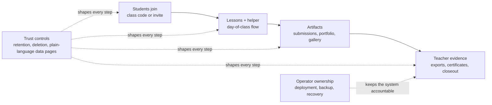

# Start Here: Board Demo

## Summary
Use this page for a 5-10 minute board walkthrough. The main idea: ClassHub is program infrastructure, not just a website or generic LMS. It helps a nonprofit run classes, collect student work, support teachers, and preserve trust boundaries without outsourcing core operations to a black-box platform.

## What the board should understand

- Students can join with low friction: class code or invite link plus a display name.
- Teachers have a day-of-class workspace for lessons, submissions, support signals, and closeout.
- Student artifacts are central: uploads, portfolios, gallery sharing, and completion evidence.
- Trust is part of the product: clear data pages, retention controls, student data controls, and minimal student identity by default.
- Course content stays portable: file-first authoring, coursepacks, registry publishing, and print-friendly handouts.
- The Homework Helper is separate and bounded; it is not a general student surveillance layer.
- The organization owns the deployment, backup, recovery, and evidence path.

## ClassHub at a glance

Board read: this is not just content delivery. The product value is the full program loop from join to evidence, with trust and operations treated as first-class responsibilities.

## 10-minute reading path

1. [PUBLIC_OVERVIEW.md](PUBLIC_OVERVIEW.md): plain-language product and trust overview.
2. [CURRENT_STATE.md](CURRENT_STATE.md): what is live on `main` now.
3. [SCREENSHOT_GALLERY.md](SCREENSHOT_GALLERY.md): visual walkthrough of the current public screenshot set.
4. [RISK_AND_DATA_POSTURE.md](RISK_AND_DATA_POSTURE.md): family and partner-facing data posture.
5. [PROGRAM_LIFECYCLE.md](PROGRAM_LIFECYCLE.md): how the tool supports real program delivery and reporting.

## Demo path

Ask the demo lead to show these in order:

1. Student join (`/`) and student class view (`/student`).
2. One lesson page with the helper visible.
3. A submission dropbox and student portfolio/gallery path.
4. Teacher portal (`/teach`) with class cards, lesson tracker, and support signals.
5. Data lifespan dashboard (`/teach/data-lifespan`) and one export path.
6. Current screenshot gallery if a live environment is not available.

## What not to get lost in

- Do not start with deployment topology unless the board is deciding hosting risk.
- Do not read every RFC; use [CURRENT_STATE.md](CURRENT_STATE.md) for shipped scope and [FEATURE_MATURITY.md](FEATURE_MATURITY.md) for live vs optional vs planned.
- Do not treat screenshots as the reporting system. Reporting should come from exports and evidence artifacts.
- Do not overfocus on the helper. The platform value is the full program workflow: class setup, curriculum, submissions, evidence, privacy, and operations.

## Stewardship questions

- Who is responsible for weekly operations, backups, and restore rehearsal?
- Which student data does the program truly need to collect?
- Which language and reading-level needs should be reviewed by people in the community?
- Which programs need certificates, outcomes exports, or partner reports?
- Which optional infrastructure features should remain off until there is a clear operational reason?
