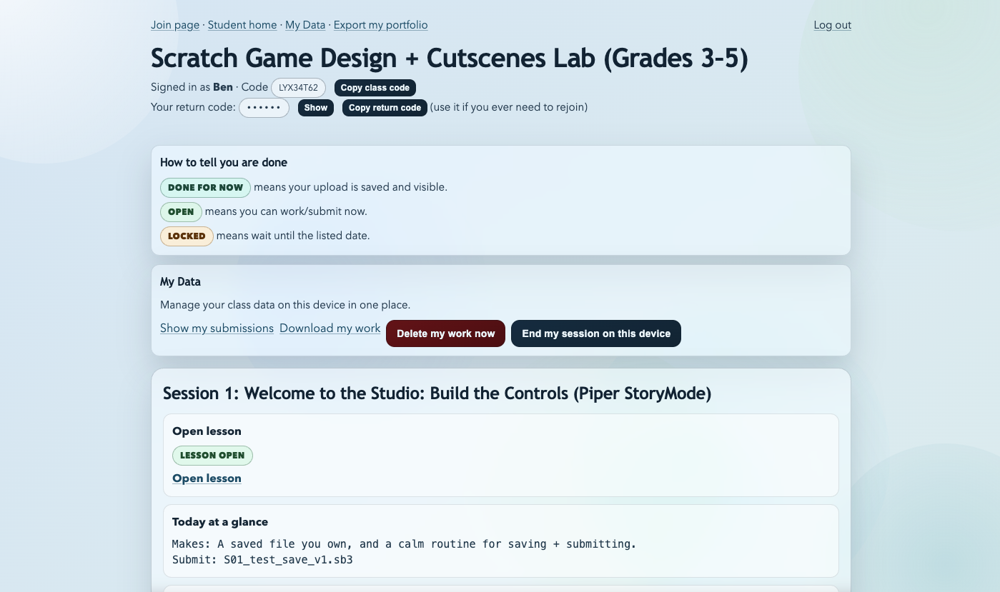
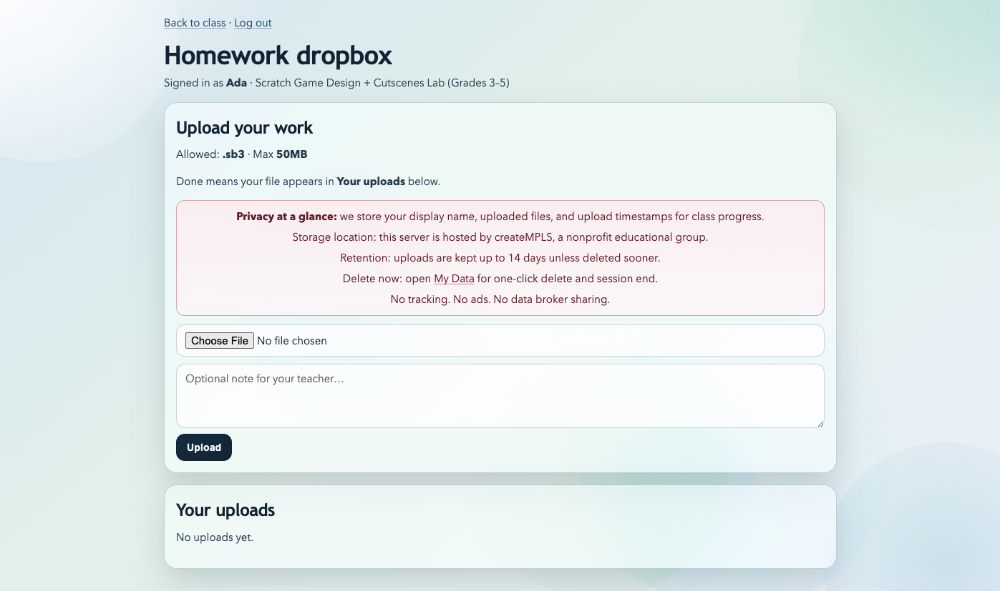

# Start Here: Fundraising

## What ClassHub is

ClassHub is a program delivery system that can produce bounded evidence of participation, submissions, and completion without building a surveillance-heavy student record.

## What ClassHub is not

- It is not a donor database.
- It is not a marketing analytics platform.
- It is not a grading or ranking engine.
- It does not promise insight by collecting more personal data than needed.

## 5-minute overview

1. Programs run in `Classes` that live inside an `Organization`.
2. Students join with low friction, usually by class code or `Invite link`.
3. Teachers can mark session completion, review submissions, and issue certificates.
4. Staff can generate `Outcomes export` and class summary exports for reporting.
5. Reporting stays privacy-forward: display names, counts, and completion evidence rather than helper prompt logs or student surveillance metrics.

## Visual references

Planned reporting captures:

## What success looks like

- Reports to funders can be assembled from exports instead of manual narrative reconstruction.
- Certificates and submissions become reusable program artifacts.
- Staff can explain the data posture clearly to families, schools, and partners.
- Program renewal conversations are based on attendance/completion evidence, not invasive analytics.

## Risks avoided

- Avoids collecting AI conversation transcripts as a default reporting dataset.
- Avoids normalizing surveillance metrics that are hard to justify ethically.
- Avoids tying program credibility to a third-party hosted platform the org does not control.

## What to review next

- Program framing and capability summary: [PUBLIC_OVERVIEW.md](PUBLIC_OVERVIEW.md)
- Program lifecycle and artifacts: [PROGRAM_LIFECYCLE.md](PROGRAM_LIFECYCLE.md)
- Privacy and data boundaries: [RISK_AND_DATA_POSTURE.md](RISK_AND_DATA_POSTURE.md), [PRIVACY-ADDENDUM.md](PRIVACY-ADDENDUM.md)
- Exact export and certificate workflow: [TEACHER_PORTAL.md](TEACHER_PORTAL.md)
