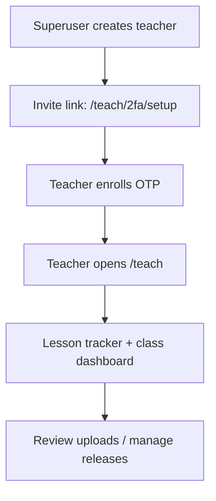

# Teacher Portal + Accounts

This guide covers:
- creating teacher accounts
- accessing the teacher portal
- common day-to-day workflows

## Visual references

Current captures:


Planned captures for newer teacher views:




## Access model

- Student access: class code + display name.
- Teacher portal: staff-only (`is_staff=True`) Django users.
- Django admin: usually superusers (`is_superuser=True`).
- Class visibility:
  - superusers can access all classes.
  - staff with active org memberships can access classes in those orgs.
  - staff with no active org memberships follow `REQUIRE_ORG_MEMBERSHIP_FOR_STAFF`:
    - `0` (default): legacy fallback allows global class access.
    - `1`: no class access until an active org membership exists.
- Assigned classes appear first in `/teach` and `/teach/lessons`, but assignments do not reduce org-level access.

Use superusers for setup and operations. Use staff (non-superuser) for daily teaching.

## Create teacher accounts

Prerequisite: stack is running.

```bash
cd compose
docker compose up -d
```

Create first admin (if needed):

```bash
cd compose
docker compose exec classhub_web python manage.py createsuperuser
```

Create a staff teacher account:

```bash
cd compose
docker compose exec classhub_web python manage.py create_teacher \
  --username teacher1 \
  --email teacher1@example.org \
  --password CHANGE_ME
```

Or create teacher accounts from the teacher portal (`/teach`) as a superuser:

- Fill in username, name, email, and a starting password.
- Submit `Create teacher + send invite`.
- The invite email includes a one-click `/teach/2fa/setup?token=...` link where the teacher scans a QR and confirms a 6-digit OTP code.
- Optional checkbox: include temporary password in email (off by default).

Reset a teacher password:

```bash
cd compose
docker compose exec classhub_web python manage.py create_teacher \
  --username teacher1 \
  --password NEW_PASSWORD \
  --update
```

Disable teacher access without deleting account:

```bash
cd compose
docker compose exec classhub_web python manage.py create_teacher \
  --username teacher1 \
  --inactive \
  --update
```

Useful flags:
- `--update`: required when modifying an existing teacher.
- `--clear-email`: clear existing email on update.
- `--superuser` / `--no-superuser`: elevate or remove admin-level access.
- `--active` / `--inactive`: explicitly control account state.

## Example script

A runnable command cookbook is provided at:

- `scripts/examples/teacher_accounts.sh`

By default it prints commands only (dry-run). Execute for real:

```bash
RUN=1 bash scripts/examples/teacher_accounts.sh
```

Use production compose mode:

```bash
COMPOSE_MODE=prod RUN=1 bash scripts/examples/teacher_accounts.sh
```

Customize values when running the example script:

```bash
USERNAME=teacher2 \
EMAIL=teacher2@example.org \
PASSWORD=TEMP_PASSWORD \
NEW_PASSWORD=FINAL_PASSWORD \
RUN=1 \
bash scripts/examples/teacher_accounts.sh
```

## Changing personnel (new or different teachers)

Current behavior:

- Superusers can access every class.
- Staff access follows org memberships and `REQUIRE_ORG_MEMBERSHIP_FOR_STAFF`.
- Class assignments are a priority hint ("Assigned" badge, sorted first), not an access boundary.

When a new person joins:

1. Create a new staff account.
2. Add active `OrganizationMembership` rows in Django admin for the orgs they should teach.
3. Optional: add `ClassStaffAssignment` rows in Django admin for classes that should appear first.
4. Ask them to sign in and verify `/teach` + `/teach/lessons`.
5. Keep old account active briefly during transition, then disable it.

Commands:

```bash
# 1) onboard new teacher
docker compose exec classhub_web python manage.py create_teacher \
  --username teacher2 \
  --email teacher2@example.org \
  --password TEMP_PASSWORD

# 2) rotate their password after first login or handoff
docker compose exec classhub_web python manage.py create_teacher \
  --username teacher2 \
  --password FINAL_PASSWORD \
  --update

# 3) offboard previous teacher account
docker compose exec classhub_web python manage.py create_teacher \
  --username teacher1 \
  --inactive \
  --update
```

If contact info changes (same person, new email):

```bash
docker compose exec classhub_web python manage.py create_teacher \
  --username teacher2 \
  --email teacher2@newschool.org \
  --update
```

If login username should change, create a new account with the new username and
disable the old account after handoff.

Operational checklist: [TEACHER_HANDOFF_CHECKLIST.md](TEACHER_HANDOFF_CHECKLIST.md).

## Teacher portal routes

- `/teach`:
  - class list
  - one-click `Copy` for class join codes
  - `My profile` tab for all staff:
    - update first/last name and email
    - change password (requires current password)
  - superuser-only teacher onboarding card (create account + send 2FA invite email)
  - superuser-only organization management tab:
    - create organizations
    - set organization active/inactive
    - assign/update org memberships for staff users (`owner` / `admin` / `teacher` / `viewer`)
  - create class
  - generate authoring templates (`.md` + `.docx`) by setting:
    - `course slug`
    - `course title`
    - `sessions`
    - `session duration (minutes)`
  - download generated template files directly from the same card (per slug)
  - recent submissions queue
- `/teach/lessons`:
  - lesson tracker grouped by class
  - per-dropbox quick actions: `All`, `Missing`, `ZIP latest`
  - row shortcut: `Review missing now`
  - row shortcut: `Manage videos`
- `/teach/videos`:
  - select course + lesson
  - upload video file or add video URL
  - bulk-upload multiple files in one action
  - order videos for lesson playback
  - publish/unpublish videos (draft visibility)
  - remove lesson-tagged videos
- `/teach/assets`:
  - create reusable folder paths for reference files
  - upload docs/images/PDFs and optionally tag by `course_slug` + `lesson_slug`
  - publish/hide/delete assets
  - copy markdown-ready link snippets like `[GPIO map](/lesson-asset/12/download)`
- `/teach/class/<id>`:
  - lesson tracker for one class
  - module/material editor
  - `Copy` join code
  - `Printable join card` shortcut for in-room posting
  - student landing editor:
    - landing title, message, and optional hero image URL
    - weekly highlight is derived from class lesson release dates and appears first on `/student`
  - enrollment mode control: `Open`, `Invite only`, `Closed`
  - student invite-link management:
    - create links with optional label, expiry, and seat cap
    - copy full invite URL for distribution
    - disable links
  - class exports:
    - outcomes CSV (`/teach/class/<id>/export-outcomes-csv`)
    - summary CSV (`/teach/class/<id>/export-summary-csv`)
  - inline student rename controls
  - roster reset action (clears student identities + submissions, invalidates active student sessions, optional join-code rotation)
- `/teach/class/<id>/join-card`:
  - print-friendly join instructions + class code
  - prefilled join URL (`/?class_code=<JOIN_CODE>`)
- `/teach/class/<id>/certificate-eligibility`:
  - per-student session/artifact/milestone rollup
  - teacher/admin-only `Mark session completed` action for offline completions
  - issue/re-issue certificate for eligible students
  - download issued certificates:
    - PDF (`/teach/class/<id>/certificate/<student_id>/download.pdf`)
    - TXT (`/teach/class/<id>/certificate/<student_id>/download`)
- `/teach/material/<id>/submissions`:
  - submitted vs missing filters
  - bulk download latest submissions as ZIP
- `/teach/2fa/setup`:
  - teacher self-service TOTP enrollment
  - supports signed invite links from onboarding emails
  - invite links are one-time use and expire after `TEACHER_2FA_INVITE_MAX_AGE_SECONDS` (default 24h)
  - shows QR + manual secret and verifies one-time code

## Common workflow

1. Sign in at `/admin/login/` with a staff or superuser account.
2. Open `/teach`.
3. Open `Lessons` for the target class.
4. Use `Manage videos` on a lesson row to add/update that lesson's video list.
5. Use `Review missing now` to jump to students who still owe uploads.
6. Use `ZIP latest` for batch review/download.

## Student experience structure (what teachers should expect)

- `/student` now opens to a class landing page with three clear blocks:
  - `This week` (calendar-linked highlighted lesson + primary start action)
  - `Course links` (full lesson list in a collapsible panel)
  - `Account` (My Data + export/session controls)
- Module cards on `/student` are collapsible, and the highlighted module opens by default.
- Checklist/reflection/rubric materials show status first (`Done`/`Open`/`Locked`) and keep edit forms inside collapsible details.
- The helper widget is collapsed by default on student pages; students open it when needed.
- Lesson videos are collapsed by default on lesson pages.
- Density defaults are profile-driven (`compact`/`standard`/`expanded`) and can be course-overridden via `ui_level`; see [PROGRAM_PROFILES.md](PROGRAM_PROFILES.md).

If a teacher says “the page looks empty,” first confirm collapsed sections are expanded where needed.

## Enrollment + invite workflow

Use this when a cohort needs controlled joins without student login accounts.

1. Open `/teach/class/<id>`.
2. Set enrollment mode:
   - `Open`: class code or invite link can join.
   - `Invite only`: class code joins are blocked; invite link required.
   - `Closed`: all new joins blocked.
3. In `Student Invite Links`, create links as needed:
   - optional expiry (`expires in hours`)
   - optional seat cap (`seat cap`)
4. Copy links and distribute to students/families.
5. Disable links after enrollment window closes.

Student join behavior:

- "This invite is full right now..." means seat cap was reached.
- "Invite required" means class is `Invite only` and class-code join was attempted.

## Outcomes + certificate workflow

1. Open `/teach/class/<id>/certificate-eligibility`.
2. Review threshold summary (`CLASSHUB_CERTIFICATE_MIN_SESSIONS` + `CLASSHUB_CERTIFICATE_MIN_ARTIFACTS`).
3. If a session was completed offline, use `Mark session completed` (teacher/admin roles only).
4. Export rollups with `Export outcomes CSV` (counts only; no student response bodies).
5. For eligible students, issue/re-issue certificate.
6. Download PDF or TXT certificate from the student row.

Role note:

- `viewer` can open eligibility pages but cannot submit mark/issue actions.

## Lesson video workflow

Use `/teach/videos` to tag media directly to `course_slug + lesson_slug`.

1. Pick a course and lesson from the selectors.
2. Add a title (+ optional minutes/outcome).
3. Choose one source:
   - `Video URL` (self-hosted MP4/HLS or YouTube URL), or
   - `Upload video file` (stored as a private lesson asset).
4. Save, then use `↑` / `↓` to set playback order.
5. Use `Publish` / `Unpublish` to control whether students can see each video.
6. Use `Bulk upload files` when adding many lesson clips at once (titles auto-generate from filenames).

Large file note:
- Upload request size is controlled by `CLASSHUB_UPLOAD_MAX_MB` (default `200`) in compose env.
- Upload request timeout is controlled by `CLASSHUB_GUNICORN_TIMEOUT_SECONDS` (default `1200`).
- After changing `.env`, restart `classhub_web` to apply.

Lesson behavior:
- Student lesson page video panels are collapsed by default.
- Clicking a video heading opens that panel.
- Opening a different heading closes the previous panel.
- Uploaded files stream via `/lesson-video/<id>/stream` with permission checks.
- Draft videos are hidden from students until published.

## Lesson asset workflow

Use `/teach/assets` when a lesson needs reference files (for example GPIO maps or printable guides).

1. Create a folder path (example: `piper-kits/gpio`).
2. Upload one or more files into that folder.
3. Keep `Publish immediately` checked when students should access the file now.
4. Copy the generated snippet and paste it into lesson markdown or a text material:
   - `[GPIO map](/lesson-asset/<asset_id>/download)`
5. Use `Hide` to remove student access without deleting the file.

## Troubleshooting

- Invite emails not sending from `/teach`:
  - set SMTP env values (`DJANGO_EMAIL_BACKEND`, `DJANGO_EMAIL_HOST`, `DJANGO_EMAIL_HOST_USER`, `DJANGO_EMAIL_HOST_PASSWORD`, etc.)
  - restart `classhub_web` after env changes
  - for local verification only, keep `DJANGO_EMAIL_BACKEND=django.core.mail.backends.console.EmailBackend` and inspect container logs

- Redirect to `/admin/login/` when opening `/teach`:
  - account is not authenticated, or
  - account does not have `is_staff=True`.
- Teacher can open `/teach` but should not have admin access:
  - ensure `is_superuser=False`.
- No lesson rows in tracker:
  - class modules may not include lesson links in `/course/<course>/<lesson>` format.
