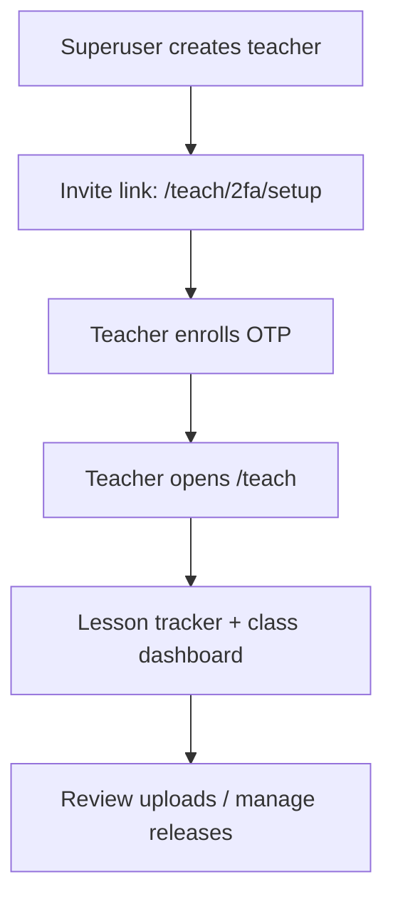

# Teacher Portal + Accounts

This guide covers:
- creating teacher accounts
- accessing the teacher portal
- common day-to-day workflows

## Visual references

Capture status:
- `Live`: captured from current `main`.
- `Placeholder`: planned capture; view is live but screenshot refresh is pending.

Current captures:

Additional captured teacher views:

`18-teacher-landing-editor.png` is temporarily withheld from the public gallery while the landing-editor capture is refreshed after the 2026-04-11 blank-image audit.

```mermaid
flowchart TD
  A[Superuser creates teacher] --> B[Invite link: /teach/2fa/setup]
  B --> C[Teacher enrolls OTP]
  C --> D[Teacher opens /teach]
  D --> E[Lesson tracker + class dashboard]
  E --> F[Review uploads / manage releases]
```

## Access model (plain language first)

- Students join with class code + display name.
- Teachers use staff accounts for daily class work.
- Admins/superusers have broader setup permissions.
- Most teacher access is scoped by organization and class assignment.
- Assigned classes appear first in `/teach` and `/teach/lessons`.

Technical note (for setup/admin teams):

- Teacher portal requires staff users (`is_staff=True`).
- Django admin access is typically superuser (`is_superuser=True`).
- If `REQUIRE_ORG_MEMBERSHIP_FOR_STAFF=1` (production default), staff need active organization membership before class access.
- If `REQUIRE_ORG_MEMBERSHIP_FOR_STAFF=0`, legacy global class access is allowed for staff without active org memberships.
- Detailed org-boundary examples: [ORG_BOUNDARY_EXPLAINER.md](ORG_BOUNDARY_EXPLAINER.md).

## Teacher portal screens

Use this section in two passes:

1. `Daily teacher use` (most readers should start here).
2. `Advanced admin/policy controls` (setup and governance teams).

### Daily teacher use

- `/teach`:
  - optional view mode switcher (`?portal_mode=`):
    - `setup` (default): setup/import/template surfaces
    - `day`: class-day surfaces only (focus + digest + closeout + recent submissions)
    - `all`: superuser + advanced-mode full cockpit
    - `admin`: superuser + advanced-mode organization/setup surfaces
    - `policy`: superuser + advanced-mode RBAC/policy surfaces
  - class list
  - one-click `Copy` for class join codes
  - superuser-only operator config snapshot card:
    - read-only summary of active program profile, organization/permission settings, helper mode, and helper behavior defaults/customizations
    - links to `docs/FEATURE_MATURITY.md` and `docs/START_HERE_EVALUATOR.md` for rollout and evaluator context
  - superuser class row action: `Set organization` (opens org-admin move form)
  - `My profile` tab for all staff:
    - update first/last name and email
    - change password (requires current password)
  - superuser-only teacher onboarding card (create account + send 2FA invite email)
    - per-account actions:
      - enable/disable teacher account
      - promote/demote superuser
      - reset temporary password
      - resend 2FA invite email
  - superuser-only organization management tab:
    - create organizations
    - rename organizations
    - archive/restore organizations
      - archive is blocked while classes are still assigned to that organization
    - assign/update org memberships for staff users (`owner` / `admin` / `teacher` / `viewer`)
    - move classes between active organizations
    - assign teachers to classes (single assign/update + bulk teacher-to-classes set)
      - assignment selectors are teacher-account-focused (active non-superuser staff)
- `/teach/lessons`:
  - lesson tracker grouped by class
  - per-dropbox quick actions: `All`, `Missing`, `ZIP latest`
  - row shortcut: `Review missing now`
  - row shortcut: `Manage videos`
- `/teach/videos`:
  - select course + lesson
  - upload video file or add video URL
  - bulk-upload multiple files in one action
  - order videos for lesson playback
  - publish/unpublish videos (draft visibility)
  - remove lesson-tagged videos
- `/teach/assets`:
  - create reusable folder paths for reference files
  - upload docs/images/PDFs and optionally tag by `course_slug` + `lesson_slug`
  - publish/hide/delete assets
  - copy markdown-ready link snippets like `[GPIO map](/lesson-asset/12/download)`
- `/teach/class/<id>`:
  - lesson tracker for one class
  - facilitator support board (help-first):
    - active “I’m stuck” signals first, with `Mark resolved`
    - student deletion requests (when request mode is enabled), with `Mark addressed`
    - recent upload-error feed
    - idle-time context list (interpret carefully)
    - manual refresh link (no high-frequency polling)
  - module/material editor
  - in-browser markdown lesson editor (saves as database overrides without modifying source files)
  - `Copy` join code
  - `Printable join card` shortcut for in-room posting
  - student landing editor:
    - landing title, message, and optional hero image URL
    - weekly highlight is derived from class lesson release dates and appears first on `/student`
  - enrollment mode control: `Open`, `Invite only`, `Closed`
  - student invite-link management:
    - create links with optional label, expiry, and seat cap
    - copy full invite URL for distribution
    - disable links
  - class exports:
    - outcomes CSV (`/teach/class/<id>/export-outcomes-csv`)
    - summary CSV (`/teach/class/<id>/export-summary-csv`)
  - inline student rename controls
  - roster reset action (clears student identities + submissions, invalidates active student sessions, optional join-code rotation)
- `/teach/data-lifespan`:
  - read-only operator retention snapshot
  - shows `StudentEvent` row volume, oldest submission timestamp, and policy-overdue counts
  - includes retention trend table for recent prune activity (last 7 days)
  - exports audit-stamped evidence snapshots as JSON/CSV via `/teach/data-lifespan/export?format=<json|csv>`
  - shows exact timestamp of the last successful retention prune run
  - includes recent `retention.prune_*` audit rows for quick verification
  - includes helper knowledge-source status panel (enabled/index-ready status, content source counts, last index build, curriculum-only boundary statement)
- `/teach/class/<id>/join-card`:
  - print-friendly join instructions + class code
  - prefilled join URL (`/?class_code=<JOIN_CODE>`)
- `/teach/class/<id>/certificate-eligibility`:
  - per-student session/artifact/milestone rollup
  - teacher/admin-only `Mark session completed` action for offline completions
  - issue/re-issue certificate for eligible students
  - download issued certificates:
    - PDF (`/teach/class/<id>/certificate/<student_id>/download.pdf`)
    - TXT (`/teach/class/<id>/certificate/<student_id>/download`)
- `/teach/material/<id>/submissions`:
  - submitted vs missing filters
  - bulk download latest submissions as ZIP
  - gallery materials add moderation controls:
    - view `student published` and `teacher approved` state
    - use `Approve` / `Unapprove` to control gallery visibility
- `/teach/module/<id>`:
  - if the module has gallery materials, use `Enable/Disable session gallery`
  - disabling a session gallery hides gallery wall entries for that session without deleting submissions
- `/teach/2fa/setup`:
  - teacher self-service TOTP enrollment
  - supports signed invite links from onboarding emails
  - invite links are one-time use and expire after `TEACHER_2FA_INVITE_MAX_AGE_SECONDS` (default 24h)
  - shows QR + manual secret and verifies one-time code

### Advanced admin and policy controls

Most classroom teachers can skip this section.

- owner/admin/superuser permissions + policy tools tab:
  - assign fine-grained permission grants by class/user/action/range
  - support submission, roster, and policy grant scopes
  - use range `0-0` for class-wide roster/policy controls
  - enable/disable existing grants without Django admin
  - run "simulate access" checks before applying live changes
  - run a bulk simulation matrix across staff for one class/capability scope
  - manage custom roles, custom-role capabilities, and assignments
  - export/import policy bundles (JSON)
  - optional approval queue for policy changes (`CLASSHUB_RBAC_POLICY_APPROVAL_REQUIRED=1`)
  - review audit feed for recent policy/scope changes
  - review/approve/reject pending policy change requests
  - tab appears only for accounts with syllabus-export capability (`staff_can_export_syllabi`)
  - create class
  - compile syllabus sources into coursepack ZIPs (stateless):
    - accepts `.md`, `.docx`, and `.zip`
    - supports optional overview file (`.md`/`.docx`) and parser mode (`auto`/`template`/`verbose`)
    - can overwrite an existing slug when updating a course
  - operator link: `/teach/data-lifespan` (owner/admin/superuser) for retention verification snapshot
  - generate authoring templates (`.md` + `.docx`) by setting:
    - `course slug`
    - `course title`
    - `sessions`
    - `session duration (minutes)`
  - download generated template files directly from the same card (per slug)
  - recent submissions queue

## Facilitation guide: respond without shame

When using the **Facilitator Support Board** on `/teach/class/<id>`:

- Start with private, practical support language:
  - “Thanks for flagging this. Want me to sit with you for two minutes?”
  - “Show me where it stopped making sense.”
- Treat “I’m stuck” as a support request, not a deficit signal.
- Use `Mark resolved` only after you have checked in, so the board stays trustworthy.
- If deletion requests are enabled, use `Mark addressed` only after confirming policy and action with the student.
- Treat upload errors as tool friction first:
  - check file type, file size, and retry path before interpreting effort.
- Treat idle signals as context only:
  - students may be reading, planning, collaborating, or waiting for shared devices.
- Avoid public call-outs tied to these signals. Keep the intervention one-on-one when possible.

## Common workflow

1. Sign in at `/admin/login/` with a staff or superuser account.
2. Open `/teach`.
3. Open `Lessons` for the target class.
4. Use `Manage videos` on a lesson row to add/update that lesson's video list.
5. Use `Review missing now` to jump to students who still owe uploads.
6. Use `ZIP latest` for batch review/download.

## Student experience structure (what teachers should expect)

- `/student` now opens to a class landing page with three clear blocks:
  - `This week` (calendar-linked highlighted lesson + primary start action)
  - `Course links` (full lesson list in a collapsible panel)
  - `Account` (My Data + export/session controls)
- Artifact sharing stays teacher-only by default.
- Students can opt in per artifact on upload pages using `Publish to class gallery wall`.
- `/student/portfolio` gives each student a "What I made" view with lesson/date/station filters.
- `/student/gallery` only shows artifacts that are student-published and teacher-approved.
- Module cards on `/student` are collapsible, and the highlighted module opens by default.
- Checklist/reflection/rubric materials show status first (`Done`/`Open`/`Locked`) and keep edit forms inside collapsible details.
- The helper widget is collapsed by default on student pages; students open it when needed.
- Lesson videos are collapsed by default on lesson pages.
- Density defaults are profile-driven (`compact`/`standard`/`expanded`) and can be course-overridden via `ui_level`; see [PROGRAM_PROFILES.md](PROGRAM_PROFILES.md).

If a teacher says “the page looks empty,” first confirm collapsed sections are expanded where needed.

## Enrollment + invite workflow

Use this when a cohort needs controlled joins without student login accounts.

1. Open `/teach/class/<id>`.
2. Set enrollment mode:
   - `Open`: class code or invite link can join.
   - `Invite only`: class code joins are blocked; invite link required.
   - `Closed`: all new joins blocked.
3. In `Student Invite Links`, create links as needed:
   - optional expiry (`expires in hours`)
   - optional seat cap (`seat cap`)
4. Copy links and distribute to students/families.
5. Disable links after enrollment window closes.

Student join behavior:

- "This invite is full right now..." means seat cap was reached.
- "Invite required" means class is `Invite only` and class-code join was attempted.

## Outcomes + certificate workflow

1. Open `/teach/class/<id>/certificate-eligibility`.
2. Review threshold summary (`CLASSHUB_CERTIFICATE_MIN_SESSIONS` + `CLASSHUB_CERTIFICATE_MIN_ARTIFACTS`).
3. If a session was completed offline, use `Mark session completed` (teacher/admin roles only).
4. Export rollups with `Export outcomes CSV` (counts only; no student response bodies).
5. For eligible students, issue/re-issue certificate.
6. Download PDF or TXT certificate from the student row.

Canonical meaning reference:
- [OUTCOME_SEMANTICS.md](OUTCOME_SEMANTICS.md)

Role note:

- `viewer` can open eligibility pages but cannot submit mark/issue actions.

## Lesson video workflow

Use `/teach/videos` to tag media directly to `course_slug + lesson_slug`.

1. Pick a course and lesson from the selectors.
2. Add a title (+ optional minutes/outcome).
3. Choose one source:
   - `Video URL` (self-hosted MP4/HLS or YouTube URL), or
   - `Upload video file` (stored as a private lesson asset).
4. Save, then use `↑` / `↓` to set playback order.
5. Use `Publish` / `Unpublish` to control whether students can see each video.
6. Use `Bulk upload files` when adding many lesson clips at once (titles auto-generate from filenames).

Large file note:
- Upload request size is controlled by `CLASSHUB_UPLOAD_MAX_MB` (default `200`) in compose env.
- Upload request timeout is controlled by `CLASSHUB_GUNICORN_TIMEOUT_SECONDS` (default `1200`).
- After changing `.env`, restart `classhub_web` to apply.

Lesson behavior:
- Student lesson page video panels are collapsed by default.
- Clicking a video heading opens that panel.
- Opening a different heading closes the previous panel.
- Uploaded files stream via `/lesson-video/<id>/stream` with permission checks.
- Draft videos are hidden from students until published.

## Lesson asset workflow

Use `/teach/assets` when a lesson needs reference files (for example GPIO maps or printable guides).

1. Create a folder path (example: `piper-kits/gpio`).
2. Upload one or more files into that folder.
3. Keep `Publish immediately` checked when students should access the file now.
4. Copy the generated snippet and paste it into lesson markdown or a text material:
   - `[GPIO map](/lesson-asset/<asset_id>/download)`
5. Use `Hide` to remove student access without deleting the file.

Fast path for visual lessons:
- On `/teach/module/<id>`, use `Add a photo or image` to upload an image and place it in the session immediately.
- This uses the same lesson-asset library underneath, but removes the upload-copy-paste loop for day-of-class visuals.

## Troubleshooting

- Invite emails not sending from `/teach`:
  - set SMTP env values (`DJANGO_EMAIL_BACKEND`, `DJANGO_EMAIL_HOST`, `DJANGO_EMAIL_HOST_USER`, `DJANGO_EMAIL_HOST_PASSWORD`, etc.)
  - restart `classhub_web` after env changes
  - for local verification only, keep `DJANGO_EMAIL_BACKEND=django.core.mail.backends.console.EmailBackend` and inspect container logs

- Redirect to `/admin/login/` when opening `/teach`:
  - account is not authenticated, or
  - account does not have `is_staff=True`.
- Teacher can open `/teach` but should not have admin access:
  - ensure `is_superuser=False`.
- No lesson rows in tracker:
  - class modules may not include lesson links in `/course/<course>/<lesson>` format.
