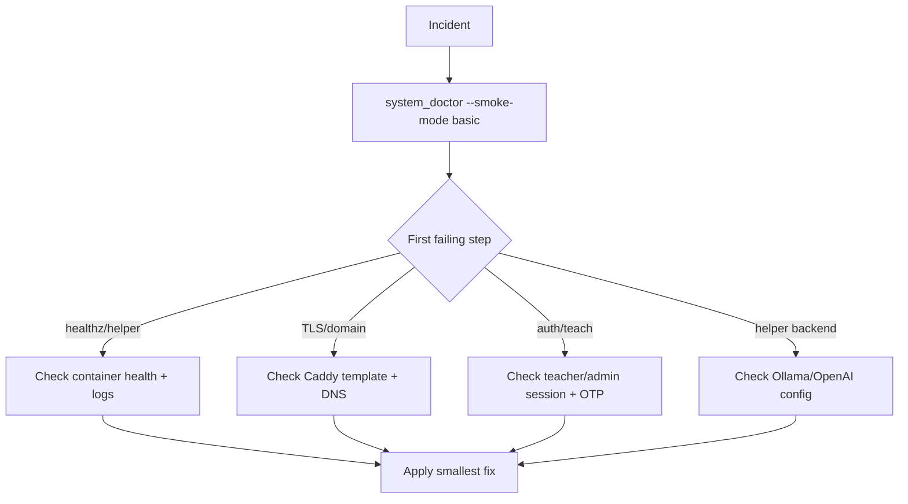

# Troubleshooting Guide

Use this page when something is broken right now.

Flow:

1. confirm failure once
2. capture logs
3. classify symptom
4. apply smallest reversible fix



## 3-minute baseline

```bash
cd /srv/lms/app
bash scripts/system_doctor.sh --smoke-mode basic
bash scripts/check_llm_backend.sh --probe-chat
```

If this fails early, fix the first failing step before changing anything else.

## Fast triage commands

```bash
cd /srv/lms/app/compose
docker compose ps
curl -I http://localhost/healthz
curl -I http://localhost/upstream-healthz
curl -I http://localhost/helper/healthz
docker compose logs --tail=200 classhub_web helper_web caddy
```

## Symptom index

| Symptom | Check first | Most likely area |
|---|---|---|
| Site not loading over HTTPS | Caddy logs + `.env` domain/template | Edge routing/TLS |
| `/helper/chat` failing (502 / `ollama_error` or 503 / `busy`) | `helper_web` logs + Ollama tags | Helper backend/model/queue saturation |
| Private LLM check failing before smoke | `bash scripts/check_llm_backend.sh --probe-chat` | Tailnet DNS/auth/upstream reachability |
| `/helper/chat` failing with 403 CSRF page | Browser request headers (`Referer`, `X-CSRFToken`, `Cookie`) + `classhub_web` logs | CSRF/referrer/session |
| Student join shows "Security check blocked the join request" | `/join` response code + cookie secure flags in `.env` | CSRF cookie transport mismatch |
| Teacher login smoke fails | smoke credentials + login response path | Auth/config mismatch |
| Accessibility smoke fails (`scripts/a11y_smoke.sh`) | Playwright install + teacher session/bootstrap fixtures | Tooling/session/markup regression |
| Container unhealthy/restarting | service logs + DB auth | Boot/runtime dependency |
| Helper returns policy redirect unexpectedly | topic filter mode + scope context | Policy config |
| Admin blocked by OTP | admin device enrollment | Auth hardening |
| Content missing after reset/rebuild | class/module records | Data reset/reseed |
| Deploy shows `The "<token>" variable is not set` warnings | `compose/.env` secrets with `$` | Docker Compose interpolation |
| Student join says "invite required" or "invite is full" | class enrollment mode + invite status | Enrollment controls |
| 500 Internal Server Error on a page load | Django log stack trace (`TemplateSyntaxError`) | UI/Template formatting |
| Script fails with "DJANGO_SECRET_KEY is required" | Active virtual environment or Docker status | Environment/Secret sourcing |

## Symptom: site does not load over HTTPS

Common causes:

- wrong Caddy template mounted
- wrong or missing optional Caddy fragment mounted
- wrong `DOMAIN`
- ACME/DNS mismatch
- a public hostname points at the LMS edge but is absent from every active Caddy site block

Checks:

```bash
cd /srv/lms/app/compose
docker inspect classhub_caddy --format '{{range .Mounts}}{{println .Source "->" .Destination}}{{end}}'
docker compose logs --tail=200 caddy
grep -E '^(CADDYFILE_TEMPLATE|CADDY_EXTRA_CONFIG_TEMPLATE|CADDY_STATIC_SITE_ROOT_HOST|CADDY_STATIC_SITE_DOMAINS|DOMAIN)=' .env
```

Look for:

- expected template (`Caddyfile.domain` or `Caddyfile.domain.assets` for public TLS)
- expected extra fragment (`Caddyfile.extra.empty` or `Caddyfile.extra.static-site`)
- correct domain in logs and `.env`
- ACME identifier/certificate errors

If the LMS hostname works but another hostname on the same IP fails during TLS negotiation, inspect the adapted Caddy host matchers. A static site on the same edge must use the tracked `Caddyfile.extra.static-site` fragment and read-only root mount; do not rely on an ad-hoc runtime Caddy configuration that the next deploy will replace.

For a co-hosted Memory Engine, also check that `CADDY_PROXY_CONFIG_TEMPLATE=Caddyfile.proxy.memory-engine`, that both proxy containers appear in `docker network inspect public_edge`, and that `memory_engine_proxy` resolves from `classhub_caddy`. A missing public site block produces a TLS handshake failure; a missing shared-network upstream produces a `502` after TLS succeeds.

The tracked Memory Engine proxy redirects its bare public hostname to `/kiosk/`. A healthy `/healthz` and `/kiosk/` paired with a bare-host `404` means the deployed proxy fragment predates that redirect.

Strict deployment smoke reuses the existing smoke identity's return code from inside the trusted ClassHub container. This keeps repeated deploys compatible with `CLASSHUB_REQUIRE_RETURN_CODE_FOR_REJOIN=1` without creating a new roster entry or storing the return code in `compose/.env`.

## Symptom: deploy logs repeated `The "<token>" variable is not set` warnings

Example signal:

```text
WARN[0000] The "BA1VKkxkjyEBba" variable is not set. Defaulting to a blank string.
```

Common cause:

- a secret in `compose/.env` contains an unescaped `$` (most often `CADDY_ADMIN_BASIC_AUTH_HASH` bcrypt value)

Fix:

- wrap the value in single quotes, for example:
  - `CADDY_ADMIN_BASIC_AUTH_HASH='$2a$14$...'`
- or escape dollars as `$$`:
  - `CADDY_ADMIN_BASIC_AUTH_HASH=$$2a$$14$$...`

Then re-run:

```bash
cd /srv/lms/app
bash scripts/validate_env_secrets.sh
bash scripts/deploy_with_smoke.sh
```

## Symptom: `/helper/chat` fails with 502/`ollama_error` or 503/`busy`

Common causes:

- Ollama not ready
- model not pulled
- `OLLAMA_BASE_URL` mismatch
- bundled Ollama only listening on localhost instead of `0.0.0.0:11434` inside its container
- mixed canonical/legacy helper env keys (`LLM_*` vs `HELPER_LLM_BACKEND` / `OLLAMA_*`)
- `LLM_API_KEY` mismatch between LMS and private proxy
- helper worker timeout too strict for retry budget
- helper request queue is saturated on CPU-bound inference
- the local smoke model/context is too large for the LMS host RAM budget

Checks:

```bash
cd /srv/lms/app/compose
docker compose logs --tail=200 helper_web
docker compose logs --tail=200 ollama
curl http://localhost:11434/api/tags
bash scripts/check_llm_backend.sh --probe-chat
docker compose exec -T ollama sh -lc 'echo "${OLLAMA_HOST:-}" && ollama list'
docker compose exec -T helper_web env | grep -E '^(LLM_BACKEND|HELPER_LLM_BACKEND|LLM_BASE_URL|OLLAMA_BASE_URL|LLM_MODEL|OLLAMA_MODEL|LLM_TIMEOUT_SECONDS|OLLAMA_TIMEOUT_SECONDS|HELPER_GUNICORN_TIMEOUT_SECONDS|HELPER_BACKEND_MAX_ATTEMPTS|HELPER_QUEUE_MAX_WAIT_SECONDS|HELPER_BACKOFF_SECONDS)='
bash scripts/validate_env_secrets.sh
```

Fix pattern:

```bash
cd /srv/lms/app/compose
docker compose --profile local-ollama up -d ollama
docker compose exec ollama ollama pull llama3.2:1b
# Keep helper timeout above queue+retry budget (env-check enforces this).
# Fast safe defaults for deploy smoke:
# HELPER_GUNICORN_TIMEOUT_SECONDS=180
# OLLAMA_TIMEOUT_SECONDS=20
# HELPER_BACKEND_MAX_ATTEMPTS=1
# SMOKE_HELPER_CHAT_RETRIES=6
# SMOKE_HELPER_CHAT_BUSY_RETRY_DELAY_SECONDS=30
docker compose up -d helper_web
```

Bundled local Ollama should expose the server to other Compose services with:

```dotenv
OLLAMA_HOST=0.0.0.0:11434
```

The shipped Compose file now sets that automatically and the doctor waits for Ollama to become healthy before probe chat.

If the local smoke lane still fails on a small VPS, reduce the local smoke profile before treating it as a private-backend design problem. `make smoke-full` now uses a bounded local profile, but very small hosts may still need:

```bash
SMOKE_FULL_LOCAL_OLLAMA_MODEL=llama3.2:1b \
SMOKE_FULL_LOCAL_LLM_NUM_CTX=1024 \
SMOKE_FULL_LOCAL_LLM_MAX_TOKENS=96 \
SMOKE_FULL_LOCAL_HELPER_BACKEND_MAX_ATTEMPTS=1 \
make smoke-full
```

If the serious deployment target is the Thundercompute vGPU host, solve that path there instead of trying to turn the LMS server into the long-term inference node.

If both canonical and legacy helper keys are present, keep them aligned:

```dotenv
LLM_BACKEND=ollama
HELPER_LLM_BACKEND=ollama
LLM_BASE_URL=http://ollama:11434
OLLAMA_BASE_URL=http://ollama:11434
LLM_MODEL=llama3.2:1b
OLLAMA_MODEL=llama3.2:1b
LLM_TIMEOUT_SECONDS=30
OLLAMA_TIMEOUT_SECONDS=30
```

If using non-compose Ollama, ensure `OLLAMA_BASE_URL` points to a host reachable from containers.
If you are using the Thundercompute vGPU node, ensure `LLM_BASE_URL`/`OLLAMA_BASE_URL` points at the tailnet-only hostname and that the private proxy/API key still match.
If this deployment uses Headscale, confirm Jetson_B is healthy as a control plane, but do not treat it as a request-path proxy for the model traffic.

Recommended separation check:

- public LMS stays at `https://lms.creatempls.org`
- private model endpoint stays at a tailnet-only hostname such as `https://thundercompute-vgpu.tail.creatempls.org`
- only Homework Helper talks to that private endpoint

If bounded remote helper compute control is enabled, also check:

- the class lease on `/teach/class/<id>` is active for the intended class
- the remote-helper state is actually `ready`; `requested` or `starting` still stay on local/default helper compute
- the helper internal remote-compute status/control URLs are configured
- `CLASSHUB_REMOTE_HELPER_COMPUTE_ENABLED=1` and `CLASSHUB_REMOTE_HELPER_COMPUTE_ACKNOWLEDGED=1` are both set for the intended deployment
- the helper healthcheck URL is configured if your orchestration bridge needs a separate readiness signal
- provider control calls remain server-side; no browser should talk to the remote provider directly

Useful class-day signals:

- `/teach/class/<id>` shows whether helper will use the remote backend right now
- `remote_compute_fallback_local` in helper logs means the remote path degraded and the request retried locally
- a `degraded` or `error` state should not send students directly to the provider; it should keep them on the LMS-side helper path

## Symptom: `/helper/chat` fails with 403 CSRF page

Example failure signal:

```text
Forbidden (403)
CSRF verification failed. Request aborted.
... requires a "Referer header" ... but none was sent.
```

Common causes:

- request was sent by `curl`/script without CSRF cookie + `X-CSRFToken` + `Referer` (expected to fail)
- browser privacy extension/policy strips `Referer`
- mixed hosts (for example `localhost` vs `lms.example.org`) causing cookie/referrer mismatch

Checks:

```bash
cd /srv/lms/app/compose
docker compose logs --since=10m classhub_web | grep -Ei 'csrf|forbidden|referer|helper/chat'
docker compose exec -T helper_web env | grep -E '^(CSRF_TRUSTED_ORIGINS|DJANGO_ALLOWED_HOSTS)='
```

In browser DevTools (`Network` -> `helper/chat`), verify request headers include:

- `Referer: https://<your-domain>/...`
- `X-CSRFToken: ...`
- `Cookie: csrftoken=...; sessionid=...`

Notes:

- A raw `curl` POST to `/helper/chat` is expected to fail CSRF unless you include valid session + CSRF headers.
- The helper widget now surfaces structured errors as `Helper error: <error_code> (request <id>)`; CSRF HTML responses map to `csrf_forbidden`.

## Symptom: student join shows "Security check blocked the join request"

Example failure signal:

```text
Security check blocked the join request. Reload and try again.
```

Common cause (local/day-1 HTTP mode):

- `DJANGO_DEBUG=0` with `http://localhost`, but `DJANGO_CSRF_COOKIE_SECURE` and/or `DJANGO_SESSION_COOKIE_SECURE` are unset or `1`.
- Browser never sends secure cookies over HTTP, so `/join` POST fails CSRF with HTTP `403`.

Checks:

```bash
cd /srv/lms/app/compose
grep -E '^(CADDYFILE_TEMPLATE|SMOKE_BASE_URL|DJANGO_DEBUG|DJANGO_SESSION_COOKIE_SECURE|DJANGO_CSRF_COOKIE_SECURE)=' .env
```

Expected for local HTTP:

- `CADDYFILE_TEMPLATE=Caddyfile.local`
- `SMOKE_BASE_URL=http://localhost`
- `DJANGO_SESSION_COOKIE_SECURE=0`
- `DJANGO_CSRF_COOKIE_SECURE=0`

Then run:

```bash
cd /srv/lms/app
bash scripts/validate_env_secrets.sh
cd compose && docker compose up -d --force-recreate classhub_web helper_web caddy
```

## Symptom: smoke says teacher login failed

Example failure signal: `teacher login returned 200`.

Common causes:

- smoke credentials not present or stale
- login route returns form again instead of redirect/session success
- CSRF/host/cookie settings drift

Checks:

```bash
cd /srv/lms/app/compose
grep -E '^(SMOKE_|DJANGO_ALLOWED_HOSTS|CSRF_TRUSTED_ORIGINS)=' .env
docker compose logs --tail=200 classhub_web
```

Then re-run strict smoke:

```bash
cd /srv/lms/app
bash scripts/smoke_check.sh --strict
```

## Symptom: accessibility smoke fails

Example failure signals:

- `browserType.launch: Executable doesn't exist...`
- `expected authenticated teacher view but was redirected to /teach/login...`
- `[a11y] FAIL: found N violation(s) at critical+ impact`

Checks:

```bash
cd /srv/lms/app
bash scripts/system_doctor.sh --smoke-mode golden
bash scripts/a11y_smoke.sh --compose-mode prod --install-browsers
```

If browser install is still missing:

```bash
npm --prefix scripts/a11y run install-browsers
```

If teacher routes redirect to login:

1. Confirm golden fixtures completed successfully.
2. Confirm `smoke_teacher` exists in Class Hub and is active staff.
3. Re-run `scripts/a11y_smoke.sh` (it mints a fresh server-side session each run).

If violations remain:

1. Fix the exact selector(s) reported by axe.
2. Re-run `scripts/a11y_smoke.sh`.
3. Re-run strict smoke before deploy:
   - `bash scripts/smoke_check.sh --strict`

## Symptom: helper or classhub container unhealthy/restarting

Common causes:

- DB credential mismatch
- migration/import-time failure
- route/view symbol mismatch after partial deploy

Checks:

```bash
cd /srv/lms/app/compose
docker compose ps -a
docker compose logs --tail=200 helper_web
docker compose logs --tail=200 classhub_web
```

Look for:

- `password authentication failed`
- migration errors
- import/attribute errors

## Symptom: helper tests fail with `current transaction is aborted`

Common cause:

- helper best-effort classhub table access in environments missing classhub tables

Recovery:

```bash
cd /srv/lms/app/compose
docker compose up -d --build helper_web
docker compose exec -T helper_web python manage.py test tutor.tests.HelperChatAuthTests
docker compose exec -T helper_web python manage.py test tutor.tests
```

Interpretation:

- warning logs about missing classhub tables can be expected
- hard failure is persistent transaction-aborted state on later queries

## Symptom: teacher invite email fails

Common causes:

- SMTP host typo
- DNS failure in container
- provider SMTP AUTH policy restrictions

Checks:

```bash
cd /srv/lms/app/compose
grep -nE '^(DJANGO_EMAIL_|TEACHER_INVITE_FROM_EMAIL)=' .env
docker compose exec -T classhub_web env | grep -E '^(DJANGO_EMAIL_|TEACHER_INVITE_FROM_EMAIL)'
docker compose exec -T classhub_web python - <<'PY'
import os, socket
host = os.getenv("DJANGO_EMAIL_HOST","")
print("HOST:", host)
print("DNS:", socket.gethostbyname(host))
PY
```

Office 365 baseline:

- host `smtp.office365.com`
- port `587`
- `DJANGO_EMAIL_USE_TLS=1`

## Symptom: helper returns policy redirect instead of answer

Common cause:

- strict topic filtering and prompt outside allowed scope

Check:

```bash
cd /srv/lms/app/compose
docker compose exec -T helper_web env | grep -E '^HELPER_TOPIC_FILTER_MODE='
```

Behavior:

- `strict` intentionally short-circuits out-of-scope prompts
- `soft` is less restrictive

## Symptom: student join fails with invite-related error

Example failure signals:

- `"error":"invite_required"` when posting to `/join` with class code
- `"error":"invite_seat_cap_reached"` when using invite link

Common causes:

- class is set to `invite_only` and student used class code flow
- invite link seat cap (`max_uses`) was reached
- invite was disabled or expired

Checks:

```bash
cd /srv/lms/app/compose
docker compose exec -T classhub_web python manage.py shell -c \
"from hub.models import Class, ClassInviteLink; print(list(Class.objects.values_list('id','name','enrollment_mode')[:20])); print(list(ClassInviteLink.objects.order_by('-id').values_list('id','classroom_id','is_active','max_uses','use_count','expires_at')[:20]))"
```

Fix pattern:

1. For class-code joins, set class mode back to `open` if appropriate.
2. For invite-only cohorts, create a fresh invite link or raise seat cap.
3. Disable stale/accidentally shared links and distribute the new link.

## Symptom: admin login blocked by OTP requirement

Cause:

- admin 2FA enforced with no enrolled device

Fix:

```bash
cd /srv/lms/app/compose
docker compose exec classhub_web python manage.py bootstrap_admin_otp --username <admin_username> --with-static-backup
```

If no superuser exists:

```bash
docker compose exec classhub_web python manage.py createsuperuser
```

## Symptom: browser shows a username/password popup before `/admin/login/`

Cause:

- Caddy `/admin*` basic auth is enabled and intercepting the login route, so Django OTP login is never reached

Checks:

```bash
cd /srv/lms/app/compose
grep -E '^(CADDY_ADMIN_BASIC_AUTH_ENABLED|CADDY_ADMIN_BASIC_AUTH_USER)=' .env
docker compose logs --tail=120 caddy
```

Fix:

1. Deploy the updated Caddy template that exempts `/admin/login*` from edge basic auth.
2. Restart Caddy (`docker compose up -d caddy`).
3. Re-test `https://<domain>/admin/login/` and confirm Django login (with OTP) appears instead of browser auth modal.

## Symptom: `/teach` redirects to `/teach/2fa/setup`

Cause:

- staff account is authenticated but not OTP-verified
- `DJANGO_TEACHER_2FA_REQUIRED=1` is enabled (default)

Fix:

1. Complete setup at `/teach/2fa/setup` for that account.
2. If the account has no device yet, enroll one with the QR/manual secret flow.
3. If this is temporary bootstrap only, set `DJANGO_TEACHER_2FA_REQUIRED=0`, restart, then re-enable after enrollment.

## Symptom: class content disappeared after rebuild/reset

Cause:

- DB or volume reset removed class/module/material records

Recovery:

```bash
cd /srv/lms/app
scripts/rebuild_coursepack.sh --course-slug piper_scratch_12_session --create-class
```

Then verify in `/teach` and `/student`.

## Symptom: CI dependency security job fails (`pip-audit`)

Cause:

- pinned package below a fixed advisory version

Fix pattern:

1. bump dependency pin
2. rebuild services
3. rerun service tests
4. rerun CI/security workflow

Verification pattern:

```bash
cd /srv/lms/app/compose
docker compose up -d --build classhub_web helper_web
docker compose exec -T classhub_web python manage.py test hub
docker compose exec -T helper_web python manage.py test tutor.tests
```

## Symptom: 500 Internal Server Error on a page load

Example failure signal: Browser shows a "500 Internal Server Error", and logs show `django.template.exceptions.TemplateSyntaxError` (e.g. `Invalid block tag`).

Common cause:
- A code formatter automatically inserted newlines inside a Django template tag (e.g., ``).
- A code formatter removed required padding spaces around operators (e.g., ``).

Fix pattern:
1. Identify the file from the stack trace in the logs.
2. Flatten the broken `` tag back onto a single line.
3. Ensure there are spaces immediately around `==` operators.
4. Disable or configure your IDE's HTML formatter for that specific file.

## Symptom: Script fails with "DJANGO_SECRET_KEY is required"

Example failure signal: `RuntimeError: DJANGO_SECRET_KEY is required` or `ModuleNotFoundError: No module named 'django'` when running a python script or `manage.py`.

Common cause:
- The script fell back to the local system Python instead of activating the `.venv` that contains Django.
- The command was not sourced and run inside a `.env` shell.

Fix pattern:
1. Ensure you are running within Docker (where variables are bound automatically), OR
2. Explicitly activate your virtual environment (e.g. `source services/classhub/.venv/bin/activate`) before executing the script.
3. If running scripts locally, prefix the command with environment variables (or rely on `scripts/import_coursepacks.sh` which auto-resolves the `.venv`).

## Escalation criteria

Escalate to full incident workflow ([DISASTER_RECOVERY.md](DISASTER_RECOVERY.md)) when:

- health checks fail after restart and config verification
- migrations fail in production
- repeated auth failures with no config drift
- data integrity concerns (missing submissions/classes unexpectedly)

## Anti-patterns to avoid

1. Rebuilding everything before capturing first-failure logs.
2. Making multiple config changes at once.
3. Ignoring warning logs without classification.
4. Skipping health endpoint checks.
