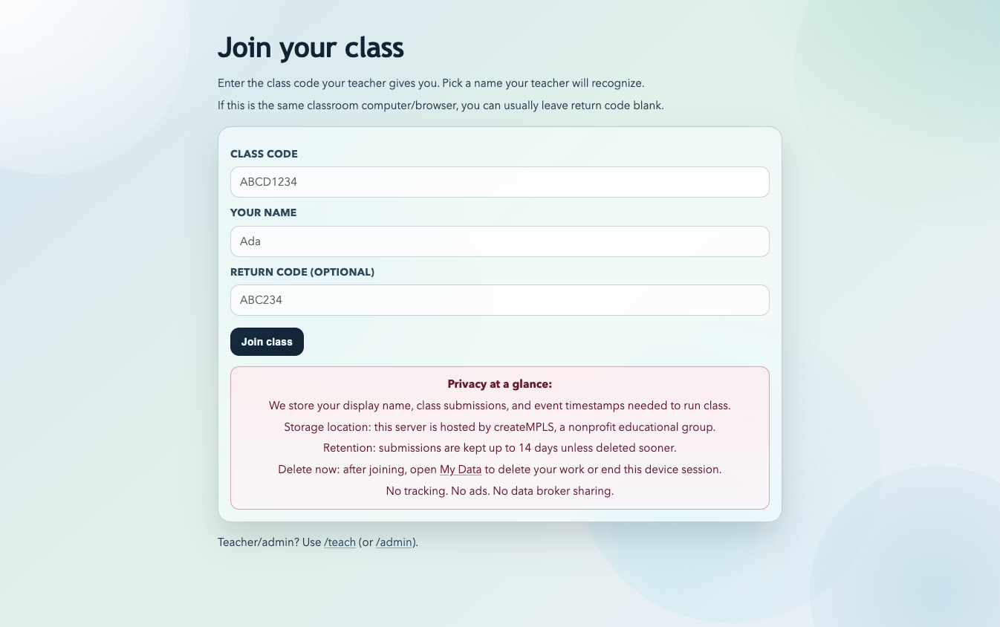
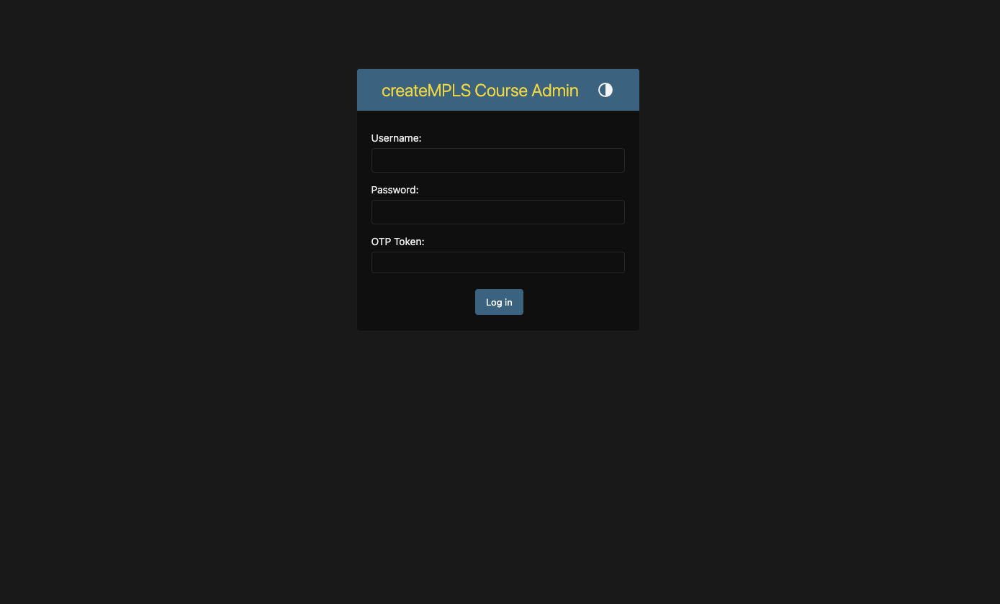

# ClassHub Docs

ClassHub is a self-hosted, classroom-first LMS designed for real programming:
fast student join → lesson → submission → teacher review, with a quarantined Homework Helper behind `/helper/*`.

Evaluating for your org? Start with [Public Overview](PUBLIC_OVERVIEW.md) and [Try It Local](TRY_IT_LOCAL.md).

## Quick links
- [Start Here](START_HERE.md)
- [Public Overview](PUBLIC_OVERVIEW.md)
- [Try It Local](TRY_IT_LOCAL.md)
- [Day 1 Checklist](DAY1_DEPLOY_CHECKLIST.md)
- [Runbook](RUNBOOK.md)
- [Security Baseline](SECURITY_BASELINE.md)
- [Privacy Addendum](PRIVACY-ADDENDUM.md)
- [Disaster Recovery](DISASTER_RECOVERY.md)

## Pilot in a box
- Time to deploy: local demo in minutes; domain pilot typically in a single setup session.
- Week 1 success: students can join, submit once, and teachers can review from `/teach` without manual triage.
- Deliberate non-goals: no gradebook, no surveillance analytics, no ad-tech stack.
- Student control is visible: `/student/my-data` export/delete/end-session works in rehearsal before class day.
- Reliability signal: strict smoke passes (`/healthz`, `/helper/healthz`, join, helper, teacher route checks).
- Measure without surveillance: onboarding time, submissions per session, and teacher minutes saved on closeout.
- Pilot guide: [Pilot Playbook](PILOT_PLAYBOOK.md).

## Press screenshots
Synced from `press/screenshots/` for wiki/docs browsing.

