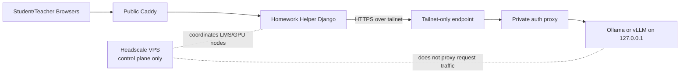

# Private LLM Server Ops

This directory is the operator bundle for the private GPU-side inference node.

Current recommended path:

- run the LMS publicly as usual
- run the model server on the Thunder GPU node
- keep the model server bound to loopback only
- use a private tailnet for host-to-host connectivity only
- for createMPLS-style production deployments, use a self-hosted Headscale server on a tiny Ubuntu VPS as the recommended control plane
- publish a tailnet-only HTTPS endpoint from the GPU node
- require a bearer token at the private edge if you are fronting Ollama with Caddy
- keep the tailnet limited to LLM traffic and related operator/admin troubleshooting only
- if you enable bounded remote helper compute control, treat this GPU node as lease-driven capacity for staff-run class windows, not as a student-facing feature
- if you use the Thunder-oriented control path, let the server-side bridge report `starting`/`ready` honestly so Homework Helper only routes remote traffic when the path is actually warm

The helper app already supports two server-side paths:

- `LLM_BACKEND=ollama`: current production path for private Ollama
- `LLM_BACKEND=openai_compatible`: future swap path for vLLM or another OpenAI-compatible server



## Files

- `env.example`: variables for the GPU node
- `install.sh`: base host bootstrap for Ubuntu-class nodes
- `run-ollama.sh`: loopback-only Ollama launcher
- `ollama.service`: systemd unit for the loopback-only Ollama process
- `run-vllm.sh`: loopback-only vLLM launcher with native API-key support
- `vllm.service`: systemd unit for vLLM
- `Caddyfile.private`: optional bearer-token wrapper for Ollama
- `run-private-proxy.sh`: safe launcher that refuses to start the wrapper without a token
- `private-proxy.service`: systemd unit for the private auth proxy
- `tailscale-acl.example.hujson`: example ACL/tag policy snippet for tailnet clients

## Recommended first pass

If you are already committed to an Ollama distribution:

1. Install the tailnet client and Ollama with `install.sh`.
2. Run Ollama on `127.0.0.1:11434` only.
3. Install Caddy on the GPU node and copy `Caddyfile.private` + `run-private-proxy.sh`.
4. Start the included private Caddy wrapper in front of Ollama so the LMS must send `Authorization: Bearer ...`.
5. Publish the wrapper as a tailnet-only HTTPS endpoint, not the raw Ollama socket.
6. Point ClassHub `LLM_BASE_URL` at the private tailnet hostname.

For the control plane behind that path, see [docs/HEADSCALE_CONTROL_PLANE.md](../../docs/HEADSCALE_CONTROL_PLANE.md).

If you later want a cleaner OpenAI-compatible target, move to `run-vllm.sh` + `vllm.service` and switch the LMS to `LLM_BACKEND=openai_compatible`.

## Start / stop / warm

Ollama:

```bash
sudo systemctl enable --now classhub-ollama
ollama pull llama3.2:3b
curl http://127.0.0.1:11434/api/tags
```

Private auth proxy for Ollama:

```bash
sudo cp ops/llm-server/Caddyfile.private /opt/classhub-llm/Caddyfile.private
sudo cp ops/llm-server/run-private-proxy.sh /opt/classhub-llm/run-private-proxy.sh
sudo chmod 755 /opt/classhub-llm/run-private-proxy.sh
sudo cp ops/llm-server/private-proxy.service /etc/systemd/system/classhub-private-proxy.service
sudo systemctl daemon-reload
sudo systemctl enable --now classhub-private-proxy
```

Verify the wrapper before publishing it on the tailnet:

```bash
curl -H "Authorization: Bearer ${LLM_SHARED_API_KEY}" https://127.0.0.1:8443/api/tags -k
```

vLLM:

```bash
sudo systemctl enable --now classhub-vllm
curl -H "Authorization: Bearer ${LLM_SHARED_API_KEY}" http://127.0.0.1:${VLLM_PORT:-8000}/v1/models
```

Tailnet-only publish example:

```bash
sudo tailscale serve --bg 443 https://127.0.0.1:8443
tailscale serve status
```

That example assumes the private Caddy wrapper is listening on `127.0.0.1:8443`.
If you are using Headscale, this is still a data-plane publish step on the GPU node; the Headscale VPS only coordinates node reachability.

## Key rotation

- rotate `LLM_SHARED_API_KEY` in the GPU node env file
- restart the private wrapper / model service
- update `LLM_API_KEY` in `compose/.env` on the LMS host
- recreate `helper_web`
- run `bash scripts/check_llm_backend.sh --probe-chat`

## Snapshots and replaceable nodes

- treat the GPU node as disposable compute
- keep long-lived config in `/etc/classhub/llm-server.env`
- keep model cache on attached volume if available
- snapshot after:
  - tailnet enrollment
  - model pull
  - systemd units verified
  - private endpoint verified from LMS

If the node is rebuilt, restore the env file, re-enable the services, re-run the smoke check, and only then flip traffic back.

## Privacy boundaries

- Browsers never call the GPU node directly.
- The LMS sends only server-to-server requests over the tailnet.
- Prompt redaction is enabled by default in the helper.
- Full prompt logging is off by default.
- Teacher review, policy limits, and class context remain in ClassHub, not on the model host.
- The tailnet is not for public browser traffic and not for general site routing.

FERPA-style caution:

- avoid putting unnecessary student identifiers into prompts
- do not treat the model host as the authoritative audit surface
- keep retention short and logs metadata-only unless you have a documented reason otherwise

## Troubleshooting

From the LMS host:

```bash
cd /srv/lms/app
bash scripts/check_llm_backend.sh --probe-chat
```

If bounded remote helper compute is enabled, also check `/teach/class/<id>`:

- `requested` or `starting` means the LMS is still on local/default helper compute
- `ready` means helper traffic for that class may use the remote backend
- `degraded`, `stopping`, or `error` means helper should stay on local/default compute

From the GPU host:

```bash
tailscale status
tailscale serve status
curl http://127.0.0.1:11434/api/tags
journalctl -u classhub-private-proxy -n 200 --no-pager
journalctl -u classhub-ollama -n 200 --no-pager
journalctl -u classhub-vllm -n 200 --no-pager
```

From the Headscale VPS:

```bash
systemctl status headscale
```

Common failure classes:

- `dns_resolution_failed`: tailnet DNS / private hostname mismatch
- `auth_error`: LMS and proxy API keys diverged
- `upstream_unavailable`: model host up but server not reachable or still warming
- `timeout`: model too cold/heavy for current timeout budget
- `malformed_response`: reverse proxy returned HTML/error page instead of JSON

## Known limits

- The Ollama path is still a private native Ollama integration with a thin auth proxy, not end-to-end zero-trust service identity.
- The helper redacts obvious PII patterns, but lesson context or operator-supplied scope text can still contain sensitive details if you put them there.
- A tailnet-only HTTPS publish step plus the private proxy is the supported secure path; direct public exposure of the model endpoint is intentionally treated as misconfiguration for production.
