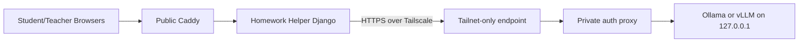

# Private LLM Server Ops

This directory is the operator bundle for the private GPU-side inference node.

Current recommended path:

- run the LMS publicly as usual
- run the model server on the Thunder GPU node
- keep the model server bound to loopback only
- use Tailscale for host-to-host connectivity only
- publish a tailnet-only HTTPS endpoint with `tailscale serve`
- require a bearer token at the private edge if you are fronting Ollama with Caddy

The helper app already supports two server-side paths:

- `LLM_BACKEND=ollama`: current production path for private Ollama
- `LLM_BACKEND=openai_compatible`: future swap path for vLLM or another OpenAI-compatible server



## Files

- `env.example`: variables for the GPU node
- `install.sh`: base host bootstrap for Ubuntu-class nodes
- `run-ollama.sh`: loopback-only Ollama launcher
- `ollama.service`: systemd unit for the loopback-only Ollama process
- `run-vllm.sh`: loopback-only vLLM launcher with native API-key support
- `vllm.service`: systemd unit for vLLM
- `Caddyfile.private`: optional bearer-token wrapper for Ollama
- `tailscale-acl.example.hujson`: example ACL/tag policy snippet

## Recommended first pass

If you are already committed to an Ollama distribution:

1. Install Tailscale and Ollama with `install.sh`.
2. Run Ollama on `127.0.0.1:11434` only.
3. Put the included private Caddy wrapper in front of Ollama so the LMS must send `Authorization: Bearer ...`.
4. Publish the wrapper with `tailscale serve`, not the raw Ollama socket.
5. Point ClassHub `LLM_BASE_URL` at the `.ts.net` hostname.

If you later want a cleaner OpenAI-compatible target, move to `run-vllm.sh` + `vllm.service` and switch the LMS to `LLM_BACKEND=openai_compatible`.

## Start / stop / warm

Ollama:

```bash
sudo systemctl enable --now classhub-ollama
ollama pull llama3.2:3b
curl http://127.0.0.1:11434/api/tags
```

vLLM:

```bash
sudo systemctl enable --now classhub-vllm
curl -H "Authorization: Bearer ${LLM_SHARED_API_KEY}" http://127.0.0.1:${VLLM_PORT:-8000}/v1/models
```

Tailnet-only publish example:

```bash
sudo tailscale serve --bg 443 https://127.0.0.1:8443
tailscale serve status
```

That example assumes the private Caddy wrapper is listening on `127.0.0.1:8443`.

## Key rotation

- rotate `LLM_SHARED_API_KEY` in the GPU node env file
- restart the private wrapper / model service
- update `LLM_API_KEY` in `compose/.env` on the LMS host
- recreate `helper_web`
- run `bash scripts/check_llm_backend.sh --probe-chat`

## Snapshots and replaceable nodes

- treat the GPU node as disposable compute
- keep long-lived config in `/etc/classhub/llm-server.env`
- keep model cache on attached volume if available
- snapshot after:
  - Tailscale enrollment
  - model pull
  - systemd units verified
  - private endpoint verified from LMS

If the node is rebuilt, restore the env file, re-enable the services, re-run the smoke check, and only then flip traffic back.

## Privacy boundaries

- Browsers never call the GPU node directly.
- The LMS sends only server-to-server requests over Tailscale.
- Prompt redaction is enabled by default in the helper.
- Full prompt logging is off by default.
- Teacher review, policy limits, and class context remain in ClassHub, not on the model host.

FERPA-style caution:

- avoid putting unnecessary student identifiers into prompts
- do not treat the model host as the authoritative audit surface
- keep retention short and logs metadata-only unless you have a documented reason otherwise

## Troubleshooting

From the LMS host:

```bash
cd /srv/lms/app
bash scripts/check_llm_backend.sh --probe-chat
```

From the GPU host:

```bash
tailscale status
tailscale serve status
curl http://127.0.0.1:11434/api/tags
journalctl -u classhub-ollama -n 200 --no-pager
journalctl -u classhub-vllm -n 200 --no-pager
```

Common failure classes:

- `dns_resolution_failed`: MagicDNS / tailnet name mismatch
- `auth_error`: LMS and proxy API keys diverged
- `upstream_unavailable`: model host up but server not reachable or still warming
- `timeout`: model too cold/heavy for current timeout budget
- `malformed_response`: reverse proxy returned HTML/error page instead of JSON
