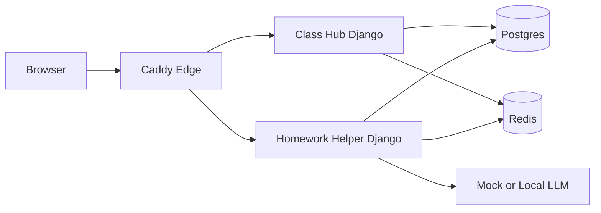

# Press Architecture Snapshot

## Summary
This diagram shows the public-facing deployment shape in one page.

## What to do now
1. Use this diagram when explaining stack boundaries.
2. Pair with `docs/ARCHITECTURE.md` for implementation details.
3. Pair with `docs/SECURITY_BASELINE.md` for header/control ownership.

## Verification signal
A reader should be able to identify edge, app services, and stateful dependencies from this page alone.

