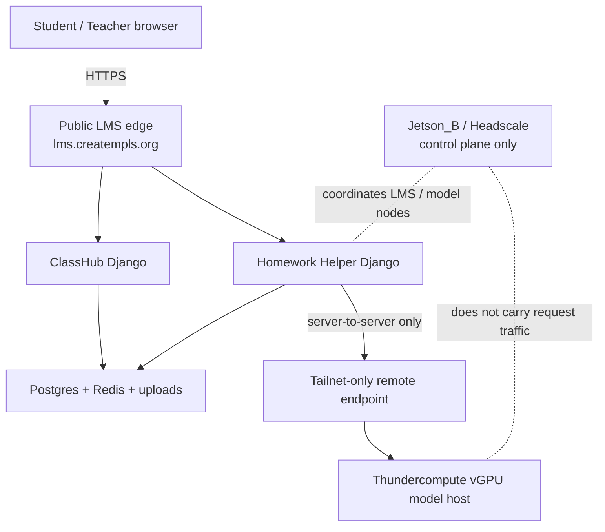

# Press Architecture Snapshot

## Summary
This page is the compact press/evaluator architecture source.

Use it when you need one diagram and a few grounded sentences, not a full engineering walkthrough.

## What to do now
1. Use this diagram when explaining stack boundaries.
2. Pair with `docs/ARCHITECTURE.md` for implementation details.
3. Pair with `docs/SECURITY_BASELINE.md` for header/control ownership.
4. Treat `press/diagrams/classhub_boundary_architecture.mmd` as the editable source of the core talk diagram.

## Verification signal
A reader should be able to identify the public boundary, the private compute boundary, and the control-plane boundary from this page alone.

```mermaid
flowchart TB
  Browser["Student / Teacher browser"]
  Edge["Public LMS edge<br/>lms.creatempls.org"]
  Hub["ClassHub Django"]
  Helper["Homework Helper Django"]
  Data["Postgres + Redis + uploads"]
  Tail["Tailnet-only remote endpoint"]
  Model["Thundercompute vGPU model host"]
  Headscale["Jetson_B / Headscale<br/>control plane only"]

  Browser -->|HTTPS| Edge
  Edge --> Hub
  Edge --> Helper
  Hub --> Data
  Helper --> Data
  Helper -->|server-to-server only| Tail
  Tail --> Model
  Headscale -. coordinates LMS / model nodes .- Helper
  Headscale -. does not carry request traffic .- Model
```

## What this diagram is saying

- The public LMS stays public.
- Browsers never talk directly to the model host.
- Homework Helper is the only component that crosses the private compute boundary.
- Headscale is a control plane, not a request proxy.
- Remote helper compute is optional and bounded; it does not become the center of the stack.

## Why this is worth showing

The unusual move here is not “we added AI.”

The unusual move is:

- AI is treated as leased infrastructure rather than ambient platform logic,
- the classroom path remains calm when the special path fails,
- and the private compute layer stays replaceable because the app boundary is narrow.
