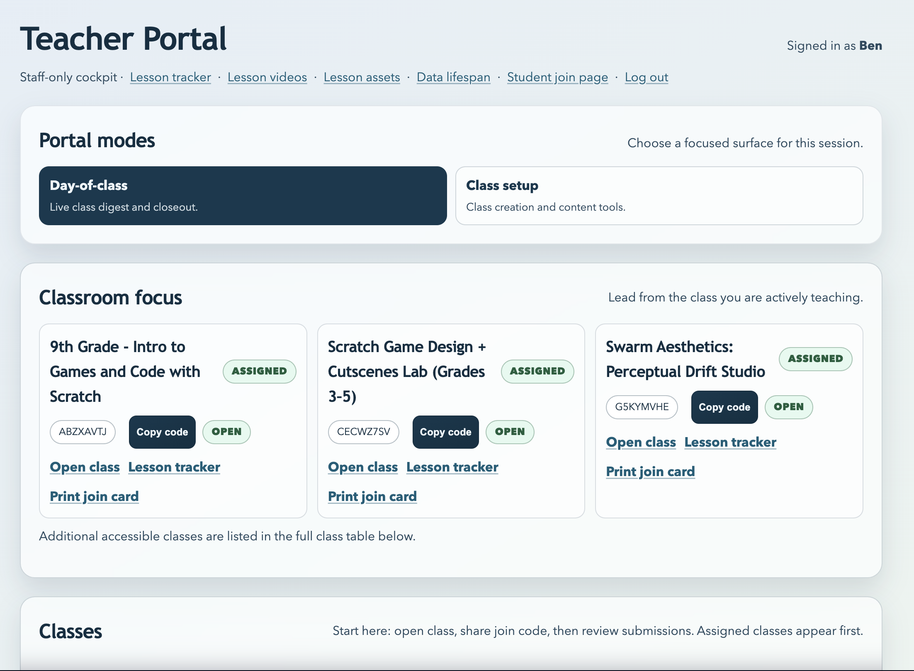

# Evaluator Quick Pack

## Summary
This is the shortest evidence bundle for external evaluators who need a factual snapshot without reading the full docs tree.

## What to do now
1. Use the six screenshots below in order.
2. Pair each screenshot with one claim from the claim table.
3. Link every claim to a source doc before sharing externally.
4. Use the measured-vs-aspirational notes below to avoid overclaiming.

## Verification signal
A reviewer can explain what is live, what is optional/advanced, and what trust controls exist in under 10 minutes.

## Core screenshot set (6)

### 1) Student join flow

### 2) Student class landing

### 3) Teacher classroom workflow

### 4) Superuser org + assignment controls

### 5) Advanced permissions surface (RBAC)

### 6) Ops reliability signal

## Claim pack (use as-is or adapt)

| Claim | Source |
|---|---|
| Students join without password accounts and have explicit trust/data controls. | `docs/PUBLIC_OVERVIEW.md`, `docs/RISK_AND_DATA_POSTURE.md`, `docs/PRIVACY-ADDENDUM.md` |
| Teacher daily workflow is class-first and supports facilitation without rankings/surveillance scoring. | `docs/TEACHER_PORTAL.md`, `docs/COMMON_SCENARIOS.md` |
| Superusers can manage organizations, teacher accounts, and class-to-teacher assignment from `/teach`. | `docs/TEACHER_PORTAL.md`, `docs/CURRENT_STATE.md` |
| Advanced permission features (RBAC) are documented with clear maturity notes for live defaults vs optional controls. | `docs/FEATURE_MATURITY.md`, `docs/RBAC_GUIDE.md` |
| Reliability/operations posture is documented and testable with runbooks and health checks. | `docs/RUNBOOK.md`, `docs/DAY1_DEPLOY_CHECKLIST.md`, `docs/TROUBLESHOOTING.md` |
| The private helper path is boundary-conscious: browsers never talk directly to the model host, and remote compute is bounded rather than ambient. | `docs/PRIVATE_LLM_BACKEND.md`, `docs/REMOTE_HELPER_COMPUTE_CONTROL.md`, `docs/EVIDENCE_REMOTE_COMPUTE.md` |

## Measured vs aspirational

Measured now:

- bounded remote lease accounting and export
- honest readiness semantics for the remote helper path
- graceful fallback evidence when remote helper compute fails
- reproducible Headscale control-plane bundle for backup/restore

Still aspirational or operator-local:

- long-run uptime numbers
- rich alerting and dashboards
- full automation of external provider orchestration

## Optional add-on for RBAC maturity clarity
- Add a second RBAC screenshot with approval workflow ON (`CLASSHUB_RBAC_POLICY_APPROVAL_REQUIRED=1`) to show review-queue mode.
- Keep baseline screenshot captured with approval workflow OFF for default-state clarity.
- Tracking note lives in `press/screenshots/PLACEHOLDERS.md`.

## Companion docs

- `press/conference_packet.md`
- `press/stack_claims_and_evidence.md`
- `press/stage_safe_claims.md`
